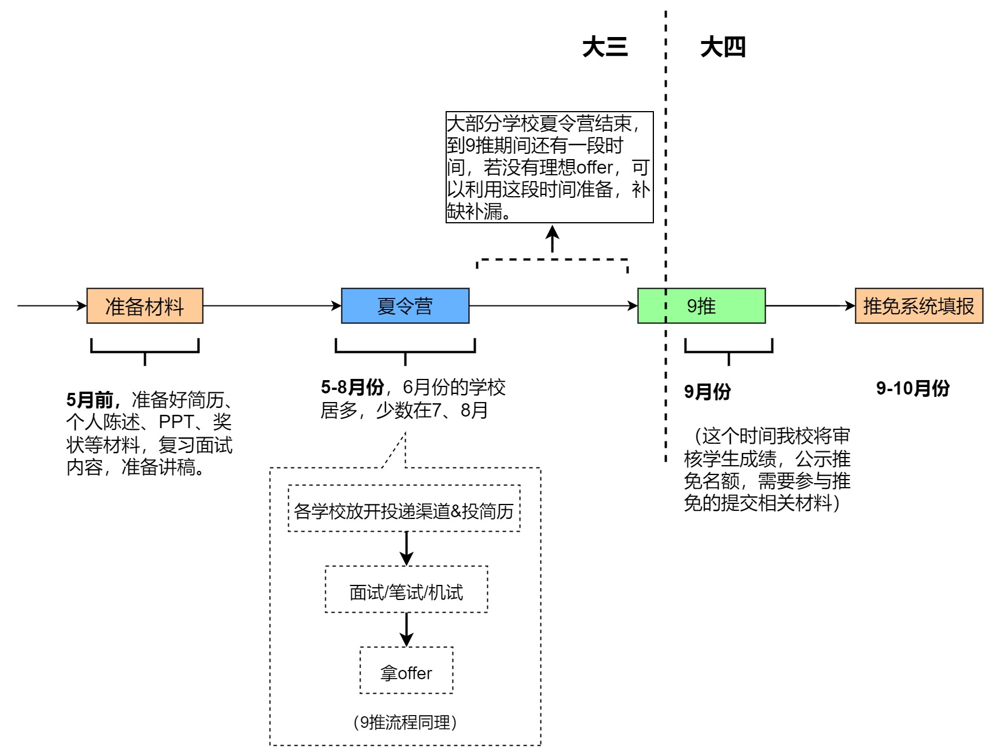
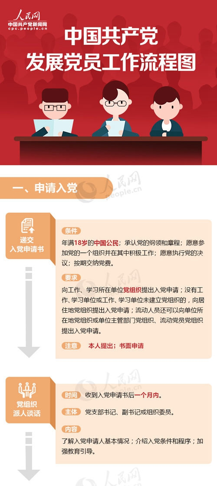
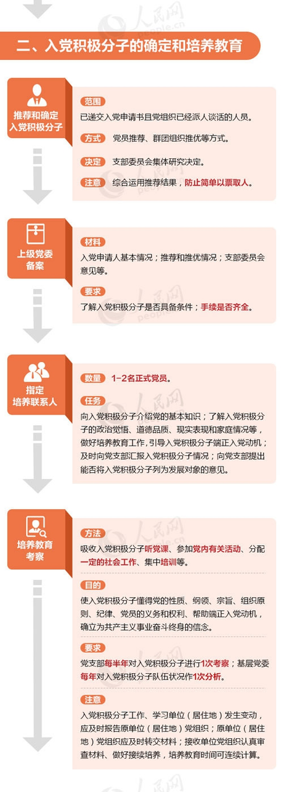
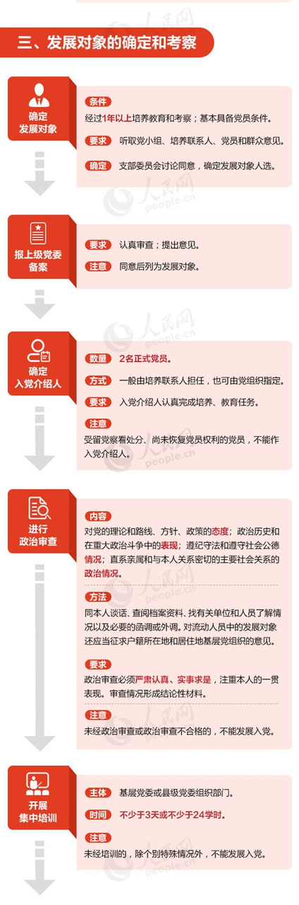
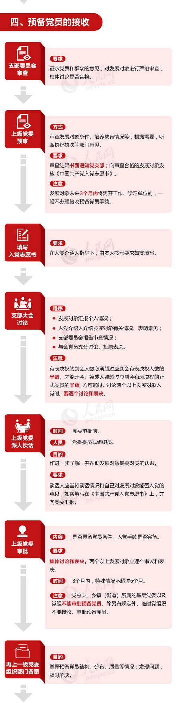
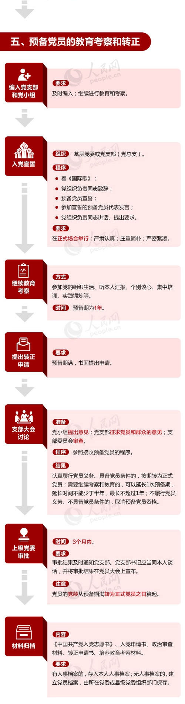

---
# 语言 （可选）
lang: zh-cn
# 网页关键词和描述
keywords: 简历主题,Hexo主题,简历模板
description: 
# 简历标题
resume_title: FAFUCS-大学四年攻略-计算机方向
# 应聘者姓名
name: CS-strategy
avatar: ./images/logo1.png #https://cdn.jsdelivr.net/gh/xaoxuu/cdn-assets/avatar/avatar.png
# 联系方式
contact:
  - icon: fas fa-globe-asia
    text: efafucs.com
    url: https://efafucs.com
  # 邮箱
  - icon: fas fa-envelope
    text: luyuhong_fafu@163.com
    url:
# PDF下载链接
--- 

<!-- 

<a href='/'>简体中文</a> | <a href='/zh-cn/'>English</a>

 -->

## FAFU-大学四年攻略-计算机方向

## 前言

&emsp;&emsp;经过大学四年，踩了许多坑，越来越有感觉有一个明确的计划和消除信息差是决定大学四年发展好坏的决定性因素，因此找到了都出身于农大的各方向的人才写了这篇攻略，希望学弟学妹们可以更好的发展。
&emsp;&emsp;对于刚入学的新生，当你看完这篇攻略后，会觉得很茫然，突然接触到大量陌生的东西，这是很正常的，因为这篇攻略几乎包含了计算机相关专业的主要发展路径和方法，可以每隔一段时间进行回顾这篇攻略，相信你会有新的认识。

&emsp;&emsp;本文主要在以下七大类进行介绍：
  &emsp;&emsp;1. **大学四年怎么过：** 高三暑假到大四的关键时间节点，核心课程
  &emsp;&emsp;2. **如何学习计算机：** 如何学习计算机相关的核心科目
  &emsp;&emsp;3. **竞赛：** ACM,数学建模，智能设计，AI类等
  &emsp;&emsp;4. **就业：** 互联网就业的开发与算法方向，国企，银行，考公，选调等
  &emsp;&emsp;5. **保研：** 推免材料，夏令营，9推，经验贴
  &emsp;&emsp;6. **考研：** 初试，复试，经验贴
  &emsp;&emsp;7. **校园生活：** 学生会，协会，校园的吃喝玩乐

&emsp;&emsp;由于大部分写者是毕业1~4年的同学和少部分高年级的同学，水平有限，因此以下攻略的观念仅代表各作者的个人观念，希望读者辩证地看待本文的内容。若本文出现与事实不符的内容，请以事实为准，也敬请谅解 。预祝各位在FAFU度过美好的大学时光，谢谢。 
&emsp;&emsp;推荐**电脑端**阅读，全文5w字，阅读大概25分钟。也可以 ctrl+f 直接寻找你感兴趣的内容。
&emsp;&emsp;攻略将持续更新，该攻略的飞书文档版本优先更新，博客版以及流传于各群的pdf版本可能并为最新，期待读者通过飞书文档的链接进行阅读.
&emsp;&emsp;攻略网站：[guide.efafucs.com](http://guide.efafucs.com) &emsp;飞书文档链接：[FAFU-大学四年攻略-计算机方向 ](https://w1sbvdiwuk.feishu.cn/docs/doccnVzxnsjsAWDF4Vh9KlhtyNc)
&nbsp;
&nbsp;
《FAFU-大学四年攻略-计算机方向》pdf版本提供下载：[《FAFU-大学四年攻略-计算机方向》pdf版本](./images/FAFU-大学四年攻略-计算机方向.pdf)
<object data="./images/FAFU-大学四年攻略-计算机方向.pdf" type="application/pdf" width="700px" height="700px">
    <embed src="./images/FAFU-大学四年攻略-计算机方向.pdf">
        
This browser does not support PDFs. Please download the PDF to view it: <a href="./images/FAFU-大学四年攻略-计算机方向.pdf">Download PDF</a>.

    </embed>
</object>
## 大学四年怎么过
### 大学四年总览
&emsp;&emsp;本节主要介绍了大学四年中，围绕核心课程与推荐在哪些时间节点该做哪些事来进行介绍. 其中包括考研、保研、就业三方向方面的内容。本节旨在让读者们对大学四年的学习内容有一定的认识，并大致了解每个方向要怎么走、走这个方向最终需要达到什么要求等，希望能对读者的四年规划起到启发作用。
&nbsp;
**绿色框：** 推荐完成的事项
<image src="./images/四年总览.png"></image>
**就业面试基础：** 数据结构 +计算机网络 + 操作系统 + 数据库
**考研408科目：** 数据结构 +计算机网络 + 操作系统 + 计算机组成原理 + 数学
&emsp;&emsp;以上是本科几乎最重要的几门专业课，以及代码能力，它们直接关系到求职和考研的笔试复试。
&emsp;&emsp;此外**数学**也同样重要，首先它是 AI 算法和考研笔试的基础，大一时很多同学可能并不清晰自己之后会走哪条路，所以大一时要学好数学，否则在大三时复习成本是很高的。其次数学所占的**学分**很高，尤其是高数高达5分，对于重视奖学金或想要保研的同学，可能因此拉开排名。
- 以上课程，编程语言类有：C语言、java、C++、SQL，其中C语言和数据结构强相关，上机课也要求同学们写代码。4年时间必须熟练掌握一门至多门语言。
- 数构、计网、操作系统无论是就业还是**考研**都需掌握，不同的是考研专业课内容还包括机组，**求职面试**中则是数据库。数据结构最重要，算法题/项目都是重点，若大一能够掌握C语言则可提前学习数据结构。计网和操作系统则是实践中会遇到的，需要能够实践应用。
&nbsp;
**英语四六级**
&emsp;&emsp;四六级对于**升学**和**就业**都是有用的。在一些公司招聘网站填写信息时，有的会要求填写英语水平。在保研时，四级是拿到推免资格的**门槛**，在复试和导师面试时，可能会问及你的六级成绩，因为这关系到科研中阅读论文的能力。
&emsp;&emsp;**时间点：**考试时间在 6月和12月，报名时间在考试前3个月左右，学校会通知，不要错过。最好在大一大二时就把四六级过了，越往后可能越没时间准备，所以趁大一大二有时间、英语也没忘那么多就先考了，否则越拖越难。
&emsp;&emsp;**怎么准备：**四六级考试时间接近期末考试周，时间都比较紧，所以建议**提前一个多月**开始准备。可以买华研社或者星火英语的往年真题，每次都掐好时间练一套，听力音源可以在微信公众号或者英语听力app上找到。四级难度和高考差不多，大一可以趁热打铁考掉；六级在听力和阅读上难度增加，需要多练听力和刷真题。
&emsp;&emsp;**Tips：**和高中考试不一样，写作部分和听力部分在考试第一个小时，时间到了会先收这部分的答题卡，且不给涂卡时间，所以要边听边涂卡。
&nbsp;
**高三暑假**
&emsp;&emsp;**关键词：** C语言入门 + 代码练习
&emsp;&emsp;**C语言入门：** 可在高三暑假或大一上学期开始学习。（学习建议参照下文的 “如何学习计算机知识->程序设计基础”）

### 大一
&emsp;&emsp;**关键词：** 数学、C语言入门、个人兴趣  
&emsp;&emsp;**数学：** 大一的重要课程，包括高等数学、线性代数、离散数学。
&emsp;&emsp;**C语言和算法：** 大一上学期完成C语言入门，然后根据自身情况向算法进阶，在大二前掌握一些简单算法。
&emsp;&emsp;**蓝桥杯：** 一个省级程序设计竞赛，门槛不高，每年大一都会有很多人参加，可以提升代码能力。
&emsp;&emsp;**个人兴趣：** 大一时很多协会和部门会纳新。部门和协会的区别是：**部门**负责一些学生工作，部员是要完成一些任务的，可以锻炼自己的能力，但需要付出一些时间精力。**协会**是发展爱好的社团，除了任职的成员，其余会员没有工作要求，主要是玩和交流。大家可以根据自己的时间和爱好选择。建议本专业的同学参加程序设计协会，QQ群号:725748814

### 大二
&emsp;&emsp;**关键词： 数据结构与算法、竞赛、java学习、做项目**
&emsp;&emsp;因为大一是打语言基础，大三要找实习或考研，所以大二是提升能力的**关键时期**。大二的主要内容是 **专业课 + 学算法 + 做项目**。

&emsp;&emsp;**数据结构：** 本专业**最核心**课程之一，无论是考研还是就业都有用。
&emsp;&emsp;**算法：** 对某种现实问题的解决方案，需要编程让计算机运行并解决问题。在竞赛和就业时会用到，可以从大二开始长期积累。
&emsp;&emsp;**Java：** 一种编程语言，语法和 C++ 语言比较相似。建议多上手写代码，熟悉语言特性。
&emsp;&emsp;**C++：** 一种编程语言，和 java 有些异同点。
&emsp;&emsp;**竞赛：** 每年都有很多固定的省级、国家级竞赛举办。不要被这些 title 吓到，很多是所有人都可以参加的，并且认真准备就有可能获奖。竞赛主要可以分为程序设计、智能设计、数学建模 3 类，可以积极尝试，下述竞赛模块将详细介绍。
&emsp;&emsp;**项目：** 用较完整的技术栈实现一个系统，是在找工作时用来证明个人能力的重要指标。但老师不会要求这些，需要自驱去做，大佬和咸鱼就是从这里拉开的，在大二下学期开始准备即可，具体在下文介绍。

### 大三
&emsp;&emsp;**考研：** 建议大三上学期就可以开始准备，具体情况视自己情况而定。
&emsp;&emsp;**保研：** 继续参加本学年的各类学科竞赛，保证智育分加分，同时了解学校信息。准备5-8月的保研第一波招生——夏令营，在大三下学期，准备各项材料，制作简历，找老师写推荐信等（将在下面保研专题详细展开）。
&emsp;&emsp;**就业：** 请在大三寒假结束前，达到以下要求：
 - 至少熟悉一门编程语言：如 C++或java
 - 数据结构，计算机网络，操作系统，数据库
 - 2-3个完整项目
 - 你选择方向的技术栈

&emsp;&emsp;**注意：** 就业向的同学请查看下自己的培养计划，其中（数据结构，计算机网络，操作系统，数据库）这4门课程建议安排在大三的寒假前学完，如果学校的安排是大三下学期的，建议提前自学，因为春招面试会问。

### 大四
&emsp;&emsp;**介绍：** 大三暑假至9、10月份，是**秋招**时间，面向**应届生就业**，若此时有暑期实习的经历（通过春招获得），则比较有优势。大厂秋招时间都比较早，且有提前批，**越早**投递简历面试，上岸概率越大，尝试机会更多，并且越往后坑位越少。若拿到offer，则可在大四期间实习（许多公司会要求实习），毕业转正。
&emsp;&emsp;大四阶段基本没课，在大四上学期有一个实训，即学校请讲师来上课，教java开发的技术，为期约一个月，最终要完成一个给定的项目，评定学分。此外的时间可以申请外出实习。  

## 如何学习计算机知识

&emsp;&emsp;首先先强烈推荐来自北大学生PKUFlyingPig整理的CS国外网课自学指南，非常全，强推：[CS自学指南（强烈推荐）](https://csdiy.wiki/)
&emsp;&emsp;以下将按介绍程序设计基础，数据结构，算法，Java，C++，计算机网络，操作系统，数据库，软件工程，数学，项目，建议提前学习的内容的顺序来进行介绍。
#### 程序设计入门——C语言
&emsp;&emsp;C 语言是大一新生的入门编程语言，在大二学数据结构的时候就要用它来编程；在学习其它语言时，只要熟悉C语言你很快就能学会。此外在考研机试、公司面试时很可能需要用C语言写算法，所以这门课非常重要，下面是入门的建议。
&emsp;&emsp;**入门方式：** 网课 + 代码练习 + 书。在入门初期，个人认为的权重：**网课 >= 代码练习 > 书**。在网课看完后，代码练习为主，书起到速查和加强记忆的作用。 进度快的话，一个多月就能基本掌握 C 语言基础。开学初老师上课进度一般偏慢，建议有能力的自己安排学习进度，提早学完了就多写代码题，提高熟练度。推荐的入门编程工具：Dev C++ 5.11
&emsp;&emsp;**网课推荐：** [北大郭炜《程序设计与算法（一）》](https://www.icourse163.org/course/PKU-1001553023)   [浙大 翁恺《程序设计入门——C语言》](https://www.icourse163.org/course/ZJU-199001?from=searchPage)（选一门即可）
&emsp;&emsp;**刷题推荐：**
  - 若选择刷上面郭炜老师的网课，则**优先**做完MOOC课程配套的代码练习。有些题目有点难度，可以百度答案弄懂后，自己再写一遍。
 &emsp; - [浙大版《C语言程序设计（第4版）》题目集](https://pintia.cn/problem-sets/1298273728383766528/problems/type/6)
  &emsp; - 洛谷，入门到进阶的题都有，若刷入门的题，可以刷 [洛谷题单](https://www.luogu.com.cn/training/list) 的入门1~6题单。除入门1 ~ 6以外，其它都是进阶的针对性题目，可以循序渐进。

&emsp;&emsp;**如何检验是否熟练掌握语言基础：**
&emsp;&emsp;推荐大家参加 PAT 的题库练习和考试。PAT 等级考试分为 乙级、甲级、顶级，考试时间3月、9月、12月都有，大一上学期即可参加当年12月份的乙级考试（需要自己报名，学校不组织）。PAT 官网： https://www.patest.cn/

&emsp;&emsp;以下为作者个人认为的对标水平。

|  PAT 成绩   | 对标水平  | PAT 成绩  | 对标水平  |
|  ----  | ----  | ----  | ----  |
| 乙级40分  | 会基础语法了 | 甲级70分 | 浙大计算机学生平均水平，校内算法相关的考试都能90+ |
| 乙级80分  | 会写点代码了，可以写项目了，达到校内毕业生平均水平 | 甲级90分 | 校内算法相关的考试都能95+ |
| 乙级90分  | 想去大厂的最低门槛 | 甲级100分 | 接近acm铜牌 |

#### 数据结构
&emsp;&emsp; 讲了各种数据是怎样存储与应用在计算机里的，以及基本的算法。这门课在考研专业课中占分数最大，考研保研和找工作的面试必考，实际编程中也一定会用到。
**学习建议：**
1. 跟紧老师上课的节奏
2. 网课巩固：中国大学MOOC 浙江大学 陈越老师 [《数据结构》](https://www.icourse163.org/course/ZJU-93001?from=searchPage)
3. 用不同方法从**底层**编程实现这个数据结构，比如实现队列、栈、堆、树 、图 、哈希表等。

&emsp;&emsp;**进阶：**
&emsp;&emsp;对于课内涉及的算法，比如最短路、贪心、搜索、排序，公司面试可能问到，也是竞赛必考算法。可以在洛谷、POJ等网站找题目针对性训练，也可以刷[PAT甲级真题](https://pintia.cn/problem-sets/994805342720868352/problems/type/7)。

#### 程序设计进阶-算法
&emsp;&emsp;算法是对某种现实问题的解决方案，需要编程让计算机运行并解决问题，比如给定一个迷宫，编程让计算机找到起点到终点的路径，只要熟练掌握C语言后就可以开始入门。下面针对不同层次介绍如何学习算法。
&emsp;&emsp;展示基础算法（必须要掌握）：
<image src="./images/基础算法.png"></image>
**阶段一：入门和进阶层次：** 大部分同学可以在大二学数据结构时入门算法，想参加竞赛的同学建议从大一下学期开始。算法的学习建议养成长期习惯，空闲时间刷一两题，学习路线可定为 递归 - 搜索 - 并查集 - 贪心 - 图论 - 动态规划，每个部分都做一定题量，分配一个学期 + 一个假期的时间做完。其中**绿色部分**是比较简单的算法，在大一下学期就可以掌握，达到了蓝桥杯拿奖的水平。
网课推荐：
- 中国大学MOOC：北京大学 郭炜老师的[《程序设计与算法（二）》](https://www.icourse163.org/course/PKU-1001894005)
- acwing:[《算法基础课》](https://www.acwing.com/activity/content/11/)
刷题网站：
- 若选择刷上面郭炜老师的网课，则可以做 MOOC 课程配套的代码练习。
-  [Leetcode ](https://leetcode-cn.com/)

**阶段二：竞赛层次：**
&emsp;&emsp;在这个层次，学习算法的过程可能是枯燥的，并且有一定难度。但是在这个过程会让你的代码能力得到很大的提升，在往后的代码相关的课程上你将会具有很大的优势。
&emsp;&emsp;建议在 [kuangbin专题题目一览](kuangbin专题题目一览)中边学边做，此外[codeforce](http://codeforces.com/)、[牛客网竞赛](https://ac.nowcoder.com/acm/home/) 都有周赛可以参加，是以赛代练的网站。
1. **蓝桥杯：** 掌握 搜索 - 并查集 - 贪心 就有可能在省赛拿奖，掌握动态规划则可能晋级国赛并拿奖。省赛在每年4月举行，从寒假到开赛前这段时间可以投入精力准备，大一下学期就可以参加。
&emsp;**刷题网站:** [AcWing](https://www.acwing.com/problem/) (关键词搜索蓝桥杯，有很多历年**蓝桥杯真题**。)
2. **ACM和福建省赛：** 难度大于以上两个，除了上面提到的算法，还需要学习的算法有图论、动态规划、数论、计算几何、线段树、字符串匹配等。
&emsp;**书籍推荐：**《挑战程序设计竞赛》
3. **天梯赛：** 难度和涉及的算法与蓝桥杯差不多
&emsp;网站 [天梯赛练习集](https://pintia.cn/problem-sets/994805046380707840/problems/type/7) 里有历年真题。

**阶段三：求职层次：**
&emsp;&emsp;算法是能决定能力上限的技能，越大的公司招人时越看重算法。求职中考察到的算法大多是搜索题、数据结构题、思维题。建议刷 [Leetcode](https://leetcode-cn.com/) 里的题，每种难度都做，面试官提问时基本是从里面选。
&emsp;&emsp;**总结：** 算法学习最重要的就是**多刷题**。在学习到新的算法时就需要用代码实现。刷题时碰到不会的，思考后没有思路，可以先看题解，看完题解自己敲一遍代码，学习到一定程度的时候就可以进行一些比赛的训练。比赛完之后尽量把比赛时候没做的题目做完。
&emsp;&emsp;**Tips：** 这里建议刷题时代码文件命名为 OJ名 + 题目名称，然后在文件夹中归类存放，便于之后的复习。分类可以按大一大二这种时间阶段分类，里面再按具体的某场比赛分成文件夹。

####  Java、C++ 语言基础 
&emsp;&emsp;这两门是在大二开设的课程，是目前比较流行的编程语言，在找实习前要熟练掌握其中一门。
&emsp;&emsp;**Java：** 语法和 C++ 语言比较相似，在大二上学期开课。建议多上手写代码，熟悉语言特性。这里推荐中国大学MOOC，翁恺老师的[《零基础学java语言》](https://www.icourse163.org/course/ZJU-1001541001?from=searchPage)入门。
&emsp;&emsp;目前我校毕业生选择java开发岗位较多，相比于 C++，java对完成稍大的工程的功能上手更快。学完课内内容后，可以写一些有图形界面的小游戏或工程项目练手，比如扫雷、飞机大战和QQ聊天系统等等。
&emsp;&emsp;**C++：** 和 java 有些异同点，在大二下学期开课。对于参加竞赛的同学使用比较多。学习时推荐看中国大学MOOC，北京大学 郭炜老师的[《程序设计与算法（三）C++面向对象程序设计》](https://www.icourse163.org/course/PKU-1002029030?tid=1207491203)。如果想深入学习，推荐书籍 《C++ Primer Plus》。

####  计算机网络 
&emsp;&emsp;**简介：互联网招聘**的门槛科目和**考研**408联考科目之一。主要通过网络的分层模型（5层）描述了计算机网络是怎么构成的、为什么这样设计，以及计算机如是何通过网络进行通信的。
&emsp;&emsp;**建议：** 先跟老师的进度过完一本书，期末考掌握书本内容即可。求职时面试官更侧重于考察网络模型的<u>应用层</u>、<u>网络层</u>，可以多看面经来深入了解原理，碰到不会的逐一百度，拓宽知识面和理解。

####  操作系统 
&emsp;&emsp;**简介：互联网招聘**的门槛科目和**考研**408联考科目之一。操作系统例如win、linux，是用户操作计算机硬件的软件接口，主要内容为：进程管理、内存管理、文件管理、输入输出管理等，前两项是企业面试提问的**高频点**。
&emsp;&emsp;**建议：** 这门课大概在大三下学期开，与春招时间重合了，而春招的面试就需要熟练掌握这门课，因此要在春招前学完，尤其是**进程管理**、**内存管理**两部分，并且最好能够掌握基本的linux命令。自学推荐清华大学老师向勇老师的课程《操作系统》，配套教材《现代操作系统》

####  数据库 
&emsp;&emsp;**简介：** 数据库是应用软件存储各种信息的地方，本身是用来设计存储结构、使用 SQL 语言操作数据的软件。应用软件的后台往往与数据库交互，例如将账户信息、购物车信息等，存入数据库或从数据库查出，是后端开发的必备技能，面试时主要考察数据库的一些底层原理和 SQL 语言的使用。
&emsp;&emsp;**建议：** 在先看书籍和网站内容后再跟进视频教程实战，一定要跟着实际动手操作，而不是简单地看着老师写。最后大家可以选择类似 [leetcode](https://leetcode-cn.com/) 这种有数据库题目的刷题网站来巩固自己的学习成果，细心巩固自己的知识点。

####  软件工程 
&emsp;&emsp;**简介：** 是一门理解性的课程，能让你对整个软件开发的流程和方法论有一个大体的认识。书里提到的很多流程和开发模式会在将来的实际工作中碰到，包含了很多计算机行业的常识性问题。比如：软件的需求、设计、开发、测试、维护具体都是怎么做的，什么是瀑布模型，什么是敏捷开发，怎样的软件设计才是好的…等等。
&emsp;&emsp;**建议：** 书本的内容主要靠记忆和理解，跟老师进度即可。但有些东西可能不经过实际的工作，是没法深刻理解的，所以这门课的实际意义在于让你知道有这些东西，大概是怎么回事，以至于对将来的工作有一个概念。

####  数学 
- **高等数学**：考研数学科目，大一要认真打好基础。
- **线性代数**：AI 原理的基础。
- **离散数学**：主要分为 <u>集合论、数理逻辑、图论</u> 3个部分，其中图论部分和大二的数据结构课程有部分重复内容，也是算法竞赛中的经典内容，建议尽早掌握以节省后续学习时间。
- **概率论**：大三的课程，是 AI 原理的基础，在数学建模的一些算法中也可能用到。

&emsp;**Tips**：学校课堂和课本在高数和线代这两门课中，更偏向于教授计算方法和应用，对原理本质几乎没有提及，很容易让人不知道学的是什么，知识点关联不起来然后失去兴趣（尤其是线代）。在这里**强烈推荐**大家在课外看完这几个系列的视频：[线性代数的本质](https://space.bilibili.com/88461692/channel/detail?cid=9450)、[微积分的本质](https://space.bilibili.com/88461692/channel/detail?cid=13407)、[微分方程](https://space.bilibili.com/88461692/channel/detail?cid=181202)。这个系列出自 b站up主 [3Blue1Brown](https://space.bilibili.com/88461692?from=search&seid=194882784978502192)，课看起来有趣不累，而且绝对能够帮助你加深理解，串联所有知识点！推荐知乎答主 [马同学](https://www.zhihu.com/people/matongxue)，在数学话题下有很多非常帮助理解数学的回答，可以帮助你理解书本没有讲清楚的东西。

####  工程项目 
&emsp;&emsp;计算机专业学习的目的就是掌握编程技能，然后能做出实际有用的东西，这就是项目。在大三找实习、大四就业时，项目就是个人能力的体现，若没有项目经历的话，简历可能比较空，缺乏竞争力，所以项目主要是让自己形成比较完整的技术栈，获得一些工程经验，充实简历，增加竞争力，在面试的时候也有谈资。

**哪些可以作为项目：**
一个比较**完整**的有实际意义的**工程**就可以做为项目：
&emsp;&emsp;1.参加智能设计类的比赛，你的作品就可以是一个项目。比如AI下棋机器人、全自动无人奶茶机、自动魔方机器人…这样往往可以获得 <u>竞赛奖项</u> + <u>项目经历</u>。
&emsp;&emsp;2.使用某种框架（java、python等）做一个网页系统，比如xx管理系统、电商系统。我校现状是毕业做java web前/后端开发的比较多，如果选择这个方向，则可以做这类项目。
&emsp;&emsp;3.学生创新创业项目，每年都有，可以找指导老师立项选题，题材也包括以上的智能设计和java开发等。
&emsp;&emsp;4.求职时实在没有项目经历的，可以把**完成度很高**的课程设计包装成项目。比如计算机网络课程设计中的聊天应用程序（类似qq），如果功能比较完善，也可以在面试里用。

**如何准备一个项目：**
&emsp;&emsp;大二下学期-大二暑假-大三春招前 这些时间是可以自己做项目的时间，其中大二暑假时间比较完整，大三上学期课也会少一些。
&emsp;&emsp;**软件开发项目**项目：可以是前端，后端，客户端。根据对未来职位的倾向做选择。可以在b站搜索网课，比如尚硅谷、黑马等，有项目实战课程，可以边学边写代码，跟一个课程做一遍下来，吃透，就可以把它最为自己的一个项目经历了。对于java后端，可以选择SSM框架入手（需要同时了解一点数据库知识），然后再接触SpringBoot。这里可以看下面对开发方向的介绍选择其中之一进行学习，大佬可全栈。
&emsp;&emsp;**智能设计**项目：以锐智杯为例，竞赛在暑期8月左右，可提前5个月找好指导老师确定做什么，然后开始实现。这类项目有关单片机编程，购买单片机后一般有赠送学习资料，可供参考。

####  建议提前学习 
**1.算法**：
&emsp;&emsp;**大一：** 尽快学完语言基础，然后开始打算法基础，此时可以提前学习数据结构。
&emsp;&emsp;**大二：** 也可以花时间去刷题练习，算法在日后求职中是可能决定上限的，这部分要自己去刷。
**2.Git + GitHub 使用：**
&emsp;&emsp;**git：** 管理你代码的工具，例如3个人一起开发一个项目，然后可以自动将3人的代码整合到一起，并且方便维护。
&emsp;&emsp;大二就可以接触使用，毕业选择就业的同学建议找项目做，那么一定将使用到这两个。稍大的项目开发，比如课程设计，就可以使用 git 来协作。
&emsp;&emsp;**推荐教程：** [Git + GitHub入门](https://www.bilibili.com/video/BV1KD4y1S7FL)  、 [Git + GitHub进阶](https://www.bilibili.com/video/BV1hA411v7qX)
&emsp;&emsp;**模拟器：** [Git 在线模拟器](https://oschina.gitee.io/learn-git-branching/)（可以熟悉 git 操作）
**3.数据库和操作系统：**
&emsp;&emsp;这两门课在大三开，但是春招在大三下学期初，所以参加春招的同学要在**春招前**学完这两个面试必考的科目。

## 竞赛
&emsp;&emsp;以下将按程序设计，数学建模，智能设计，人工智能和其他的顺序来进行介绍竞赛。
### 程序设计
&emsp;&emsp;算法能力强的同学建议多参加算法类竞赛，竞赛经历是求职简历的亮点。能力一般的同学也建议参加蓝桥杯（下面有详细介绍）获奖概率大，也能提升自己的能力。
**我校组织参加的比赛主要是：** 蓝桥杯、天梯赛、福建省大学生程序设计竞赛、ACM-ICPC，难度和含金量按 递增顺序排列，比赛使用C或C++语言编程。
普及程度如下：
- **蓝桥杯：** 所有人都可报名参加，往年参加人数50%左右，获奖比例高。
- **天梯赛：** 我校组织 2 队参加，每队 10 人，名额从蓝桥杯获奖者中择优选取。
- **福建省赛：** 2018年有 5 队参加，每队 3 人，名额从蓝桥杯、天梯赛获奖者中择优选取。
- **ACM：** 共 2~3 队参赛，每队 3 人，每年最多只有 2 队能进入现场赛。队员代表本校算法能力最高水平。

**ACM ICPC程序设计竞赛**
&emsp;&emsp;业界公认的最能体现个人水平的比赛，含金量最高，若拿奖则就业时很抢手。建议从大一开始刷算法题，每周要保证足够的刷题量，并找到同样有目标和能力的队友组队，争取在大二大三参赛。
**竞赛时间：**  暑假末（8-9月）进行网络赛竞争区域赛（现场赛）资格，我校水平一般有两支队伍可以参加区域赛。区域赛在10月-12月，近两年因为疫情原因时间不固定，可能延期。
**赛制：** ACM赛制，三人一队，5个小时，13 道左右难度不同的算法题。
**竞赛难度：** 难度最高，参赛队员代表学校算法最高水平。网络赛晋级后才可以参加区域现场赛。

**[蓝桥杯软件设计大赛](https://dasai.lanqiao.cn/)**
**竞赛时间：** 4月份初赛，5月份决赛。
**赛制：** 个人赛。题型为填空题、编程题，都需要写代码完成，比赛时间4小时。
**竞赛难度：** 省奖难度较低，获国奖难度适中
**介绍：** 蓝桥杯门槛较低，我校每年近两百人参加，省赛获奖几率大，省一等奖则可晋级国赛。国奖稍难一点，获奖人数在10+人左右。**我校报名机制为**：报名相关信息会在程序设计协会群内通知，学生自费300元报名，若省赛获奖则费用学校报销。

**[团体程序设计天梯赛](https://gplt.patest.cn/regulation)**
**竞赛时间：** 4月份
**赛制：** 十人一队，分数采用最后的十人的累加总成绩。
**竞赛难度：** 适中
**介绍：** 学院选拔十个实力相近的人 **(大概率从蓝桥杯成绩好的同学中挑选)**。题目的难度梯分 3 个档次递增上升。

**福建省大学生程序设计竞赛(省赛)**
**竞赛时间：** 5月份
**赛制：** 三人一队。2018年，我校共 5 队参加，包括大一到大三队员，大概率从蓝桥杯天梯赛获奖同学中挑选。

**[牛客网竞赛](https://ac.nowcoder.com/acm/contest/vip-index?&**headNav=www)、[计蒜客竞赛](https://nanti.jisuanke.com/contest?kw=2020%20%E8%AE%A1%E8%92%9C%E4%B9%8B%E9%81%93)
**竞赛时间：** 每周
**介绍：** 二者提供许多程序设计竞赛，可以训练算法能力。都是面向**noip**和**noi**建立的平台，平台定期举行比赛，成绩好还能获得比赛的奖品。牛客网面向参加ACM区域赛举办**多校集训营**，许多大学都会参加，我们学校也会按算法能力选拔人员参加，作为参加ACM竞赛的集训。

**[leetcode(力扣)](https://leetcode-cn.com/)**
**竞赛时间：** 每周
**介绍：面试找工作** 和 **必刷**题库，也可以作为算法练习题库，leetcode只需要算法的核心代码，屏蔽了许多包括输入输出的代码细节，相比其他平台的代码提交要方便。
**竞赛难度：** 总体难度更适合找工作

**[codeforce](http://codeforces.com/)**
**竞赛时间：** 每周
**介绍：** 俄罗斯的一个在线评测网站，每周都有不同等级的比赛。难度较高，主要面向参加 ACM 的队员，建议 ACM 队员作为练习赛训练。

**[百度之星程序设计大赛](https://star.baidu.com/#/program-design-match?**tab=1)**
**竞赛时间：** 每年5-7月份报名，7月初赛，8月复赛，9月决赛。
**赛制：** 个人赛
**竞赛难度：** 难度较大。

**Tips:** 有意向参加以下程序设计类竞赛的同学欢迎加入**程序设计协会**的协会群进行了解。
协会介绍：协会实验室（机房）在宝玲楼202，一般晚上有开，作为算法训练和授课场地。
主要活动有：IT文化节中的ACM赛制的算法校赛、新生C语言入门教学授课等。
**福建农林大学程序设计协会QQ群号:725748814** 

### 数学建模
&emsp;&emsp;数学建模竞赛为 3 人一队，在开题 3~4 天内，选择一道题进行数学建模，涉及数学、算法编程，并以一篇论文详细阐明建模过程和求解结果，最后在截止时间前提交论文。其中含金量最高的为国赛和美赛。
**1 [高教社杯"全国大学生数学建模竞赛](http://www.mcm.edu.cn/)（国赛）**
**竞赛简介：** 业界认可度最高的数模比赛，含金量最高。可以加入数学建模协会了解相关信息。
**竞赛时间：** 每年9月中旬，学校组织报名。
**综合难度：** ⭐⭐⭐⭐⭐   **竞赛含金量：** ⭐⭐⭐⭐⭐

**2 [美国大学生数学建模竞赛](https://www.comap.com/)（美赛）**
**竞赛简介：唯一**的国际性数学建模竞赛，也是世界范围内**最具影响力**的数学建模竞赛。赛题内容涉及经济、管理、环境、资源、生态等众多领域。需要在 4 天内提交一篇全英论文（在写作方面不会有太大阻碍，可以先用中文，然后借助翻译器）。
**竞赛时间：** 每年2月初左右
**综合难度：** ⭐⭐⭐⭐        **竞赛含金量：** ⭐⭐⭐⭐

**3 [深圳杯](http://www.m2ct.org/)**
**竞赛简介：** 深圳杯是全国大学生数学建模竞赛活动的**延伸**，获奖难度比国赛大。
**竞赛时间：** 每年4、5月份
**综合难度：** ⭐⭐⭐⭐⭐  **竞赛含金量：** ⭐⭐⭐⭐

**4 [MathorCup高校数学建模挑战赛](http://www.mathorcup.org/)**
**竞赛简介：** 比国赛难度稍低，但含金量较高，整体性价比较高，建议参加。
**竞赛时间：** 每年4月中旬
**综合难度：** ⭐⭐⭐⭐       **竞赛含金量：** ⭐⭐⭐⭐

**5  [电工杯](http://shumo.neepu.edu.cn/)**
**竞赛简介：** 由中国电机工程学会电工数学专委会主办。
**竞赛时间：** 每年5月中下旬
**综合难度：** ⭐⭐⭐           **竞赛含金量：** ⭐⭐⭐⭐

**6 东北三省数学建模联赛（无官网，学校统一组织）**
**竞赛简介：** 由三省有关高校联合发起的面向大学生、研究生和中学生的赛事。
**竞赛时间：** 4月下旬到5月中旬
**综合难度：** ⭐⭐⭐          **竞赛含金量：** ⭐⭐⭐

**7 [数学中国（认证杯）数学建模网络挑战赛](http://www.tzmcm.cn)**
**竞赛简介：** 建议作为入门数模竞赛的第一场比赛。竞赛题目来源于工程技术和管理科学等方面经过简化的实际问题。
**竞赛时间：** 每年4月中旬，分为第一和第二阶段，两个阶段没有晋级关系，第二阶段难度略有提升，可都参加或只参加一个。
**综合难度：** ⭐⭐⭐         **竞赛含金量：** ⭐⭐⭐

**8 [华东杯大学生数学建模邀请赛](https://www.saikr.com/vse/hdmcm/2020)**
**竞赛简介：** 华东杯大学生数学建模邀请赛(又名“华东杯”数模竞赛)，由复旦大学数学科学学院发起，华东地区数学建模联盟组织开展的竞赛。**规模和影响**上已经成为面向华东地区乃至全国数十所重点大学的校际通讯赛。
**竞赛时间：** 每年4月底
**综合难度：** ⭐⭐⭐        **竞赛含金量：** ⭐⭐⭐

**9 [五一数学建模联赛](http://51mcm.cumt.edu.cn)**
**竞赛简介：** 由中国矿业大学、江苏省工业与应用数学学会和徐州市工业与应用数学学会联合举办，由中国矿业大学大学生数学建模协会和矿大理学院承办的一项大学生科技竞赛活动。
**竞赛时间：** 每年5月1号
**综合难度：** ⭐⭐⭐        **竞赛含金量：** ⭐⭐⭐

**10 [华中地区大学生数学建模邀请赛](https://www.saikr.com/vse/36928)**
**竞赛简介：** 华中地区大学生数学建模邀请赛的主办方为湖北省工业与应用数学学会，并由中国地质大学（武汉）数理科技协会承办。
**竞赛时间：** 每年5月初
**综合难度：** ⭐⭐⭐       **竞赛含金量：** ⭐⭐⭐

**11 [中青杯](http://zqb.52jingsai.com/ )**
**竞赛简介：** 为培养大学生的创新意识、协作精神及运用数学方法和科技教育解决社会问题的能力，中青杯全国大学生数学建模竞赛组委会和吉林省科技教育学会共同主办了中青杯全国大学生数学建模竞赛。
**竞赛时间：** 每年5月底
**综合难度：** ⭐⭐⭐      **竞赛含金量：** ⭐⭐⭐

**12 [数维杯大学生数学建模竞赛](http://www.nmmcm.org.cn/)**
**竞赛简介：** 数维杯大学生数学建模竞赛每年分为两场，每年上半年为数维杯全国赛（5月下旬），下半年为数维杯国际赛(11月下旬)。
**竞赛时间：** 第一阶段5月下旬，第二阶段11月下旬
**综合难度：** ⭐⭐⭐     **竞赛含金量：** ⭐⭐⭐

**13 [数学中国数学建模国际赛（小美赛）](http://mcm.tzmcm.cn/)**
**竞赛简介：** 数学中国数学建模国际是由内蒙古自治区数学学会和全球数学建模能力认证中心共同主办，由数学中国网（www.madio.net）和第五维信息技术有限公司协办的全国性数学建模活动。
**竞赛时间：** 每年11月中下旬
**综合难度：** ⭐⭐⭐     **竞赛含金量：** ⭐⭐⭐

**14 [ 亚太地区大学生数学建模竞赛](http://www.apmcm.org/)**
**竞赛简介：** 亚太地区大学生数学建模竞赛是北京图象图形学学会主办的亚太地区大学生学科类竞赛，竞赛由亚太地区大学生数学建模竞赛组委会负责组织。
**竞赛时间：** 每年11月底
**综合难度：** ⭐⭐⭐    **竞赛含金量：** ⭐⭐⭐

**数学建模竞赛介绍：**
&emsp;&emsp;了解数学建模的形式、过程、历年赛题及学习优秀论文。数学建模大致分为**建模、算法、写作**三部分，建模主要寻找适当的模型，运用题目已知条件搭建模型进而解决问题；算法主要为搭建的模型中需要的步骤进行演算，与建模互相配合解决问题；写作即根据建模和算法详细过程，用书面语准确严谨表达，以论文呈现。
**推荐用书：** 司守奎《数学建模算法与应用》（第三版）。该教材配套相应的程序、数据和PPT。
**推荐软件学习：** Matlab、Lingo、Python、C或Java、Spss等。其中 MatLab 和 Python 有替代关系，熟练掌握其一即可，作为算法编程实现的工具。Lingo 和 Spss 是专门的数学分析软件。
**推荐学习网址：** [数学建模教程1](https://www.bilibili.com/video/BV1DW411s7wi?from=search&seid=14525081966665371236)、[数学建模教程2](https://www.bilibili.com/video/BV12b411i7u7?from=search&seid=2561681648816200297)、[论文写作方法教程（国赛和美赛）](https://www.bilibili.com/video/BV1Na411w7c2?p=1)、[MATLAB基础视频教程](https://www.bilibili.com/video/BV1Hy4y1y7Rj?from=search&seid=2561681648816200297)
福建农林大学数学建模协会：**FAFU模友群** 715974051

### 网络安全

​		网络安全竞赛又称为CTF，对网络安全技术感兴趣或有计划进入网络安全行业的同学可以积极参与CTF竞赛，是就业加分项。但是CTF竞赛大多面向全国甚至国际，奖项设置是固定的，使得CTF获奖难度较大。

​	**涉及知识**：例如：WEB应用安全与渗透、杂项、二进制安全、逆向安全、AI安全、移动安全、密码学、区块链安全等，一般来说一位选手专攻一个方向。

​	**涉及语言**：PHP、Python、Javascript、Java、C、C++等

​	**我校目前组织参加的主要赛事有**：黑盾杯、百越杯、ISCC、CISCN、XCTF联赛、网鼎杯、天府杯竞赛等。除此之外，几乎每周甚至每日都有CTF安全竞赛。学校重视的比赛会由网络空间安全创新创业实训室（福州市网信人才培养基地）组织安排名单参赛，其余比赛可以自行组队参加。以下对学校每年组织的相关比赛进行说明。

**1、[“黑盾杯”福建省大学生网络安全竞赛](http://heidunbei.si.net.cn/hdc/cover)**

**介绍：**国家网络安全宣传周福建省大学生网络空间安全技能竞赛，是网络安全竞赛中的省赛，福建师范大学承办。主办方：福建省公安厅、福建省教育厅、福建省委网信办

**赛制：**三人一队，资格赛-复赛-决赛，复赛解题模式（WEB、MISC、PWN、RE、CRYPTO），决赛AWD攻防模式。

**难度：**省赛只有省内高校参加，难度是所有CTF竞赛中最低的，但是只有18只队伍能够获奖，获奖学生将列入福建省网络与信息安全产业发展促进会专业人才库， 优先获得福建省网络与信息安全产业发展促进会提供的就业指导和推荐、实习实践和培训赋能等机会。

**2、[“百越杯”福建省高校网络空间安全大赛](http://www.fjcssc.net/)**

**介绍：**加快高校网络空间安全学科专业建设，创新网络空间安全人才培养机制而举办的省赛。

**主办方：**福建省教育厅、福建省网络与信息安全通报中心、福建省高校网络空间安全大赛组委会

**赛制：**三人一队，初赛为解题模式，涉及WEB、MISC、PWN、RE、CRYPTO。决赛为AWD模式

**难度：**省赛只有省内高校参加，难度是所有CTF竞赛中最低的，22只队伍可以获奖。

**3、网信柏鹭杯全国大学生网络空间安全精英赛**

**介绍：**每年在福建省厦门市举办，由厦门大学信息学院（国家示范性软件学院）、厦门市美亚柏科信息股份有限公司（全国网络警察培训基地）承办，主办方**：**厦门市委网信办

**赛制：**三人一队，CTF解题模式，题目方向涉及Pwn、Web、MISC、Crypto、Reverse、AI等方向。

**难度：**相比省赛，该比赛面向全国，获奖难度相比省赛更大，一二三等奖合计9名，其他队伍容易得到优秀奖

**4、[福建省工业互联网创新大赛](https://www.chinaiisc.cn/)**

**介绍：**工业控制设备安全方面的比赛，涉及到工业流量分析，工业平台安全等，难度大。主办方**：**福建省工业和信息化厅、福建省教育厅、福建省总工会、共青团福建省委、福建省通信管理局

**赛制：**4人一队，线上选拔赛：知识竞赛+CTF解题，线下决赛：工业控制设备攻防对抗

**难度：**工控安全学习难度较大，获奖较难，一二三等奖合计6名，优秀奖若干

**5、[信息安全铁人三项赛](http://www.t3sec.org.cn/)**

**介绍：**信息安全铁人三项赛采用以“年”为周期的联赛模式，竞赛采用资格审核、分区赛、全国总决赛三级赛制。

**赛制：**6人一队（4名正式队员、2名替补队员），信息安全铁人三项赛分为个人计算环境安全对抗赛、企业计算环境安全对抗赛和信息安全数据分析对抗赛三项。与传统CTF赛制略有不同，具体情况可以查看官网说明。

**难度：**分区赛一二三等奖名额大于15个，获得分区赛奖项概率较大。全国总决赛设置奖项18名以上，但是先要打入全国总决赛较有难度。

**6、[ISCC全国大学生信息安全与对抗技术竞赛](https://www.isclab.org.cn/)**

**介绍：**信息安全与对抗技术竞赛（ISCC：Information Security and Countermeasures Contest），ISCC竞赛的影响广泛且深远。每年5月1日-25日，持续25天。每年由北京理工大学信息系统及安全对抗实验中心承办。

**赛制：**个人挑战赛、无限擂台赛均为个人赛，线上赛CTF解题模式，涉及CHOICE、BASIC、WEB、REVERSE、PWN、MISC、MOBILE、组合题目。分组对抗赛为线下赛，3人一队，采用AWD模式。

**难度：**个人挑战赛全国赛区所设一等奖得奖率约为1.2%，二等奖得奖率约为3.5%，三等奖得奖率约为7.3%。无限擂台赛全国赛区所设一等奖得奖率约为0.7%，二等奖得奖率约为2.1%，三等奖得奖率约为4.3%

**7、[CISCN全国大学生信息安全竞赛](http://117.78.33.202/home)**

**介绍：**信息安全领域唯一一个教育部A类竞赛，即真正意义上的大学生信息安全国赛。

**赛制：**创新能力赛：分为线上预选赛（解题模式）、线下分区赛（AWD模式）、全国总决赛（AWD模式）；作品赛：提交信息安全相关作品参评，由教育部组织专家进行评分。

**难度：**国赛，竞争较为激烈，获奖2021年是线下分区赛前36名即可获得分区赛奖项。

**8、[XCTF国际网络安全技术对抗联赛](https://www.xctf.org.cn/xctf/2022/)**

**介绍：**我国网安圈子里的最高水平竞赛，网安圈子公认含金量极高。国际化联赛赛制，影响力大。总决赛冠军战队一般可以获得DEFCON世界黑客大会外卡，受邀参加DEFCON这一全球网络安全领域最具影响力赛事。

**赛制：**线上分站赛为解题模式，线下赛为AWD模式

**难度：**国际赛，总决赛战队代表了我国网络安全最高水平，获奖难度极大，奖项含金量极高。

**9、[网鼎杯网络安全大赛](https://www.wangdingcup.com/)**

**介绍：**国内规模最大的高水平网络安全竞赛，被誉为网络安全领域的“奥运会”。多家大厂协办，奖项含金量极高，如果拿奖基本上大厂随便进。

**赛制：**线上选拔赛为解题模式，线下赛半决赛和线下总决赛，均为AWD模式

**难度：**国内高水平网络安全竞赛，高校组2000只队伍，晋级线下120只。总决赛高校和政企同台竞技，获奖难度极大，奖项几乎都被企业瓜分。

**10、[TFC天府杯国际网络安全大赛](http://www.tianfucup.com/)**

**介绍：**高水平漏洞挖掘竞赛，破解最新系统、软件和组件，含金量非常高，获奖会直接收到大厂offer。中国版“Pwn2Own”，中国规模最大、最具声望的黑客大会。

**赛制：**原创性漏洞复现、现场产品破解

**难度：**难度极高，基本需要你能够挖掘0Day漏洞。奖池巨大，奖金极高。360团队在2020年TFC中获得74万美元奖金。获奖即大厂offer。

**tips：网络空间安全与网页设计协会QQ群871932280**
加入网络空间安全创新创业实训室（福州市网信人才培养基地、0xfafu攻防实验室）其中0xfafu战队（我校网络安全战队）可以联系赵湘宁老师。

### 智能设计
**锐智杯**
**介绍：** 大学生智能设计大赛福建省省赛，主题涵盖单片机硬件，软件开发，ai等
**适用对象：** 大一大二同学比较好的练手比赛，团队参赛。
**官网网址：** [东方锐智--锐智杯](http://www.dfrzedu.com/index.php/ruizhi_bei.html)
哪些项目能参加：硬件类单片机等设计，软件的系统开发，一些算法的实现应用等。参赛的项目一般是具有实际意义的应用，并且有一定的创新点。

**中国大学生智能设计竞赛**
**介绍：** 大学智能设计大赛国赛，主题涵盖单片机硬件，软件开发，ai等
**适用对象：** 大一大二同学比较好的练手比赛。
**官网网址：** [2019年第九届“华为杯”中国大学生智能设计竞赛-大学生竞赛-赛氪 ](https://www.saikr.com/vse/aidc/2019)
哪些项目能参加：硬件类单片机等设计，软件的系统开发，一些算法的实现应用等。参赛的项目一般是具有实际意义的应用，并且有一定的创新点。 

**中国机器人及人工智能大赛**
**介绍：** 由中国人工智能学会主办的人工智能类大赛，赛事项目分为创新类、竞技类以及应用类，机器人包含赛车、人性机器人、无人机、服务型机器人等；人工智能方面包括算法与应用以及创新；同时文化创新部分也允许非技术类项目参赛
**官网网址：** [CRAIC中国机器人及人工智能大赛 (yuntop.com)](https://craic.yuntop.com/#/index)

### 人工智能
**Kaggle**
**介绍：** 上面ai竞赛较多，周期也短，也可以看到往期的比赛。
**官网网址：** https://www.kaggle.com/

**其他竞赛**

**ASC超算**
**介绍：** 超级计算机竞赛，利用高性能计算机集群去解决问题。通常包含了集群的配置，测试，AI赛题，行业应用赛题等。
**时间：** 初赛：寒假前一周到寒假后一周。 决赛：4月   
**参赛方式：** 联系王长缨老师说明想参赛。每年寒假会选取优秀的学生前往北京参加超算集训。
**竞赛官网：** http://www.asc-events.org/

## 就业向攻略
&emsp;&emsp;本节主要梳理了互联网行业的相关信息，首先介绍了简历投递时间节点和面试流程，然后着重介绍了开发岗中的主要方向，如前端开发、java/c++后端开发、安卓/ios客户端开发等，并提及了岗位对应的技术栈和学习方法。此外还利用较短篇幅介绍了算法、测试、网安、产品、运营、游戏开发等岗位。
**1.互联网企业介绍：**
Top 0: [腾讯](https://careers.tencent.com/home.html)，[阿里](https://talent.alibaba.com/)，[字节](https://jobs.bytedance.com/)，[百度](https://talent.baidu.com/external/baidu/index.html)，[google](http://careers.google.cn/)，[Microsoft](https://careers.microsoft.com/us/en)等
Top 1: 拼多多，快手，[美团](https://campus.meituan.com/)，[网易](https://campus.163.com/app/net/position)，京东，米哈游，[莉莉丝](https://app.mokahr.com/apply/lilith/7802#/)，[华为](https://career.huawei.com/reccampportal/portal5/index.html)，小米，[滴滴](https://talent.didiglobal.com/)等
Top 2: [猿辅导](http://hr.yuanfudao.com/campus_apply/fenbi/28#/)，[苏宁易购](http://careers.suning.cn/rps-web/index.htm)，[新浪](https://career.sina.com.cn/portal/campushire?page=1&gql=)，[搜狐](https://hr.sohu.com/apply/sohu/5681#/)，[爱奇艺](https://careers.iqiyi.com/)，[科大讯飞](https://iflytek.cheng95.com/other/campus)，[携程](https://job.ctrip.com/index.html#/) ，虎牙等  
（同级之间不分先后顺序）

**2.大厂招聘时间：**
- 春招（找实习，大三寒假后开始，3-5月）: 面向**大三学生**暑期实习的岗位（这份实习**可以转正**），也有部分对应届生的补招（名额非常少）。
- 秋招（找工作，大三暑假到大四上，7-11月）: 面向**应届生**（大三的暑假和大四上学期）。提前批7-8月，正式秋招在9-11月。但是比如腾讯的研发在提前批（7-8月）就招满人，后续就不怎么招了，所以要提早。

**3.流程:**  网申→笔试→面试→offer发放
</img>
**4.流程介绍**
&emsp;&emsp;**网申：** 简历最好自己做（**pdf格式**），简洁即可。
&emsp;&emsp;**笔试：** 投递简历之后，邮件通知笔试时间以及网址。**在线编程**，ACM赛制，全程摄像头监控。若通过则会有邮件通知。内容包括：模拟题、思维题、树结构、递归、字符串；题库：[牛客网题库](https://www.nowcoder.com/contestRoom)、[lintcode](https://www.lintcode.com/problem/?typeId=2)、[leetcode](https://leetcode-cn.com/)、《**剑指offer**》
&emsp;&emsp;**面试：** 简历和笔试通过，则HR会通过邮箱和电话联系你，确定面试时间。面试可能2-4轮**技术面**+1轮**HR面**。
​		**（1）技术面:** 自我介绍，然后面试官会根据简历问项目经历、实习经历、竞赛经历，然后考察**语言**（C++或 java），以及**专业课**（数据结构、计算机网络、操作系统、数据库），并且可能要求**现场写代码题**。

&emsp;&emsp;①其中语言和专业课深度 > 课本知识，多看相关公司职位的面试经验。语言问**底层实现**，比如 ArrayList和 LinkList 的底层原理、C语言编译过程等。

&emsp;&emsp;②现场代码题类似如上的[lintcode](https://www.lintcode.com/problem/?typeId=2)、[leetcode](https://leetcode-cn.com/)题型，**链表、树结构**是重点。

&emsp;&emsp;③**面评：** 面试官会写你的面试情况，同时后续面试官会看到之前一轮的面评。因此面试完要及时查漏补缺。

&emsp;&emsp;④面试结束后，面试官都会问你有什么想问他的。**不能说没有**，可以问点**岗位和工作内容**相关的信息等。

**（2）HR面**：到达这一轮基本稳了，HR会跟你确认入职时间，薪资，意向工作地点等，也可能问一些个人问题、看法问题，注意不要踩红线，具体可以多看看面经。

**Tips：**
1. 招聘信息来源：[牛客网校招板块](https://www.nowcoder.com/recommend/campus)、学校的专业就业群、各公司的微信公众号、各公司官网
2. 简历内容包括但不限于：电话邮箱等个人信息，本科学校以及成绩情况；英语四六级，**竞赛获奖情况，项目经历，实习经历，技术栈**等。**亮点和优势**放在显眼位置（竞赛、项目、实习经历）
3. 一个公司支持投递1-2个职位，可选择意向城市、事业部（**一般在公司官网投递**）
4. 关注投递流程，若被挂掉，可以换事业部或职位继续投递
5.欢迎大家加入FAFU互联网求职交流qq群：925903798

### 开发方向

### 前端

**前端是什么**

&emsp;&emsp;前端主要是网页中用户直接看到的页面。根据需求编写页面布局，并接受后端传来的数据显示。

**前端学什么**

&emsp;&emsp;前端最基本的三大件HTML、Javascript、CSS，再加上一门流行的框架。可以通俗理解为，HTML是网页骨架，CSS用于装饰骨架，Javascript实现逻辑。熟悉三大件基本语法后（html和css能看懂即可，js做到会写），就可以直接学习框架了，目前三大前端框架为**Vue、React、Angular**，前两者目前比较火，Vue 更容易上手。

&emsp;&emsp;这里推荐两个前端框架课程：[Vue  ](https://www.bilibili.com/video/BV1Zy4y1K7SH)，  [React](https://www.bilibili.com/video/BV1wy4y1D7JT)

&emsp;&emsp;**设计模式：** 设计模式是对开发过程中反复出现的某种问题的通用解决方案，所有的设计模式约23种左右。前后端都有用到很多设计模式，常见的设计模式会在开发过程中用到，也是面试常考的问题。

**编辑器：** vscode、webstorm
下图为**前端知识图谱：**
<image src="./images/前端知识图谱.png"></image>
下图为 vue 知识图谱，掌握**基础部分**即可，推荐看vue的官方文档学习。
<image src="./images/vue知识图谱.png"></image>

### 后端

&emsp;&emsp;后端主要介绍：Java，c++, go这3大语言对应的开发需要的技能（选择一种即可）。后端的技术栈体系通常是一门语言配合对应的语言框架，再加上数据库，中间件，消息队列，linux等工具使用。

&emsp;&emsp;以下为各公司对应主要的后端技术栈。
**阿里：**java为主，少部分C++, go, python
**腾讯：**c++为主，少部分go，java, python
**百度：**c++为主，少部分go，java, python
**字节：**go为主，少部分java, c++, python
**微软：**c#为主，少部分c++, java,python
**美团：**java为主，少部分C++, go, python
**拼多多：**java为主，少部分C++, go, python
**网易：**java为主，少部分C++, go

**Java**

**一、基础篇：**

**1.Java基础**

&emsp;&emsp;大一开始就会学习C语言，所以基本的语句，循环那些应该都没问题了，就可以**快速入门Java**

**课程推荐**：[尚硅谷Java基础教程系列](https://www.bilibili.com/video/BV1Qb411g7cz?from=search&seid=1486008196812752376)（时长多，两倍速，有选择跳过较基础部分）

**推荐书籍：[《Java 核心技术卷 1+卷 2》](https://link.zhihu.com/?target=https://book.douban.com/subject/34898994/) [《Head First Java》](https://link.zhihu.com/?target=https://book.douban.com/subject/2000732/)** 

**2.Java并发**

&emsp;&emsp;Java并发即多线程，这部分内容稍微会比较难以理解和实践。如果刚学完 Java 基础，我建议可以先简单地了解一下**基础知识**，如线程和进程的对比。到了后面，你对于 Java 了解的更深了之后，再回来仔细看看这部分的内容。

**课程推荐**：B站大学上搜索JUC，播放量最高的视频入门一下~

**推荐书籍**:[《Java并发编程之美》《Java并发编程的艺术》](https://book.douban.com/subject/30351286/)【基本涵盖面试所有的点，并发容器核心方法源码可以记一下】

**3.JVM**

&emsp;&emsp;JVM如果刚开始比较想实战敲代码，可以等面试前再好好补一下，**偏八股文**。JVM 有很多作用，比如**内存管理、垃圾回收**等。在 JVM 的帮助下，我们的程序出现内存泄漏的概率较低的。但并不代表我们在日常开发工作中不会遇到。万一工作中遇到了 **OOM 问题**，至少要知道如何去**排查和解决问题**吧！

**课程推荐：[《尚硅谷JVM全套教程》](https://www.bilibili.com/video/BV1PJ411n7xZ?from=search&seid=4340421194275582973)** （前203集+后面JVM调优、排查OOM问题）

**推荐书籍：[《深入理解Java虚拟机（第3版）》](https://book.douban.com/subject/34907497/)** （所有的面试点都在这本书里）

**Tips**:从面试角度来说，JVM 是 Java 后端面试（大厂）中**非常重要**的一环。不论是应届还是社招，面试国内大厂时，都会被问到很多 JVM 相关的问题（应届的话侧重**理论**，社招实践）。

**4.MySQL**

&emsp;&emsp;一般企业项目开发几乎都是使用 MySQL 。**课程推荐：**B站播放量高的视频看，看完之后看书加深知识点内容

**务必掌握的知识点**：

**①常用命令** ：

&emsp;&emsp;安全：登录、增加/删除用户、备份数据和还原数据；

&emsp;&emsp;数据库操作： 建库建表/删库删表、用户权限分配

**②**常用的**数据类型、字符集编码**

**③**简单**查询**、条件查询、模糊查询、多表查询以及如何对查询结果排序、过滤、分组……

**④使用**索引、视图、存储过程、游标、触发器

……

注意（如果你想深入了解 MySQL 及准备面试的情况）：

**索引**：索引优缺点、B 树和 B+树、聚集索引与非聚集索引、覆盖索引

**事务**：事务、数据库事务、ACID、并发事务、事务隔离级别

**存储引擎**（MyISAM 和 InnoDB）

**锁机制与 InnoDB 锁**算法

**5.Redis**

​		​&emsp;&emsp;Redis 是使用 C 语言开发的数据库，但是Redis 的数据是存在内存中（与传统数据库的不同），也就是它是内存数据库，所以读写速度非常快，因此 Redis 被广泛应用于**缓存**方向。

**推荐书籍**： **[《Redis 设计与实现》](https://link.zhihu.com/?target=https://book.douban.com/subject/25900156/)** 、 **[《Redis 实战》](https://link.zhihu.com/?target=https://book.douban.com/subject/26612779/)** 

**视频：**20分钟入门redis https://www.bilibili.com/video/BV1GY41187d5?p=1

**面试**：Redis面试占比十分大，例如分布式锁，一致性，缓存雪崩等高并发场景，如何保存热点缓存，主从，哨兵，集群等

**6.Java Web**

​		​&emsp;&emsp;学完Java Web你就可以做一些页面而不只是在编译器里自娱自乐了。Servlet、JSP(过一遍就好，被淘汰了)，了解整体的过程

**二、框架篇（SSM三巨头）**

**MyBatis**

​		&emsp;&emsp;先学MyBatis，可以感受JDBC和框架使用上的巨大差别，开发效率翻倍。**视频推荐**：B站播放量高的冲一下

**Spring**

​		&emsp;&emsp;Spring 中 bean 的**作用域与生命周期**、SpringMVC **工作原理详解**等等知识点都是非常重要的。**注意：** 一定要搞懂 AOP 和 IOC 这两个概念。

**SpringMVC**

​		&emsp;&emsp;学完SpringMVC之后，就可以SSM整合来写一些小项目练练手了，撸出一个项目也会有成就感，加深对SSM的理解

**Maven**

​		&emsp;&emsp;可能SSM里我们需要导Jar包，而用了Maven之后我们导入各种依赖就十分方便了。很简单的一个东西，搜个视频一两小时就能学完。

**SpringBoot**

​		&emsp;&emsp;企业中做 Java 后端，你一定离不开 SpringBoot ，这个是必备的技能了！一定要学好！

**三、开发**

​		&emsp;&emsp;学完你就会发现开发起来有多么地清爽，很轻松地快速开发。像 SpringBoot 和一些常见技术的整合你也要知识怎么做，比如 SpringBoot 整合 MyBatis、 ElasticSearch、SpringSecurity、Redis 等。**课程推荐：**B站尚硅谷雷神

​		&emsp;&emsp;**Tips**:可能视频会整合一系列你没学过的技术，那些就是你需要进行补充的技术栈，该学的就得学，例如MQ，Docker，ES等等。

**SpringCloud**

​		&emsp;&emsp;下面我们开始学习微服务以及高并发、高可用了。直接上手SpringCloud Alibaba吧。**推荐课程：**[《尚硅谷SpringCloud(H版&alibaba)》](https://www.bilibili.com/video/BV18E411x7eT?from=search&seid=10271535099519846400)

​		&emsp;&emsp;校招面试中分布式不会是重点，面试官知道在校生的demo项目碰不上分布式高并发场景。所以面试是重视基础的，例如Java基础集合JVM数据库计网操作系统那一些，所以学完之后不用花太大精力在这一块，适当准备一点就ok。

**四、其他一些技术栈**

整体后端Java要学的技术是很多的，这里给个**路线图**（如下图）。

​		&emsp;&emsp;记住前端也是要学的：HTML、CSS、JS、jQuery、Node.js、Vue、Element-ui、Layui等等。学完这些之后就可以开始前后端分离开发了。尚硅谷有好多个这种实战项目，都挺不错的，可以跟着视频做一下，一些亮点多准备一下就可以作为简历的项目经历了
<!--   -->
<image src="./images/java.jpg"></image>

**C++**

**C++基础**：上述程序设计学习中描述的 语法 + stl + 算法进阶。还需要了解的C++11,C++20的新特性。

**C++框架：**qt,grpc,brpc等

**网络编程**：io，select，poll，epoll，socket等。

**数据库**：SQL语句，索引，视图，存储过程，触发器，事务原理分析、缓存策略、集群方案等。

**中间件**：redis, nginx,MongoDB等

**其他**：分布式架构，linux源码(锁，进程调度等)

**设计模式：** 后端也经常用到一些设计模式，如单例模式、观察者模式、中介者模式、工厂模式、装饰模式等，这些模式是对一些特定问题的解决方案，每种语言都有自己的实现方式，学习时可以写一些小 demo 体会原理。

### 客户端

**一、安卓**

**语言：** Java，Kotlin, Js

**书籍：** 安卓之光（进阶），安卓逆向工程（深入），第一行代码（入门）

**视频：[深入学习Kotlin](https://www.bilibili.com/video/BV1rE411k7Xe?from=search&seid=17811667517171278384)，[安卓组件化，UI，架构等](https://www.bilibili.com/video/BV13y4y1S7Fo?from=search&seid=12702182943588322407)**

**安卓知识图谱（如下图，按照族谱从上到下学习**）：
<image src="./images/安卓图谱.png"/>

**二、IOS**

**介绍**：IOS指的是在苹果系统下软件的开发，大部分为手机上app的开发。

**语言**：oc,swift（刚开始入门推荐先学oc，和c很像，面试会一种可达门槛）

**编译器：** xcode， **开发环境**：最好用mac, 虚拟环境很难受

**推荐书籍**：《ios开发基础知识》

**学习路线**： oc语法 -> IOS组件 -> 框架，内存，存储，渲染，线程 ->进阶

**相关技术**：Flutter,RN （跨端技术，未来趋势）

**推荐网址**：http://www.ioscodehub.com/ ,  [WWDC](https://developer.apple.com/wwdc21/)  http://www.cocoachina.com/

**知识图谱：**
<image src="./images/ios.png"/>

### 测试

&emsp;&emsp;**介绍**： 测试是软件开发完成后保障整个流程的最后一个环境，通过各种测试方法来保障软件开发的合理性。

&emsp;&emsp;**基础知识：** 软件测试的定义、生命周期、工作流程、需求分析，测试用例的设计、编写、评审，bug的基本知识，测试计划、测试报告的编写，Git使用

**Linux：** 基本操作命令、部署测试环境等

**数据库：** 各种命令用法、字段、增删改查

**接口测试相关技能：** 接口测试基本理论、http协议、测试方法；接口测试需求分析、用例编写、评审；

**工具：** jmeter、postman、soupUI

**APP：** charles等抓包工具的使用

Tips:测试这个岗位的面试要求会较开发低些，是进入大厂的一个方法，校招面试考核的主要**计算机基础+测试工具的使用及理论+算法（要求低）**

### 网安

​	网络安全是软件工程、计算机网络、通讯工程的交叉学科。学习网络安全主要从这几个方向入手：WEB安全与渗透测试、逆向工程、二进制安全、电子取证、AI安全、区块链安全等。即网络安全就是发现软件或系统存在的脆弱性问题，所以要求我们需要掌握常见的开发框架和语言，才能够进行较好的工作。

**注意：**

**！！！网络安全技术是一把双刃剑，学习相关技术更要有道德底线，守住法律底线。善恶一念间，一念持剑卫国，一念堕入牢狱。《中华人民共和国刑法》第286条 违反国家规定，对计算机信息系统功能进行删除、修改、增加、干扰，造成计算机信息系统不能正常运行，后果严重的，处5年以下有期徒刑或者拘役;后果特别严重的，处5年以上有期徒刑。！！！**

**一、学习好去处**：[NEPNEP网络安全公益课（Bilibili平台）](https://www.bilibili.com/video/BV1VA411u7Tg)、[404paper](https://paper.seebug.org/)、[FreeBUF](https://www.freebuf.com/)、[安全客](https://www.anquanke.com/)

**二、资源SRC：[漏洞盒子](https://www.vulbox.com/)、[补天漏洞平台](https://www.butian.net/)**

**三、就业：**

​	可从事岗位包括：安全研究员、安全服务工程师、信息安全工程师、渗透测试工程师、安全技术支持工程师、逆向工程师、企业攻防蓝军等。

**就业企业：**

&emsp;&emsp;**网络安全企业：**奇安信集团、安恒集团、奇虎360、深信服集团、天融信集团、神州绿盟、长亭科技、暗泉科技等

&emsp;&emsp;**编制或国企：**国企or政府网信部门，国家安全局，网警等

&emsp;&emsp;**大型互联网企业：**腾讯科恩实验室、腾讯玄武实验室、腾讯云鼎实验室、腾讯湛泸实验室、字节跳动无恒实验室、阿里云安全团队、阿里巴巴猎户座实验室、阿里巴巴双子座实验室、京东安全团队等

**四、学习建议：**

​		网安目前人才缺口大，就业还算容易，但是进入大厂的话还是要求你的个人能力较强。CTF竞赛获奖、个人技术博客、CVE漏洞证书、CNVD漏洞证书都是加分项。

1、 需要学习C、C++、Python、PHP、Java、JS等语言，当然这些里至少会两门以上是比较合适的。建议一门Python+其他语言，可以通过Mooc资源，bilibili、YouTube等，也可以自行购买一些书籍学习。

2、 熟悉Web安全攻防技术，具备一定的漏洞发现和利用能力

3、熟练使用后渗透工具及相关套件，包括但不限于MSF、CobaltStrike、Empire、FRP、BloodHound等

4、熟悉常见工具：dirsearch、burpsuite、wpscan、hackbar、antsword、冰蝎等

5、熟练使用Linux操作系统和Windows系统，熟悉主流数据库软件（MSSQL、Oracle、Mysql等）

6、了解AD域、域渗透、内网穿透及安全设备绕过等，能够快速的描绘出目标内网的情况

 

### 游戏开发

**一、UE4客户端Gameplay方向**

**推荐课程**：[UE4基础入门](https://www.bilibili.com/video/BV1C54y1R7co)

**基本功：** 熟悉整个引擎，入门级别需要知道引擎的功能。适用于任何工种：美术、地编、策划、程序等。

**可视化编程系统**

-  基本蓝图语法（可视化编程）：[UE官方蓝图教程](https://www.youtube.com/watch?v=EFXMW_UEDco&list=PL9KfHZARfY8Z7RVgTubrw5-xWOA8dvGic)
-  UMG(UE4中内置的**UI设计系统**)：[官方UMG教程](https://www.youtube.com/watch?v=r4tltrLLVuQ&list=PLZlv_N0_O1gZalvQWYs8sc7RP_-8eSr3i)
-  AI行为树（UE4中做AI的功能）：

&emsp;&emsp;推荐课程：[初学者系列](https://www.bilibili.com/video/BV155411P7Tx) 、[入门教程(中英字幕)](https://www.bilibili.com/video/BV1C441187W6?from=search&seid=823011749869099674)、 [UE4 AI EQS教程](https://www.bilibili.com/video/BV13E411q7iP?from=search&seid=8003844899679238637)

-  动画系统（调模型动画的播放逻辑 以及 动画与的交互）：

&emsp;&emsp;推荐课程：[动画基本教程](https://www.bilibili.com/video/BV1t441157oc?p=13)

- UE4网络同步：【学会用UE4怎么做网络游戏即可，不需要理解UE4底层的网络通信实现】

&emsp;&emsp;推荐课程：[RPC远程程序调用](https://www.bilibili.com/video/BV1Ms411L7aZ?from=search&seid=7120352837465926829)、[UE4网络通信教程](https://www.bilibili.com/video/BV1rt411C7wN?from=search&seid=5126920464778985995)

**学习方法**：

​      &emsp;&emsp;看完【基本功】概念入门教程，熟悉工具以后就要进行创造。把游戏功能在UE4中用可视化编程重新实现一边，这个时候可以找完整项目的教程 或 单个游戏功能模块的教程，进一步提高对蓝图的熟练度。例：背包系统，对话系统，处决功能，任务系统，RPG游戏，FPS游戏等

​		&emsp;&emsp;Tips：这个过程**All-in**的状态去做短则2-3个月，长的可能要半年，不仅接触蓝图还包括刷教程等，用熟工具才是目的。期间可能会触及除了蓝图以外的杂项知识点，例如地编，编辑材质节点，写UE4C++代码等等。

**二、游戏程序Gameplay方向**

**入门**：[入坑指南](https://search.bilibili.com/all?keyword=UE4C%2B%2B&from_source=web_search)

**UE4C++入门学习方法**：

​		&emsp;&emsp;懂了UE4C++基础概念之后，找一些用C++实现游戏项目 或 单个功能 的教程来看，熟悉使用C++，由于有前面蓝图的基础，再加上只是重复一遍，这部分反而不是那么难，专注一点的一个月就能用熟了。

**进阶UE4C++：**

​		&emsp;&emsp;垃圾回收、AActor源码等其他引擎源码：推荐文章系列[《InsideUE4》--大钊](https://zhuanlan.zhihu.com/p/22813908)，注意：源码要求读懂，越熟悉源码，debug蓝图的时候出了问题越容易知道哪里出了问题。

**重点知识**：数据结构(深入钻研)、游戏设计模式(重中之重)、计算机网络(课上知识就够了）

**可选项：**

- 性能分析及优化（使用工具:UnrealInsight）：[UE4多线程机制详解](https://zhuanlan.zhihu.com/p/38881269)
- 渲染：(警告：超难，一般是技术美术负责)
- 游戏AI：行为树、搜索算法(A*等)

**拓展方向**：

​		&emsp;&emsp;游戏AI、渲染、客户端插件制作、性能优化等等，基本上会一样你就可以去投简历了，百分之百进。只学到UE4C++也不用担心，已经满足行业的招聘最低需求。

**首推城市**：上海

​		&emsp;&emsp;原因：上海游戏公司最多，尤其是外企的游戏公司，另外关于一些游戏技术的会议每年也是大都在上海，要跳槽的时候也方便搬家。

**5.应聘难易度排序**：

越左越难，公司中的**最低入职门槛**要求越高。

  &emsp;&emsp;例：EpicGames(包含语言门槛)>游戏科学>米哈游>西山居>腾讯 == 网易 == 完美世界==小牛互娱>盛趣游戏 

### 产品

**介绍**：产品也叫产品经理也叫pm，在软件开发中担任提需求的一方。

**工作内容**：和业务需求方确认需求，与软件开发人员沟通需要开发的需求。

**岗位特性**：写代码较少，但通常要明白软件开发的流程，会基础知识。

### 设计

**介绍**：包含了UI设计师，交互设计师等，偏向前端的美工设计。

**需要掌握的技能**：PS,AICAD,AE,PR等等

**面试要求**：要有现成的设计作品，对行业的了解

### 运营

**介绍：** 负责平台运营，提供解决方案

**面试要求**：有相关运营项目，或行业背景（直播，国际化，短视频，电商等等）

**小结**

​		&emsp;&emsp;以上对研发岗位有较详细的介绍，但由于对产品，设计，运营等岗位没有专业的认识，所以没有过多介绍，但这些也是互联网公司重要的岗位，所以也在这里提一下。感兴趣的同学需要自己去了解下。但通常产品，设计，运营等岗位的门槛会比研发低，更容易进入大厂，产品可能对学历有一定要求。

### 算法方向

**AI基础：** 线性代数，概率论，python 

**书籍推荐：** Keras之父的《Python深度学习》和李沐老师的《动手学深度学习》

**网课**： [吴老师的机器学习](https://www.coursera.org/learn/machine-learning)，pytorch深度学习入门 https://www.bilibili.com/video/BV1hE411t7RN?spm_id_from=333.999.0.0

**框架**：tensorflow, pytorch,caffe(推荐前2个选一个学就好)

入门算法的同学：请先至少熟悉一门语言再加上以上AI基础的前置学习后再进行。

### CV

**介绍**：CV(计算机视觉)，包含图像分类，目标检测，图像分割，风格迁移，超分辨率，人脸等对图像的处理。对于传统的处理计算机视觉的方向有openCV库可以学习，也有基于AI的CV.

cs231n:http://cs231n.stanford.edu/  斯坦福的经典cv课

### NLP

**介绍**：nlp(自然语言处理)，包含文本向量化，文本分类，信息提取等。可以应用于聊天机器人，淘宝搜索等应用场景。

**网课**：cs224n

**书籍推荐**：《自然语言处理入门》

### 推荐系统

**介绍**：个性化地根据用户特征进行推荐。如抖音短视频，淘宝商品推荐等应用场景。有如LR,FM,FFM等广告中常用模型。

**学习路线**：《统计学习方法》-> 《推荐系统实践》-> 复现论文

### 图形学

**介绍**：计算机中有关图形的几何建模，渲染等。例如应用于吃鸡中的场景的底层引擎等。其中图形学也是游戏引擎的基础。

**书籍推荐**：《计算机图形学编程 使用OpenGL和C++》，这本有C++的基础就能上手

### 元宇宙

<object data="./images/2021元宇宙发展研究报告.pdf" type="application/pdf" width="700px" height="700px">
    <embed src="./images/2021元宇宙发展研究报告.pdf">
        
This browser does not support PDFs. Please download the PDF to view it: <a href="./images/2021元宇宙发展研究报告.pdf">Download PDF</a>.

    </embed>
</object>

### 其他

&emsp;&emsp;算法方向还包括**云计算，可视化，知识图谱，游戏引擎，边缘计算，联邦学习，网络安全，AR，VR，区块链**等等没有展开介绍。

## 银行

**一、五大行是哪五大行**？

​		&emsp;&emsp;中国银行、中国工商银行、中国农业银行、中国建设银行、交通银行。推荐是先考五大行，然后是其他银行。

**二、招聘时间**

​		&emsp;&emsp;一般分为**两个阶段**，第一阶段为每年**9月**开始，第二阶段为**春季招补**，一般在3月到6月，想报考哪家银行可以多关注该银行的人才招聘公众号，上网找一下该银行一般是在什么时候开始招聘，一定要自己去留意，不要等着别人提醒你，推荐考五大行先，身边感觉考上建行的小伙伴比较多，考不上再去考虑其他的银行，报考自己家乡的分行或银行，本地人有优势，就感觉你会比较靠谱，不容易离职。

**三、考试方式和内容：**

一般为笔试+面试

​		&emsp;&emsp;**笔试：**五大行的笔试内容是**全国统考**，**各出各的**，并不是五家银行同一份考题，笔试内容类似于公务员的**行测**吧，一般有行政能力测试、英语、专业课和心理测试，专业课的内容不多。

​		&emsp;&emsp;**面试：**提前准备好一份通用的**自我介绍**，每一家银行都不同，有可能是线下的单面、群面，也有可能是线上的单面、群面，不管哪种面试，回答问题的时候记得要望着面试官的眼睛回答，可以理解为在面试官的对视中谁先逃开谁就赢，还有不要单单只看一个面试官，也要照顾一下其他面试官，这样会给人一种你很自信的感觉。我一开始没有想过考银行，出于某种原因想考的时候，已经错过了很多家银行的招聘时间了，所以我只报考了东莞银行和招商银行东莞分行的科技岗位，都过了，最终选择去东莞银行。

 

**东莞银行**：简历初筛+线上录制几个问题的小视频+笔试+线上面试（科技岗）

**1、简历：** 自己会什么东西就写什么东西！不要什么都写上去，挑自己擅长的，重点写。

**2、线上录制的几个问题：** 很简单的，因为有三次录制机会，当你第一次知道问题时，就可以去搜搜答案，自己再组织一下语言。

**3、笔试内容：** 全是专业课，包括：计算机网络、Linux一些命令、数据库、数据结构、算法题等，不像五大行那样考行测那些东西。

**4、线上面试：** 两个面试官，其中一个主要负责提问，会根据你的自我介绍和简历提问题，所以一定要清楚自己在简历上写了什么内容，例如，你所学过的课程有计算机网络，那么面试官就会问计算机网络的内容。

**招商银行：** 简历初筛+笔试+线上初面+线下二面+线下终面（科技岗）

**1、简历：** 同上。

**2、笔试：** 统考，内容有行政能力测试、英语、专业课和心理测试，专业课的内容不多，笔试给我感觉刷人不多，因为我之前从未接触过这样类型的考题，随便做了下也通过了笔试，到时候如果也准备了公务员考试的小伙伴应付起来相对简单点，

**3、线上初面：** 一个面试官，问你是怎么看待银行的科技岗，还问了在自己做过的项目中，令你印象最深的一件事。

**4、线下二面：** 本来这个应该是终面，临时多加了一轮面试，单面，应该是招商银行某个主管吧，挺随意的，让你介绍一下自己，然后在那瞎扯一些东西，小伙伴们要学会见人说人话，学会跟别人打太极，还有如果面试官想让你去做其他岗位，就算不愿意，也不要马上拒绝，先把offer拿到手了再去考虑。

**5、线下终面：** 面试官是行长+三个主管，到了这个环节基本上不怎么刷人了，面试官无非也是根据你的简历提提问题，尤其是当行长来面试你，而你报的是科技岗。

 

**四、穿着打扮：**

&emsp;&emsp;不管是哪种面试，男生女生都**推荐穿正装**，整个人看起来要干净整洁，不管男生女生，发色要那种常见的，黑色或者棕色，不要搞个五彩斑斓的头发去面试！女生最好在面试的时候不要带花里胡哨的首饰，指甲油也不要涂那种鲜艳夸张的颜色，男生要看起来清爽一点，不要搞得那么油腻，怎么适合自己怎么来。

## 国企

&emsp;&emsp;国企中包含了国家电网，各航空公司，中国移动，中国电信，中国联通，等，都有招收计算机专业相关的岗位。
 

## 保研

### 保研的3种类型

&emsp;&emsp;介绍：推免就是可以不用经过考研的阶段，直接攻读研究生的一种途径，类似高中里的保送。通常推免会经过夏令营和9推的2个阶段，需要大学前3年的努力。推免共有三种途径：推免研究生保研（“0+3”）、研究生支教团推免保研（“1+3”）、推免研究生辅导员（“2+3”）。

### 推免研究生保研（“0+3”）

**时间线**

&emsp;&emsp;在大三上学期或下学期初就可以估计自己是否能拿到推免名额。在大三上学期，仍然可以参加比赛加分进行最后冲刺，然后在夏令营前准备好提交的材料、完成专业课复习。夏令营和9推是流程相同的两次招生，都有机会获取offer。拿到offer后，在大四上学期学校会公示推免名额，此时需提交推免申请，之后等待全国推免系统开放填报即可。

**推免途径：**

**1.夏令营**

​		&emsp;&emsp;各大学校的第一波招生，大概3月中旬（过完年就开始） 港校最先开始，然后到各个985高校，持续到7月，一些211可能7-8月还有。**形式：** 投简历→面试/机试→拿 offer/优秀营员。可以同时投递多所学校，同时拿多个 offer，最后择优选择。一些学校比如厦大，在夏令营拿到优秀营员，就相当于拿到offer，代表上岸；而浙大，南大等拿到优营就并不是 offer 。

**2.9推**

​		&emsp;&emsp;9 月份的预推免属于第二波招生。若在夏令营就拿到心仪 offer 又不想冲的，可以不用参加（但一般都会）。**形式**：投简历→面试/机试→拿 offer，在这一轮中若拿到 offer 就相当于上岸，根据各学校的规定，在最终的推免填报系统中报名即可。

**推免流程：**

1.材料准备

&emsp;&emsp;**简历**：包括联系方式、本科学校、本科成绩介绍、竞赛/项目经历、综合能力。不要用花里胡哨的模板简历，自己的优势和亮点要突出显示。

&emsp;&emsp;**志愿表**：学校招生网址下载模板填写

&emsp;&emsp;**个人陈述**：可以根据字数或学校的不同要求准备多份。字数1000字以内、1500、2000字以内的都有。内容一般涵盖自我介绍、本科成绩、竞赛/项目经历、综合能力、未来规划等，亮点同样要突出。（P.S.投递多个学校，多份个人陈述可能有所差别，别把招生学校的名字写错了）

&emsp;&emsp;**成绩单**：本科学校前3学年成绩单，今日校园app上可以查看。纸质版可以在明德楼3楼电梯口处专门的打印机，带学生卡过去自助打印。

&emsp;&emsp;**四六级成绩单**：电子版可以用成绩单扫描件，纸质版同上。

&emsp;&emsp;**本科学校的前3年智育排名证明**：尽量早点催辅导员开，很多报名都要。

&emsp;&emsp;**推荐信**：根据不同招生学校的要求，找两位副教授以上的老师写推荐信并签字。一般是电子文档。

&emsp;&emsp;**身份证、学生证电子版**（可拍照或扫描）

&emsp;&emsp;**补充材料**：证明能力的材料，如竞赛奖状、论文收录证明、荣誉奖状、大创结题证明等，大多学校会将以上的排名证明、成绩单、四六级证明都归到这个材料中。

&emsp;&emsp;**面试PPT**：简历通过后进入面试，按招生学校要求做PPT。忌花里胡哨，要突出亮点，重点鲜明。然后准备讲稿，和PPT配合好。

2.面试

&emsp;&emsp;1-3分钟英文自我介绍（若有）→约5分钟以内中文自我介绍（配合PPT）→面试官提问

&emsp;&emsp;**自我介绍**最好写好稿子背流利，自己多演练几次，每次时间控制精准。

&emsp;&emsp;**提问**可能涉及专业知识、项目相关细节、开放问题等，可以在下面推免经历中详细查看。

&emsp;&emsp;P.S. 2020 年的推免由于疫情均在线上举行，除电子版材料外，一些学校要求邮寄纸质版材料，所以以上相关资料多准备几份纸质版，并注意寄送的截至时间。

3.推免志愿填报
&emsp;&emsp;一般在9月28号开始，国家的填报系统开放。最终真正意义上的填报志愿，若拿到 offer，根据目标学校的规定填报即可，相当于走正式形式。若前两轮招生都没有上岸，那这轮则是捡漏机会，也可以填报尝试，但具有高风险，也可能小概率的高回报，请视自己情况而定

**计信院 2019-2023 年的名额分配&去向：**
（以下年份为毕业年份，2021届毕业生的入学年份为2017级，以此类推）

<table height="100" width="150" border="1">
		<tr>
			<th style="text-align:center">毕业年份</th>
			<th style="text-align:center">2019</th>
			<th style="text-align:center">2020</th>
			<th style="text-align:center">2021</th>
			<th style="text-align:center">2022</th>
			<th style="text-align:center">2023</th>
		</tr>
		<tr>
			<td align="center">电信</td>
			<td align="center">1</td>
			<td align="center">1</td>
			<td align="center">1</td>
			<td align="center">2</td>
			<td align="center">3</td>
		</tr>
		<tr>
			<td align="center">计科</td>
			<td align="center">2</td>
			<td align="center">1</td>
			<td align="center">2</td>
			<td align="center">3</td>
			<td align="center">4</td>
		</tr>
		<tr>
			<td align="center">软工</td>
			<td align="center">2</td>
			<td align="center">2</td>
			<td align="center">1</td>
			<td align="center">3</td>
			<td align="center">3</td>
		</tr>
		<tr>
			<td align="center">应数</td>
			<td align="center">1</td>
			<td align="center">1</td>
			<td align="center">1</td>
			<td align="center">2</td>
			<td align="center">2</td>
		</tr>
		<tr>
			<td align="center">统计</td>
			<td align="center">1</td>
			<td align="center">1</td>
			<td align="center">1</td>
			<td align="center">3</td>
			<td align="center">3</td>
		</tr>
		<tr>
			<td align="center">网工</td>
			<td align="center">1</td>
			<td align="center">1</td>
			<td align="center">1</td>
			<td align="center">2</td>
			<td align="center">2</td>
		</tr>
		<tr>
			<td align="center">总共</td>
			<td align="center">8</td>
			<td align="center">7</td>
			<td align="center">7</td>
			<td align="center">15</td>
			<td align="center">17</td>
		</tr>
		<tr>
			<td rowspan="10" align="center">去向统计</td>
			<td rowspan="10" width="100">厦大 * 3 &emsp; 山大 * 1 &emsp; 211 * 4</td>
			<td rowspan="10" width="100">华科 * 1 &emsp; 厦大 * 1 &emsp; 211 * 5</td>
			<td rowspan="10" width="100">浙大 * 2 &emsp; 大工 * 1 &emsp; 中科院 * 1&emsp;华中师范 * 2南航 * 1</td>
			<td rowspan="10" width="100">西工大 * 2&emsp;厦大 * 2 &emsp; 重大 * 1 &emsp; 西电 * 2 &emsp; 合肥工业 * 1华中师范 * 1福大 * 6</td>
			<td rowspan="10" width="100">中科大 * 1&emsp;上海大 * 1&emsp;浙大* 1 &emsp; 厦大 * 3&emsp; 重大 * 1 &emsp; 西电 * 2 &emsp; 河海大 * 1&emsp; 苏大 * 1 &emsp;华东师范 * 1 湖南师范 * 1华中师范 * 1福大 * 3
</td>
		</tr>
</table>

### 研究生支教团推免保研（“1+3”）

​		&emsp;&emsp;按照“公开招募、自愿报名、择优选拔”的方式，招募具备学校推荐免试硕士研究生资格的应届本科毕业生，赴广西壮族自治区来宾市武宣县和四川省泸州市江阳区开展为期一年的基础教育教学和力所能及的社会扶贫、志愿服务、各类公益活动等。

**一、招募名额**

​		面向我校全日制本科毕业生，招募名额为8-10人，届时服务地点将根据实际情况进行确定

**二、招募条件**

​		&emsp;&emsp;符合《教育部关于印发〈全国普通高等学校推荐优秀应届本科毕业生免试攻读硕士学位研究生工作管理办法（试行）〉的通知》（教学〔2006〕14号）规定的具备推荐本校免试硕士研究生资格的应届本科毕业生。

（一）基本要求

&emsp;&emsp;1、纳入国家普通本科招生计划录取的应届毕业生（不含专升本、第二学士学位、独立学院学生）。

&emsp;&emsp;2、具有高尚的爱国主义情操和集体主义精神，社会主义信念坚定，社会责任感强，遵纪守法，积极向上，身心健康。

&emsp;&emsp;3、勤奋学习，刻苦钻研，成绩优秀；学术研究兴趣浓厚，有较强的创新意识、创新能力和专业能力倾向。

&emsp;&emsp;4、诚实守信，学风端正，无任何考试作弊和剽窃他人学术成果记录。

&emsp;&emsp;5、品行表现优良，无任何违法违纪记录。

（二）结合支教工作和我校实际情况，推荐人选除了具备以上条件，还应具备以下条件：

&emsp;&emsp;1、政治思想表现好，大学前三年综合测评德育测评（平均分）不低于85分；

&emsp;&emsp;2、学习成绩优良，大学前三年智育平均分居所在专业前20%（含20%），无挂科；

&emsp;&emsp;3、担任过主要学生干部，原则上担任过班长、团支部书记、副班长、团支部副书记；学生党支部书记、副书记；校团委、校学生会副部长，其他校级学生组织、院团委、学生会副部长级以上干部，时间不少于一年，工作成绩突出；

&emsp;&emsp;4、普通话水平较好；

&emsp;&emsp;5、热爱志愿服务活动，在校期间参加过志愿服务活动。

（三）在同等条件下，具备以下条件的优先考虑：

&emsp;&emsp;1、在校期间获省级以上荣誉；

&emsp;&emsp;2、中共党员或中共预备党员；

&emsp;&emsp;3、有教师资格证者；

&emsp;&emsp;4、普通话水平达二级乙等以上；

&emsp;&emsp;5、非英语专业学生大学英语（CET）4级成绩425分以上。

**三、招募程序**
（一）报名推荐。
各学院团委主动向学院党政领导汇报，报学院推荐小组同意后推荐支教团候选人（人数不限）。
（二）考核选拔
&emsp;&emsp;1、资格审查。校团委负责对候选人材料进行审核，将符合招募条件的候选人名单报送校研究生支教团工作领导小组。

&emsp;&emsp;2、笔试。如符合招募条件的候选人人数超过16名，则组织笔试，考核方向为编写中小学教案及志愿服务相关知识，根据笔试成绩的高低按照招募名额1:2的比例确定参加面试学生名单，如符合招募条件的候选人人数不足16名，则直接进行面试。

&emsp;&emsp;3、心理测试。所有具备面试资格的学生需在面试前进行心理测试。

&emsp;&emsp;4、面试。领导小组对进入面试环节的学生进行面试并根据面试成绩按照1:1的比例由高到低初步确定拟录人选，按照50%的比例确定候补人选。

（三）体检公示

面试工作完成后，按照研究生支教团的相关体检要求进行体检。对符合要求者进行为期7天的公示。公示无异议后，拟录学生应及时参加学校组织的推免生体检及复试。

（四）补录。若拟录学生未能通过学校组织的统一体检或专业复试，领导小组可根据面试成绩由高到低从候补人选中补录。

（五）上报材料。确定人选后，入选研究生支教团的成员登录西部计划官方网站，研究生支教团报名注册信息系统进行网络报名。校团委整理汇总相关材料，上报学校和团中央青年志愿者工作部。

**四、管理与保障**

（一）研究生支教团推免生为定向培养，在“中国研究生招生信息网”上只能报考我校，并享有我校推免生的相关优惠政策。

（二）志愿者服务期满，经考核合格的，按照大学生志愿服务西部计划有关规定享受服务期为1年的有关鼓励政策。

（三）志愿者服务期间，中央财政给予一定生活补贴和津贴，按月发放，生活补贴、交通补贴等执行西部计划志愿者有关规定。同时，根据学校对志愿服务欠发达地区和大学生志愿服务西部毕业生的相关政策，研究生支教团服务期满后一次性给予补贴5000元。

（四）入选志愿者推荐为我校免试攻读所学专业相关专业研究生人选，学校研究生管理部门按照“推免生”工作程序为入选志愿者办理相关手续，服务期间，保留研究生入学资格1年，党团组织关系临时转到服务地（由研究生支教团服务队队长统一保管转递）。

### 推免研究生辅导员（“2+3”）

**一、推免生辅导员是什么？**

​    &emsp;&emsp;推免生辅导员就是学校在本科毕业生中推荐免试研究生担任辅导员，在本科毕业后通过两年的**辅导员岗位的锻炼**、学习，考核合格后获得在**本校的保研资格**。我校于2019届本科毕业生开始该选聘工作，每年选聘名额在11名左右。

**二、选聘条件**

&emsp;&emsp;① **本校**应届毕业生（不含专升本和第二学士学位）

&emsp;&emsp;② **中共党员（含中共预备党员）**

&emsp;&emsp;③品行优良，无任何违法违纪记录。

&emsp;&emsp;④大学前三年综合测评中**德育**测评分数（平均分）**不低于90分**，大学前三年综合测评中**智育**测评分数（平均分）在该专业**排名不低于前20%**

&emsp;&emsp;⑤ 担任主要**学生干部**满**一学年及以上**的锻炼经历（其中，担任校、院学生会主席、副主席，校、院团委副书记或团总支书记，校、院团委或学生会部长；校、院学生社团联合会主席、副主席，校、院学生自律委员会主任、副主任，校、院大学生艺术团团长、副团长；班长、团支部书记；助理辅导员、助理班主任；学生党支部书记；校易班学生工作站站长、副站长；校电台台长、副台长，校报记者团团长、副团长，校新媒体工作室主任、副主任；校级团学组织主要刊物主编及以上职务的学生干部优先考虑。）

**三、 选聘流程**：材料提交与审核——笔试——面试

**四、 流程细节：**

材料提交与审核

笔试：主要考核党建知识、习近平总书记关于教育的重要论述、16号文件24号令、辅导员职责、时事等等（选择填空题为主，笔试内容相对比较简单）

面试：自我介绍+结构化面试。 

**五、 相关待遇**

- 推免本校研究生
- 两年年薪（8+9万左右）
- 本校辅导员岗位招聘时，同等条件下优先考虑。

**六、 一些建议**

​		&emsp;&emsp;**本科的前三年**：在不耽误自己的学习成绩的情况下积极参加**学生工作**，同时争取早日**入党**。推免生辅导员可以让你取得本校的保研资格，并且两年的辅导员工作中可以让你积累宝贵的管理经验，如今进入高校工作的门槛越来越高，若你的职业规划是**高校辅导员**或者是走**行政**路线，推免生辅导员值得大家去尝试。

### 推免经验贴

### 浙大（卢裕弘）

卢裕弘，17级计算机科学与技术，前3年智育及综测1/94，严家显奖学金，国奖。 **去向**：浙江大学

**1.浙大经验分享：**

**院校**：浙江大学软件学院，**专业**：电子信息（软件工程专硕） **推免复试总分排名**：1/360

**夏令营**： **优秀营员**。夏令营有多个分营，阿里，华为，网易，区块链等，我选择了网易的游戏分营， 考核项目是用Unity3D做个游戏，最后拿到优营。

**预推免**：机试+面试。

- **机试**：95分，pat甲级，可以用pat考试成绩抵用，也就是有多次机会，抵用规则参考底下林正轩同学的说明。
- **面试**：流程：1分钟英文自我介绍+5分钟ppt自我介绍+提问。  提问我的问题主要是：c++ ,各语言的区别分析（我提到了会好多），项目（一个qq聊天的开发项目+ai下棋的项目），ai的一些知识。

**2.厦大经验分享**

厦大cs夏令营，offer是计算机科学与技术（学硕）+ mac实验室offer，**排名**：4/135（夏令营排名）。

**夏令营：**

​		&emsp;&emsp;优秀营员，拿到计算机科学与技术（学硕）offer。20届夏令营大概130人，双非只有20人左右，我校计院就我一个进了，夏令营一般门槛高，但拿offer率很高。

​		&emsp;&emsp;面试内容：ppt自我介绍+提问。问了做的2个项目(ppt里提到的)，没问基础知识。据了解，项目不太行的就问些基础知识。

**预推免**: 夏令营拿offer了，就没参加了。

**mac实验室面试**：

​		&emsp;&emsp;要进mac实验室必须优营，没收9推的。 拿到优营后就开始了mac实验室的面试。考核内容：给2周读3篇论文+复现2个算法。后续拿到mac offer。[mac实验室招生说明](https://mac.xmu.edu.cn/info/1005/1114.htm)

**Tips:**

1. 据了解，mac在计科只有c老师有少量的名额，其他都在智能系。
2. 其中还认识了张德富老师，感觉人比较好，实验室氛围可以，偏工程，实验室去大厂的人数好像是除了mac 最多的。如果不能去mac,推荐去张老师那。

**3.哈工大本部经验分享**

哈工大本部专硕offer。

**9推面试：** 面试有4个环节，分别4位老师。分别是英文问答，智力测试，计算机基础，科研项目。都是5分钟。其中智力测试是做那种逻辑题，网上能搜到的。

**4.国防科技大学经验分享**

**夏令营**：计算机学院夏令营。 运气好进了，270人不到10个双非。面试内容为思政+专业面试。拿到一个口头offer，有其他offer后就放弃了。

**5.中科院信工所经验分享**

信工所专硕offer，工程组

**9推：**

&emsp;&emsp;**学院面试**：英语测试+自我介绍+专业问答。出结果是在实验室面试后，只要实验室老师要你，必拿offer。

&emsp;&emsp;**实验室面试**：没有主动联系老师，有2个实验室的老师都是直接电话过来聊..，然后就是问计算机基础+项目+人生。 人生中第一次在动车上面试。

### 浙大（林正轩）

林正轩：2017级计算机科学与技术，前3学年智育排名 2/94，预推免拿到**厦大和浙大**offer。

**院校**：浙江大学软件学院，**专业**：电子信息（软件工程专硕），**复试排名**： 5/360

**1.浙大经验分享：**

**夏令营**：有几个分营可以选择，有阿里、网易、区块链、AI等，会给定一个项目，在几天内完成，最后由项目成果决定是否获得优营。例如 2020 年网易营题目就是用 Unity3D 做一个游戏。但浙软的优营并不等于拿到 offer。

**预推免**：

**机试**

​		&emsp;&emsp;机试的形式与 PAT 考试完全一致，并且可以使用近期的 PAT 考试成绩抵用。因此强烈建议把握年前 12月和当年 3月的 PAT 考试。PAT 成绩抵用规则为：甲级成绩 * 100% 或 顶级成绩 * 150%，100封顶。

**面试**：

​		&emsp;&emsp;2020年的面试内容包括：1分钟英文自我介绍 + 5分钟内中文自我介绍 + 面试官提问。如果简历和自我介绍中有项目和竞赛经历，面试官可能会展开问细节，然后提问语言 + 专业课 + 开放问题。

​		&emsp;&emsp;**语言**：C/C++相关，语法，关键字作用，基本数据结构，我被问了个常量指针和指针常量的问题。

​		&emsp;&emsp;**专业课**：可能问的有数据结构、算法、计算机网络、操作系统、计组。据说有其它朋友被问到了离散数学和编译原理。我还有被问到了解几种设计模式，并被要求解释原理。

​		&emsp;&emsp;**开放问题**：当时被问了为什么选择这个专业，对自己的看法和定位等等。

​		&emsp;&emsp;P.S. 浙软面试的老师都很好说话，面试氛围很好，有答不上来的也没关系，但是要积极思考，最好基于已有知识至少做一些推测，不能什么都不答就说不会。

​		&emsp;&emsp;**选择导师**：导师可以**尽早**联系，我是在全国系统志愿填报之后联系的。大部分学生都会在这个时间前后联系导师，坑位有限。但这个时间没有正式确定导师的流程，正式流程需要提交材料，在次年上半年，和考研上岸的同学一起完成。选择导师后，一般会接受导师方的一轮面试。内容包括 简单自我介绍 + 对你技术栈的了解 + 个人能力的了解 + 在线代码题测试（可能有）这个阶段主要是对你能力的细致了解，检查一下你和所选方向的**匹配度**。

**其它**：2020年的浙大预推免，一共360人参加面试，最终收录140人，电子信息专业中包括3个大方向：**软件工程、区块链技术、智慧出行**，按复试成绩排名分配三个方向。

**2.厦大经验分享**：

厦大预推免时投的是计算机专业专硕。

- **仅面试**，内容为 若干分钟的PPT及中文自我介绍 + 面试官提问。

​		&emsp;&emsp;当时自我介绍时我提到了自己参加的项目，然后面试官从项目上展开问了一些细节问题，然后就是问了一些数据结构和算法。由于在项目上问了比较久时间，所以专业课方面没有问非常细。

&emsp;&emsp;所以如果有拿得出手的项目，建议自我介绍的时候重点提一下，面试提问的时候有谈资——相比于全部时间都被用来细致提问专业课，回答自己熟悉的项目会更稳一些，说得清楚也是加分点。

**3.北交经验分享：**

分享一个血的教训…

​		&emsp;&emsp;在夏令营阶段我投了北交，简历通过后进入了面试环节。但是因为当时是海投策略，投了有近20所学校，所以没有及时关注到北交的信息，然后甚至记错了自己在北交投的是软工还是计算机专业……所以当时我进的是计算机专业的面试，看的面试时间却是软工的，于是错过了真正的面试时间，直接没了。当时我是没有任何学校的 offer 的，所以这个失误非常影响心态。所以建议大家把投的每个学校的材料都在文件夹里归档好，并及时更新相关通知和重要时间点。

### 浙大（连榕榕）

连榕榕，2019级软件工程专业，前三年智育及综测1/98，保研至浙江大学。

**1.浙大经验分享**

**夏令营：**AI分营优秀营员 给了很多项目需要完成，主要工作就是选模型调参(有baseline)，较为简单。

**预推免：**机试(15%)+面试(85%)

* 机试：今年风格大变，换为中文题目，模板题较少，建议PAT跟力扣一起刷。
* 面试：20分钟面试时间(5~8分钟自我介绍，剩下老师提问)。浙大面试分为很多组，每组的侧重点不同（有的问数学，有的问408）。我分到的组全程项目拷打。问一些有关项目的实现细节以及创新点等等。

**tips：**浙软今年给了所有人一个面试的机会，志愿分为了人工智能与软件工程。今年人工智能报录比达到了7:1（真正华五级别难度），软件工程只有2:1，所以选专业很重要。

**2.西工大经验分享**

该学校情况近年较为特殊，卡双非(不论是否通过了导师面试)，所以这里只能分享导师面试内容。

**导师面试：**首先根据简历问有关项目的内容，之后问了让我介绍美赛的论文，面试采用腾讯会议的方式，所以在介绍自己项目以及竞赛时可以采用桌面共享进行介绍这样讲解能更加清楚。另外联系方向契合的导师十分重要，当时因为简历上有一个项目与老师研究方向十分契合，将它讲明白当场就给了承诺。

**tips：**如果想去西工大，最好参加夏令营并且拿到优营，这样进入学院面试就有保障。

**3.西电经验分享**

西电有许多分校区，因为不想去西安便联系了广研院的老师。

**导师团面试：**首先进行15分钟的自我介绍(没有看错,15分钟...可以将自己科研竞赛展开来讲以凑够时长)。之后全程问有关项目方面的内容，较为深入。

**4.南航经验分享**

**预推免：**面试时间较为简短，只有7分钟左右，首先英语提问，之后问了有关数据结构的问题以及发散性问题。

**tips：**南航今年也当起了海王，学硕报名人数达到了600+，所以如果有意向去南航的尽量不要选学硕，专硕人数加起来好像还没学硕多。

**写在最后：**

* 不管是预推免还是夏令营，今年都是极其卷的一年。但是由于28定律只要进入了面试大多数后面都有机会候补到。所以在提升自己实力的同时，填报志愿也十分重要，尽量不要去热门专业卷，选与自身相匹配的专业。
* 如果想冲更好的学校尽量在本科阶段有一篇科研论文。
* 多联系导师可以帮助入营。

### 华科（杨泽灿）

杨泽灿，16级计算机科学与技术，直博华中科技大学计算机学院

​		&emsp;&emsp;关于推免我从大三上学期寒假开始关注，从大三下一开学就开始对推免目标院校进行了解。一开始对自己能去什么样的学校，自己心里也没有数目。对于国内高校排名，计算机学科排名，导师情况和各个实验室情况的了解都比较少。因此在这方便花了不少时间。由于计算机专业课程设置，大三下也没几门课程，让我有很多时间对国内高校排名，计算机学科排名和各个实验室的情况做一些大致的了解。

​		&emsp;&emsp;我主要是从国内外四大排名中看目标学校，并结合计算机学科第四轮学科评估的结果对院校进行了解，进而再了解感兴趣院校的实验室、导师等情况。对于手头没有offer情况，可以海投985高校的夏令营和专业学科比较强的211（如计算机学科中的：西电，北邮），通过夏令营获取经验，同时，其他高校的offer也可能成为你进入更好院校的垫脚石。通过海投，本人夏令营入营三个高校计算机专业（厦大，哈工大，和湖大），最后只参加厦大夏令营，拿了学硕offer。9推过程中也面试了一些学校，联系了一些老师，最后直博华中大计算机学院。

**建议**

1. 如果明确不去某个学校，尽量尽早的告诉高校老师，以免给该校后续招生造成麻烦。
2. 英文自我介绍相对比较固定，时间一分钟左右，在夏令营和9推前准备好，烂熟于心，关于自我介绍中提到的点，最好自己也能用英文回答。面试过程中，尽量保持谦虚。
3. 夏令营尽最大努力参加，可以发现自己不足，这样在暑假能有相对比较长的时间对自己补缺补漏。同时夏令营也能结交一些好友，通过好友了解更多院校情况。
4. 本科期间参加比赛和项目会对你保研有一定帮助。好的数学成绩和英语成绩是一个相对比较大的加分点。

### 厦大（庄易鸿）

庄易鸿，2016级软件工程，前三年智育分排名1/97，保研至厦门大学信息学院信息与通信工程系（人工智能方向，电子信息，专硕），目前研究方向是自监督学习和联邦学习。

**保研准备：**

- 智育成绩：按照学校保研规则上来说，智育成绩最后直接决定你是否可以保研，智育成绩包含两块（课程成绩、额外加分）。单论课程成绩的话，首先就一定要做到不挂科，其次就是尽可能的将课程成绩提升上来。课程成绩作为智育成绩的基础分，直接决定是否有机会保研。
- 比赛加分：就保研准备来说，大学期间可以建议参加1-2种类型的学科竞赛，包括但不限于ACM程序设计比赛、数学建模比赛、互联网+/挑战杯等等。我当时大多数参加的是ACM程序设计比赛。
- 科研/项目：如果有同学在很早就坚定了想要读研的理想和信心，那么可以考虑联系合适的专业导师，参与到实际的科研或是项目。有两个好处，第一可以尽早的接触研究生工作，更快的学习到科研的方法论，第二就是可以积累项目经历或是科研经历，不论是有没有论文产出，这些经历都在后面的保研/考研面试上有很大的优势。（此条大佬可选）

**厦大保研经历：**

- 我当时因为各种原因，所以保研的时间点在于九推，错过了很多夏令营的机会。这里也只能分享一下当时九推的情况。
- 我的基本情况：ACM区域赛铜牌、全国物联网大赛一等奖、蓝桥杯国二、......、利用对抗生成网络(GAN)做人脸素描生成的算是科研经历。
- 因为时间拖到了九推，计科已经没有位置了，所以选择了信息与通信工程系的人工智能方向，目前进来的感受是这边对于软工等代码能力较好的同学还是非常看重的。
- 笔试情况：通信的人工智能方向的笔试可以选数据结构，没有上机测试，题目难度巨简单。
- 面试问题：英语自我介绍（大概3分钟，无情的背稿机器）、一个英语问题（当时是用英语问了我有关于简历上IOT的问题）、一个思想问题（大概是为人处世、政治立场之类的）、一个算法问题（在一个序列里面，找第k大的复杂度是多少？怎么做？）、GAN那一段的科研经历（详细描述）、一个数学问题（贝叶斯公式是什么？有什么意义？），剩下就是闲聊天。

**保研的小建议：**

- 在不确定自己是否有保研资格（一般前两名）的情况下，请按可以保研的假设进行。每年出保研名单的时候很晚，等那时再准备黄花菜都凉了。
- 请尽可能的参加夏令营以获取保底的offer，并且在后面的九推阶段冲一冲更好的学校。
- 保研专业的选择，目前计算机软工这两条赛道确实已经被挤得很满了，如果有可能的话，大家可以考虑其他与计算机相关的专业方向，很多专业也十分需要计算机/软工专业的同学。
- 请记住：保研不是唯一选择，如果失去保研，你同样可以有更多其他的选择。

**关于导师：**

- 很多人在保研学校时往往盯着更高更好的学校冲（包括我），但是上了研究生之后发现，其实学校没有那么重要，碰到一个好的导师，得到一个好的指导其实比学校更加重要，所以请在选择学校的时候也关注关注导师。
- 如何选择一个不坑的导师：除非有好朋友在那个导师组里，可以得到导师的准确评价外，其他渠道都不准确。如果你正在准备选择导师，尽可能的联系该学校的相关学长学姐，了解详细情况。如果实在联系不到，就可以参考导师评价网和导师近几年发的论文来评价这个导师的优劣，当然这是十分不准的。

**研究生生活：**

- 研究生生活和本科生有比较大的差距。科研往往是一个获得感比较低的工作，时不时就会产生很多沉没成本。所以如果大家选择读研，三思而后行。

> 有需要可以通过各种学长联系到我 @庄易鸿 

### 厦大（陈辰婧）

陈辰婧 ，18级应用数学专业， 保研至厦门大学厦门大学数学科学学院的数学专业

&emsp;&emsp;了解学院的推免政策，认真学好专业知识，提高智育成绩。合理安排时间，积极参加学科竞赛，努力提升科研能力。重视英语学习，坚持每天学习英语，培养语感，四六级争取尽早高分通过。有希望保研的同学可以在夏令营阶段就争取拿下offer，密切关注心仪院校的官网信息，把相关材料准备完整，在规定时间内提交。今年厦大线下夏令营有笔试和面试两个部分，面试时要大方自信，有条不紊地回答问题和说出你的看法。

### 厦大（林志颖）

林志颖，2018级电子信息工程，保研至厦门大学信息学院信息与通信工程系通信工程专业，目前研究方向为水声通信领域。

**保研准备：**

1. 尽早过四六级，分数尽量高。
2. 参与大创项目，积累科研经验。
3. 跨专业参与竞赛，争取智育加分。
4. 合理规划时间，保证裸分竞争力。

**保研经历：**

​		因为课程安排的原因，21年很多学校的夏令营都没有参加，建议在7-8月能够参与保研院校的夏令营，至少有保底offer，为预推免的投递提供参考，也让自己更加从容。

​		有需要专业课资料的可以咨询我

1. **厦门大学**

​        厦大的老师在预推免阶段有很大的主动权，如果先联系好导师，获得导师的口头offer并且彼此互相信任（若进入该校则选择该老师作为导师）的话，那后面复试的阶段就会相对轻松。

​       写在简历上的内容一定要非常熟悉，尤其对项目里自己参与了什么，学会了什么也要具体说明清楚，科创经历是会被重点问到的。专业课也要复习，建议掌握信号与系统，数字信号处理，通信原理（樊昌信）。可在知乎上收集这些课程的复习资料。

​       口语不用太担心，准备一些基本问题就可以了，可以在一些保研公众号上找到（保研人，后保研），英文自我介绍要背好。

2. **福州大学**

​        福大的复试有点特别，是采取抽试卷的形式进行复试的，试卷主要是考察英文自我介绍，两道专业课知识（数电）和一个综合题（项目设计），遇到不会的能挤一点是一点。

3. **河海大学**

     河海大学对双非院校较为友好，容易进复试且面试仅为5分钟。
	 有需要专业课资料的可以咨询我

### 厦大（黄妃妃）

黄妃妃，2019级计算机科学与技术专业，1/115，主要参加程序设计比赛，包括ICPC、天梯赛、蓝桥杯，保研至厦门大学计算机科学与技术系。

**保研经历**

投了很多学校的夏令营，真正意义上只进了厦门大学和华中师范大学。

1.**厦门大学**

为数不多的线下夏令营，报道+考核一共是两天半差不多，整个过程就是体验非常好！

**考核:** 整个流程包括**机试+笔试+面试**。机试的题目比较简单，还是很容易ak的；笔试就是数据结构，但是有很多B+树之类的内容，除了这些比较陌生的知识以外，难度还可以，可以多看看往年的真题，题型、知识点都差不多；面试包括英语自我介绍、英语翻译、PPT自我介绍、专业题和老师提问这几个环节，老师都很和蔼、很温柔，基本上不会为难人。今年在考核通过后还必须与导师进行双向选择才能获得优营，就是还要联系导师，我联系的几个导师沟通都很愉快，很好说话，不会整一些弯弯绕绕的。

**其他:** 夏令营整个安排都很周到，宿舍环境也很好，四人间体验卡get，还为每个人准备了床上五件套和一张消费卡（要走了的时候狂刷了一堆零食），学生公寓外面的小吃街也很不错，思明校区的食堂好吃又便宜（农大食堂也很好），还认识了一些优秀又有趣的人。

2.**华中师范大学**

包括**中文面试**和**英语面试**。
中文面试的时候我网巨卡，基本听不清老师说什么，老师应该也一样，只勉强听出来问了一些项目和竞赛的问题吧，所以大家一定要**提前测试网络**；英语面试的问题就是问一些你的爱好什么的。老师也都很温柔，很有耐心。

拿到厦大offer以后我就没有参加预推免了，毕竟已经是梦中情校了（鬼知道我为了等它的优营名单多少次梦中惊醒）。
保研**六级**是很重要的，很多学校都要求六级，夏令营的时候就是只有四级，很多学校都进不了，所以大家还是要好好重视英语的。

最后，祝看到这里的学弟学妹能够拿到理想的offer。 

### 厦大（蔡哲毅）

蔡哲毅，2019级计算机科学与技术，夏令营拿到厦门大学计算机科学与技术offer

首先，我想在此特别感谢裕弘学长、煜宁学长、建伟学长、郎志学长、宇琛哥一直以来的帮助。也在此给学弟学妹们个建议，尽可能多联系往届保研成功的学长学姐，多与志在保研的同学们交流，帮助很大。

**保研准备**

1.尽可能**刷高六级分数**，很多985卡六级成绩。
2.强化代码水平，没事多刷题，很多学校推免需要机试。
3.大三多参加科研项目，并归纳总结自己负责的部分，对运用的知识点要熟悉，复试基本都会问项目经历。
4.可以提前刷刷408和复习数学，确保基础扎实。

**保研经历**

建议大家关注下各种**保研公众号**，一般都会发各个学校的夏令营和预推免通知。

**厦门大学**

厦大夏令营通知挺早发的，5月份就发了。开营是七月中，要线下参加。CS考核比较多，有上机、笔试、面试。上机不是很难，平时有刷点代码就行。笔试就考数构，但是考挺细的，题量比较大，建议大家一定要复习好。面试是**英文自我介绍+随机专业题解释+英语段落翻译+ppt介绍+自由问答环节**。自由问答环节会问思政题，问了我项目内容与分工。厦大不鸽人，夏令营或者预推免通过就是offer，推荐大家来。

有想法的学弟学妹们欢迎通过各种方法联系我，预祝大家都去梦校。

### 厦大（郑宇琛）

郑宇琛，2019级电子信息工程专业，前三年智育及综测1/99，保研至厦门大学电子科学系

**专业课复习**

复试**重原理、轻计算**，电路和数理次要。信号与系统、数字信号处理重点复习；通信原理也重要（樊昌信那本比较全，我来不及看了）；数电可以刷B站郭天祥老师，模电直接上网找面试题。我自己信号方面花一个月，数电和模电各复习1天，数理没复习。

 

**厦大面经**

厦大电院夏令营优营，专业：新一代电子信息技术（含量子技术等），电科系排名5/58（同专业排名第1）。

面试共15分钟，**中文自我介绍+思政问题1题+英语问答1题+专业问题1题+随机问答**。手黑抽到最后一个面试，感觉老师累了不想说话了，老师没说话的时候自己主动说。专业问题有一次换题机会，问电子、计算机、物理选哪个，我选电子（内含信号、模数电），第一次抽到模电题不会，换题还是抽到模电题答出来了，据说回答不出来的就低分，所以能说一些是一些。随机问答主要是项目提问，问了我大创和另一个实验室项目，侃侃而谈，最后闲聊一些。

 

**山大面经**

山大信息学院夏令营优营，专业：电子信息专硕，排名：1/35

没有明说面几分钟，自己估算每人大概7分钟，面我10分钟。没有自我介绍（据说在我之前的都有），开局问六级过了没，让我用英文介绍1分钟的5G。剩下时间都是问**项目**，深度学习的项目和机械臂，还会问项目缺点。

 

**吉大面经**

吉大电院夏令营优营，专业：电子信息专硕，排名：3/59

吉大学科挺好，但是位置劝退很多人。可以报3个志愿，实际只看第一志愿，报生物医学工程入营，入营后转电子信息，面试就5分钟，两道数电全答上了。

 

**华东师范面经**

华东师范物电院夏令营优营，专业：电磁场学硕。

可填表两个院，信通没进，电磁场进了。老师研究的微波我不懂，我的项目他们也不懂，老师人很好很亲切，很努力找话题，我说了一些PCB电磁兼容企图搭边。专业课问题问了模电、数电、单片机，还问了数学建模经历。

 

**Tips**

- 工科项目面试是大头，一定要把细节重新回顾一下；英语不用太过担心，过分刁难代表不想收。

- 面试顺序被排到很后面，发挥自己的主动性，掌握话语权。

- 面试中注意观察老师表情，突然皱眉代表你说的不好，老师笑了代表对你感兴趣。

### 上海大学（陈嘉琳）

陈嘉琳，2019级统计学，前三年智育排名第一。去向：上海大学。

**1.上海大学面试介绍**

开头就是英语听力，然后根据听力翻译。英文自我介绍和中文自我介绍，关于专业方面的问题问的比较细，集中于**数分、高代、概率论与数理统计**，一个人面试10分钟。

**2.湖南大学面试介绍**

湖南大学我报的是金融与统计学院，面试首先英文介绍，然后抽题目，题目里有翻译还有一些名词的解释，老师也会另外提问。因为这个学院主要是与经济学科相关的，提问比较多的是计量经济学，面试时间10分钟左右。

**3.建议**

拿到本校的保研资格是前提，也要充分准备面试内容，大多数都学的知识。大学期间多参与**学科竞赛**和**科研**，提升自己的竞争力。英语也很重要，在提交材料的时候和面试时都会用到。 

### 华东师范（林睿旸）

林睿旸：2019级网络工程，转专业，前三年智育排名1/66，国家奖学金。去向：华东师范大学计算机科学与技术学院

写在前面：**强com学院**招生办**权利大于导师**；**弱com学院**招生办**权利小于导师**；bar：门槛

**1.夏令营**

- 华中师范cs（优营）、杭电网安（优营）、浙大软件学院（优营）、中科院信工所\计算所（入了没参加）
- 华中师范cs：中文面：背景面 英文面：专业面（谈谈网络通信、什么是CSMA/CA）。
- 杭电网安：无面试，直接做大作业：关于个人信息混淆的算法实现。优营不等于offer
- 浙软：分了好几个营，每个营应该有个自己独立的大作业，我参加的是区块链营，大作业是搭建一个NFT的危险信息分类平台。优营不等于offer

总结：因为了解到夏令营的时候已经很晚了，所以很多高校的夏令营都已经结束了，建议大家有打算保研的，在力所能及的范围内，可以**提早**去接触一些夏令营。

**2. 预推免**

- 西电网安，南航cs，浙软，厦大cs，南理网安，华东师范cs，华中师范cs，福大cs，国防科技大学电抗院网安
- 西电网安：这部分之前的学长写的很详细，我就不赘述了。
- 南航cs：专业面：TopK问题，给定一定内存能开多少线程，介绍传输层协议。拿了offer但是拒了。
- 浙软：**自我介绍+背景面+项目面+专业面**：不熟的项目不要介绍，介绍的项目一定要非常熟悉，浙软老师对项目问的都很深。专业面：什么是事务及其好处（数据库），局部变量与全局变量能否重名。
- 厦大cs：厦大今年预推免从强com变成弱com，面试变成实验室组面或者导师面。**背景面+项目面**。拿到offer，但是拒了，不是很喜欢老师的方向。
- 南理网安：专业面：nat如何实现、介绍一下TCP丢包是怎么处理的。
- 华东师范：**机试+面试**：机试4题，总分400。面试：抽题目，总共三道题：编译原理，操作系统，高数（傅里叶变化），谈谈你对二十大的期望与展望。
- 华中师范cs：用夏令营成绩抵用。拿了offer但是拒了。
- 福大cs：纯背景面。
- 国防科大电抗院网安：英文自我介绍+专业面（抽题目，3题选择2题答）+项目面+思政问题：有关人工智能的发展展望、有哪些网络安全技术、OS相关；思政：谈谈你最大的优点。成绩20/40，候补第5，由于不确定自己能不能读的下去，所以拒了直博机会。

**3.一些建议**

- 海or不海？

 对于强com学校，随便你海，offer随便拿，最后去不去看自己。但是对于弱com学校，因为名额都是老师的，所以建议不要海导师，如果收了之后发现有更好的offer，一定要尽早跟老师说，把名额给放掉，千万不要影响到导师的招生。

- 夏令营和预推免的bar？

 夏令营的bar普遍比较高，很多985高校都是收211,985起步的学生，所以可能夏令营的时候会四处碰壁，但是不要担心，因为预推免的时候各高校的bar都会**降低**很多。

### 重大（杨润锦）

杨润锦，2018级统计学，保研至重庆大学数学与统计学院的应用统计专业。

1. **重庆大学：**

​	采用的是30分钟群面的方式。先用英文回答一个日常的问题，再给一道情景题（我抽到关于假设检验的问题），要综合利用统计学的知识去阐述如何看待、解决这个问题。

2. **兰州大学：**

​       先是英文自我介绍，然后老师会询问本科上过的课程，并根据先前介绍过的内容进行提问（主要看老师心情）。有被问到Python的掌握情况，和几道有关多元和概率论的专业课问题。问题不是很难，老师也很nice。

3. **东北大学：**

​       英文自我介绍和用英文介绍如何准备这次面试。线上抽一道题进行回答，老师会问你记得的定理，并根据你的回答追加提问，我还被问到定理和定律的区别等:(。然后就是简历上项目和比赛的问题了。

4. **东华大学：**

​        英文自我介绍和PPT展示。考察了3道微积分和线代的基础知识，和1道统计学的专业知识，最后问了参加科研项目、竞赛的情况，阐述自己担任的角色、掌握了什么知识之类的。

**PS：**

①统计的专业课知识、数分高代（或者高数线代）的基础知识比较重要，同时要对自己做过的项目、竞赛等要有一定的了解。

②不同学校考察的问题也不大一样，所以有余力的话多方面准备比较好。

③老师们都挺好，不会为难人的，如果遇到实在不会的问题，可以说说大致的思路或者直言不会，如实回答自己的情况就行了。

### 大连理工大学（李思铭）

​	**材料**的话就是去网上找模板（详细一点的），然后自己提前先填好了，投报名表的时候可以复制粘贴。面试流程就是准备下中英文介绍，然后一些中英问答，回答不好也没啥关系，基本平均分都在那，老师更看重的是你的专业能力。

​	关于**专业课（数学）**的准备，基础比较重要，面试的问题不难，但是涉及的范围都比较广，对于学的比较早的课程要重新拿出来复习

### 西工大（黄建伟）

黄建伟：2018级计算机科学与技术，预推免拿到西工大软件学院offer。

​	211的面试比较水，一般只会问项目，不怎么卡英语六级。有的会有机试，可刷leetcode。专业课面试可以和秋招面试一起准备，牛客的c++工程师面经刷完，在把王道408书浏览一遍基本ok。线代可看b站up：3b1b，高数上是重点，概率论只抓重点看就好。

1. **西工大面经：**

​	西工大最好先联系导师，进行导师团的面试，面试过了就不用进行院的统一面试。提前联系导师是重点。我的导师比较看重基础，数学问了高数的微分中值定理，概率论的概率密度函数和分布函数。专业课问了基本的数据结构栈、堆、红黑树、B+树等，算法设计和分析的时间复杂度和最小生成树的两个算法，操作系统的线程进程的区别，计网的80端口号被什么服务占用，数据库的四个特性ACID，深度学习框架的静态图和动态图区别，还有一些项目的重难点，大概面了快一个小时。

2. **西电面经：**

​	西电也是先联系导师，导师要你就要你。我面的是西电的人工智能学院。对着你的简历问（西电得提交个人简历）。人工智能学院基本都是搞图像识别。问的巨细无比，包括比赛、项目、学生工作、未来打算的研究方向，比赛问做了什么担任什么角色、以及比赛中使用的算法。项目细节以及学生工作经历，未来打算的研究方向，团队导师一起面试的，大概也面了快一个小时。

3. **南理面经：**

​	南理有机试，机试会刷人。有四题：计算几何、dp、栈的基本使用、二分法。不算太难也不简单，做出两题就能过。南理的模式识别比较强，我有计算机视觉相关的项目，面试先进行英语自我介绍，然后基本全问我项目相关问题。

4. **南航面经：**

​	南航只有面试。先是英语自我介绍，然后对着你的简历问，没问专业课，体验良好。

​	按照今年的趋势预推免有进wl就约等于拟录取，今年2021十推捡漏到好学校概率更大（浙大cs，中山cs，华理cs，厦大cs等均被鸽穿），撑死胆大的。

### 西工大（陈家福）

陈家福，18级电子信息工程，保研至西北工业大学电子信息学院

1. **西工大面试经验:**

​	西工大的电子信息学院是导师的权力比较大，只要过了导师这关，基本上就稳了。在预推免时，最好先发邮件联系一下院校心仪的老师，等个一两天如果没有回复的话，继续去发邮件联系别的导师。如果导师看了你的简历对你感兴趣的话，会打电话联系你，约谈面试时间。面试的时候，导师问了很多问题，基本都是问简历上的项目和比赛，问得超级细，所以事先一定要好好熟悉自己所做过的项目。然后专业课基本没有问到，最后还有英语的口语问答，用英语介绍自己的家乡。基本上表现得真诚一点，如实回答，导师都不会为难人的。整个面试过程持续了一个多小时吧，面完后老师如果觉得可以的话就会给你明确的答复，这样就可以了，也不需要再经过学院的面试，所以导师这关是最重要的，要你就是要你，不要你就是不要你。

2. **苏大面试经验:**

​	今年苏大的计算机科学与技术学院复试改成了python上机考，总共3小时，有选择题和编程题。往年都是面试，今年只有机试没有面试，机试达到60分就算过了。然后苏大也必须联系导师，因为苏大是需要导师推荐名额到学院的，没有导师推荐，基本很难得到预推免offer。

3. **南航面试经验:**

​	南航是分组面试，每个组的面试情况都不一样，我所在的组就没有英语的面试，直接开始项目提问，项目扒得不深，但自己要熟练。然后会问你的本科学习情况，本科专业，本科院校。最后会给你一个问题，让你给出解决方案，答不出来不要紧，不要直接说不会，导师主要想看你是怎么思考的。

**Tips：**

- 在预推免的时候，最好关注一下院校是导师的权重比较大，还是学院的权重比较大，然后去学院官网了解一些导师的相关信息，阅读一下他们的论文，弄清楚他们的研究方向，并及时联系心仪的导师。如果学校的导师权力比较大的话，导师很喜欢你还会捞你。

- 刚开始可以海投院校，多刷点面试经验，这样在面试心仪院校的时候就不会紧张了。

### 中科院（陈龙）

陈龙，2019级计算机科学与技术专业，保研至中国科学院深圳先进技术研究院集成所电子信息专业，研究方向为计算机视觉（医学图像处理）。

**中科院先进院经验分享**

1. 先进院的夏令营申请时间和举办时间比较早，且材料的填写需要明确未来的研究方向和意向导师，需要尽早的在官网查看各老师的研究方向，选择适合自己的研究方向。推免生的接收基本在夏令营完成，就是在夏令营拿到Offer的概率比较大。夏令营的开展时间为4-5天（前言**学术交流+实验室参观+面试+深圳文化旅**）。
2. 面试内容：（1分钟英文自我介绍+专业提问），提问方式中英皆可能，提问内容为各人简历中比较重要的项目，我面试提问到的是（**大创+ASC+深度学习**）。面试官人数大概十几个，提问的主要是两三个。面试结束第二天导师直接打电话聊天并直接给口头Offer，面试结束一周后会发送拟录取通知。先进院招生主要取决于导师，给了Offer之后就是确定拟录取，不会超发Offer，在整个过程中都会一步步的邮件确认。

### 西电（郎志）

郎志、18级计算机科学与技术专业、**去向**：西安电子科技大学计算机科学与技术学院 

预推免拿到：西电，上海大学、福大、南邮offer

1. **西电面试情况：**

写在前面：一定要提前联系导师！

​	我面试西电的情况比较特殊，因为是面试前15分钟老师通知我参加的。当时急忙跑回到电脑前，深呼吸几下就进入了腾讯会议。但好在西电不是我的第一场面试，所以之前应该准备的自我介绍等，也都有准备。老师让我介绍了比赛中完成的项目的情况，并提问了一些专业基础知识。回答专业基础知识的时候不能出错，但是介绍比赛项目的时候一定要有所侧重！在联系老师之前，我通过学院官网和知网，去了解老师所做的研究内容，然后在介绍比赛的时候，重点介绍含金量高，与老师研究领域有交集的方面。

​	最后：在西电的面试中，我在回答基础知识的时候表现的不好，只是在介绍项目的时候把握住了机会。从接到面试通知，到面试只有15分钟。很刺激！

​	在收到面试通过的通知时，老师让我上西电预推免系统填报。这就很能说明：在西电，跟老师联系才是重点，西电的预推免系统填报是一个流程。

2. **上海大学面试情况：**

写在前面：上海大学今年好像很喜欢编译原理QAQ

​	上海大学的面试给了非常充分的准备时间（27号上午面试）。上海大学通知你的方式也非常有特色，前期你需要不停的去刷新预推免网站内的站内消息模块，后期你要准备好纸和笔，随时准备接电话并记录关键信息。面试为一（位学生）对一（组老师）,每个人一定是20分钟，分为自我介绍（英）、回答问题（英语提问+英语回答）、专业知识问答以及开放性问答。其中，英语问答涉及的专业知识比较简单，主要还是考察英语。重点要说的就是上海大学的专业知识问答，老师提问侧重概念/理论（eg:编译原理中的句柄，句子的概念、数据库原理中的第一范式，第二范式。我只能说dddd QAQ）。开放性问答中，有提问过一些算法的实现，以及让我印象深刻的问题——影响你的四本书是什么？、谈谈你对民国时期的了解、你读过《资治通鉴》吗？

​	最后：偏概念/理论的知识，一定要准备！和考研刷题不太一样的就是，面试会更侧重概念性的知识吧。

3. **福大面试情况：**

	写在前面：福大很友好！

​	也许是因为福大离农。大比较近吧，福大对我们是最友好的了。面试分为自我介绍（英）+老师提问。老师提问的内容取决于你填报了什么，

4. **南邮面试情况：**

写在前面：南邮是5个人一组，一起面试。

南邮是我第一场面试，除了专业知识抢答环节，5个人按照顺序依次发言（正序+逆序轮换），面试过程包括：

 ① 抽取一个社会话题并表达自己的思考（英，80秒）

在听其他同学回答的时候，让我体会到了对面老师的感觉。于是我赶紧简化了自己的回答，并且尽量让自己语速慢下来。

 ② 专业知识抢答（五个问题）

因为在线上，而且问题不是很难，就完全成了考验网速和反应的环节了。

 ③ 科研竞赛成果展示（90秒）

老师特别强调，不要介绍项目内容，主要说自己获奖成绩。

 ④ 对某个科研领域的理解体会。

这里老师问的是物联网技术，刚好我参与过这方面的一些竞赛，还算是比较有思考，有内容可说。

**写在最后：**

​		如果有读到这里，你也能感受到，每个学校的情况不一。因此你要做好信息收集，多关注官网和一些交流平台。但是，每个学校对专业知识和英语能力的要求都是必不可少的！我们要为以后会出现的机会，好好准备！

email：3186004085@m.fafu.edu.cn

### 西电（李龙鑫）

李龙鑫，18级网络工程专业，前三年智育和综测1/62，国奖，**去向**：西安电子科技大学

预推免拿到：西电、南理、福大offer

1. **西电面试经验：**

**院校**：西安电子科技大学网络与信息安全学院 **专业**：电子信息（网络空间安全或交叉一体化或现代产业实验室联培）

​	首先，西电导师权力很大，所以如果你想要保研西电，你应该尽早去联系导师，西电预推免系统要导师审核才能参加复试。尽量争取和老师面谈。对于面谈你也需要认真准备，因为你的第一次表现很有可能影响老师愿不愿意给你留名额。如果老师愿意给你留名额，大概率你就稳了。

**面谈**：面谈我谈了1个小时左右，问了很多问题，首先是英语自我介绍，然后就是老师用英语问问题，然后问专业知识（概率论、数据结构、计算机网络、信息安全、密码学），之后就是根据简历问竞赛和项目，以及一些个人能力，例如对前端和后端了解程度，熟悉什么语言之类的

**正式预推免面试：**由于疫情，复试只有面试，面试流程：英语自我介绍，老师英语提问（2-3个问题），专业知识提问（计算机网络、信息安全）、考察竞赛经历（主要根据简历让你自述一下竞赛情况）、考察项目经历（一个WEB应用安全实验设计和一个实习项目）、研究生规划（想要做的方向、个人规划、就业还是读博）、常用语言和掌握情况。

2. **南京理工面试经验：**

**院校：**南京理工大学网络空间安全学院  **专业：**网络空间安全（物联网与工业互联网安全）

**预推免面试：**南理工面试时间很短，只有短短的10分钟，所以你的简历就显得很重要了。流程：中文自我介绍，老师英语提问（一个问题），然后问了我竞赛相关，并且以此引出问题（智能合约和本科什么知识相关），之后就是按程序问了成绩排名、有无科研训练之类的。

3. **福州大学面试经验：**

**院校：**福州大学计算机与大数据学院 **专业：**信息安全  信安方向复试成绩第一

**预推免：**福大每个人的时间也是10分钟，流程：英语自我介绍，然后直接询问竞赛和项目情况，描述项目中遇到的问题和解决方案。

### 西电（郑荣灿）
郑荣灿，19级计算机科学与技术专业，前三年智育排名4/113，去向：西安电子科技大学人工智能学院

因为计科刚好多了一个名额，没想到自己会保研，故只匆匆忙忙的准备了预推免，一共面试了3所学校。许多的学校的预推免面试集中在系统开放前一周，能面的学校不会很多，最好有重点有目的选择几所学校面试。

1.**西安电子科技大学（计算机技术，专硕）**
西电的导师权力很大，要你的话正式面试基本只是走流程。在联系完导师之后，很快就开始了面谈。当时在自我介绍之后，导师就对着我的个人简历，基本上把写在上面的都问了一遍，专业知识和竞赛当时问的比较少，重点问了我的两段科研经历，接着就是一些日常生活的问题，整个面试大概持续了40分钟左右。面完后老师就留了名额给我。

2.**暨南大学（计算机应用技术，学硕）**
当时面试暨南大学的人很多，面试时间从早上的一个人10分钟变为了下午的一个人5分钟。在一个2分钟的自我介绍后，问了一个竞赛经历（程序设计类的竞赛），一个印象最深的算法及原因，图形和图像的区别（我选的计算机图形学方向），为什么选择这个方向，一个日常问题。5分钟能问的很少，个人感觉可能更看重你提交的材料。

由于暨南大学报名时直接细分了专业，计算机应用技术只收7个人，报名该方向的人有126个人（正式面试估计只剩下7，80人左右）。作为第一场正式面试，发挥不好的地方有挺多（如果不是面试高手，最好找个非梦校先练练手）。最后成绩排在递补的第22名。

3.**福州大学（计算机科学与技术，学硕）**
一个1分钟的英文**自我介绍+学习情况+竞赛情况+项目情况**（挑一个最熟悉的项目介绍，我介绍了一段科研经历，并问了里面最熟悉的算法、遇到过的难题、最大的收获），大概近10分钟。
福大整体面试感觉良好（老师甚至不开摄像头），最后面试成绩为第36名，报名推免系统时收到了复试通知。

4.**写在最后**
虽然面的不是很多，但是以个人浅薄的见解想冲击好学校的话要重点向几个方向突破
- **专业成绩和知识**（作为双非，专业排名可能就决定了你能不能进复试，后续面试也会考察）
- **英语成绩**（许多985可能就要求你过4级500分或过6级）
- **科研经历**（不一定要有结果产出、面试问的话概率很高）
- **竞赛经历**（如果不是高含金量的竞赛，问的都比较少）
- **面试技巧**（流利自信的演讲和随机应变能力是很大的加分项，介绍时要善于拓展）

### 华中师范（黄煜宁）

黄煜宁，2018级统计学，前3年智育排名3/91，国奖。**去向：**华中师范大学数学与统计学学院

**保研准备：**众所周知保研的前提是要拿到本校的推免资格，我们2018级的保研率是2.86%，前几年还不到1.5%，保研只看三年的平均智育成绩，智育成绩包括课程成绩和额外加分这两块。

​	 ①课程成绩：首先一定要做到不挂科，其次就是尽可能课程成绩取得高分。

​	②额外加分：每学年智育额外加分上限10分，可以通过参加比赛、发表学术论文等等。大创比赛、“挑战杯”、数学建模、统计建模、大学生市场调查这些比赛都可以参加；强烈推荐参加大学生市场调查，这是唯一一个与统计专业对口的比赛，一般从10月到次年的4月，有足够长的时间加以准备。有打算读研的同学可以尽早加入导师的科研团队，不仅可以尽早接触研究生生活，积累科研经验，这都对保研/考研面试上有很大优势，如果有论文对保研帮助。

**夏令营：**夏令营是选拔比较苛刻，一般申请时间从3月到7月。一般来说，夏令营取得优营后只要拿到推免资格就直接录取，也不排除当前众多高校的“养鱼”现象。报名时间较晚，只参加了云南大学和东北师范大学。

1. **云南大学：**

   英文自我介绍，英文专业提问，提问说出本科学过的课程，最大似然估计的思想和适用前提。

2. **东北师范大学：**

​      首先提下东师统计学科，其在国内很强，第四轮学科评估A，与厦大南开同一级别，是唯一非985统计评估是A。其面试主要两部分：英文自我介绍，专业知识问答，我当时被提问到概率值如何进行计算。

**预推免：**此时一般以确定是否拿到本校推免资格，形式比较单一，只有考核。预推免报名参加华中师范大学、东北师范大学、南京师范大学、暨南大学。

3. **华中师范大学：**

​	包括笔试和面试。笔试1个小时，考察数学分析和概率论基础专业知识。面试为5人一组，首先每人依次2-3分钟的PPT背景评估，然后2分钟依次讲述下本科期间学过的用来分类、聚类、预测、降维、综合评估的一种统计方法，并说出其方法的优缺点，最后每人2分钟依次介绍对自己本场面试的总结及想说的话。

4. **东北师范大学：**

​	其面试包括思政面试和专业面试，两场面试分开进行。思政面试问了政治面貌、社会主义核心价值观，以及说出本科期间最遗憾的一件事。专业面试为抽题方式，我当时抽到的题为矩估计和最大似然估计哪个更好，并说明原因。

5. **南京师范大学：**

​	其面试为通话面试，并且没有提前告知。主要为了报名该校的意向和原因，说出本科期间学得最好的一门科目，以及平时编程软件的使用R／python，最后说如果报他们最好系统开放后及时报，会第一时间给出答复。

6. **暨南大学：**

​	其考核心理测试和面试。心理测试相当于平时学校进行的心理测试。面试首先中文３分钟自我介绍，接着用英文对自己本科期间进行陈述。然后抽题，题中有两块，将专业名词英译汉和汉译英，还有就是３道专业知识问答。

​	总之，拿到本校保研资格是保研的前提，学弟学妹们一定不能忘记学业，学习是重中之重，并且夏令营和预推免的考核都与专业课程密切相关。要在学有余力的情况下考虑其他方面，多多参加学科竞赛以及加入老师科研团队、发表论文等等提升自己的竞争力。夏令营和预推免的择校上可以分层次，至少选择一个保底院校，并且在保底院校基础上冲自己的梦校以及比梦校更高的学校，每次的面试机会好好把握。

### 福州大学（黄烁）

黄烁，2018级统计学，本科前三年综测1/91，智育2/91，国奖，严家显奖学金，原院学生会主席，保研至福州大学。

1. **福州大学面试经验：**
英文自我介绍+本科期间学习、科研情况+专业知识，福州大学的面试环境相较于其他高校而言，感觉会亲切一些，会根据所提供的简历来询问。

2. **暨南大学面试经验：**
中文自我介绍，接着会提供题库让你选择，抽取其中的问题进行回答，包括专业英语、专业课问题，也会随机结合生活中的例子提问题，总体的流程比较完整和严谨。

3. **上海大学面试经验：**
开头就是专业英语问答！因为没有学过专业英语，也没有准备充分，所以我大部分都答不上来..总体来说感觉专业知识考得比较多，也比较细，会问一些专业课学习的情况，和他们的预期是否匹配。

4. **南京师范大学面试经：**
我面试的学院是采用电话面试，面试的老师也会根据简历提问，感觉南师的老师很温柔也很有耐心，但是电话面试的另一个方面就是她不会告知面试结果，会直接等到推免系统开放当天，根据你是否填报该学校或者是填报的顺序来决定，就是一个双向选择也是一个未知的结果。

👉建议：排名较靠前的学弟学妹们可以提前计算一下自己的智育排名，之前我没有研究过自己的排名，也没做过夏令营和保研的准备，因为今年保研名额增加了，所以准备得比较匆忙，基本上就是在保研名单出来后从零开始着手，比较赶，所以建议有想法的学弟学妹们提前准备~

### 河海大学（蓝欢欢）

蓝欢欢，19级统计学（金融转至统计学），前三年智育第三。去向：河海大学理学院。

**预推免经历：**
1.**福州大学：**

面试时间大概十分钟左右。内容为一分钟英文自我介绍，专业课知识（主要概率论，加上部分核心课），竞赛经历科研经历等。福大老师很和蔼，面试氛围比较轻松。预推免时间比较早，大概20号出头，尽量十几号报名。福大上岸概率还是很大的，时间不冲突建议都去参加一下。

2.**暨南大学：**

提前20分钟抽取题目，是用英文写的数学题（题库有数分高代概率论题，我抽到的概率论，题目不是很难，仅针对信科院，经济学院可能不是） 。然后面试环节是英文自我介绍，让你解释抽取题目的意思和解题思路，还有被问了一些竞赛经历（我被问了竞赛论文的内容）、实践活动、对学科看法等等。暨南是只要报名就给面试机会，大家可以试一下，面试结果拟录取基本是夏令营选手，可能还是比较看背景的，不过候补的概率很大，候补前十都有机会。

3.**南京师范：**

面试时间5分钟一个，会放很多人进去面试，而且很多批次。面试内容中文自我介绍，然后问了是否确定具有推免名额和是否确定去他们学校，就结束了。最后他们应该是根据提交的简历发放offer，简历不是很丰富的建议不要去了，面试没有考核，不能靠复试上岸。

4.**河海大学：**

英文自我介绍，英语问答（根据简历内容问的，建议多做准备），展示PPT（内容是实践科创经历、竞赛经历等，复试群内通知PPT非必须，有时间还是做一下，因为我没做，被说了），之后就是根据你的竞赛科研经历提问。

**建议：**

1.边缘人一定要关注全校的名额问题，每年学校的保研率是比较固定的，在4%左右。但是普通班在分配名额优先级是低于严家显的，要关注严家显班的招生情况，特别21级22级的同学，新增很多创新班，可能会影响到普通班的保研率，在边缘的同学要两手准备。
2.英语一定要过六级！！！我因为补修学业繁忙，一直没读英语，在预推免中吃了好多亏，英语在复试中是单独算分的，一定要重视！很多985会卡英语，不给复试机会。
3.不要因为转专业就觉得自己没希望保研，我大二补修的时候不知道补修课程是没有记录在智育分的，所以两边都顾了，最后智育成绩比较一般。建议转专业er可以在保证补修不挂科的前提下，尽量提高大二课程的分数。
4.多尝试比赛，比赛加分很可观，上限是10分。统计的比赛不多，一般就数学建模、市场调查和统计建模。数学建模很多只要交了论文就混到三等奖了；统计建模（2022年开始改为8月国赛了，是来得及加分的）建议做经济相关研究，因为评委老师很多都是做经济统计的。市场调查因为一些原因没有参加。（这个获奖率明显高于统计建模，而且不用查重，有时间最好去）
5.19级保研情况较18级肉眼可见的卷了，夏令营非常难进，而且很多计算机、数学类也选择跨保统计，建议大家多报学校，多去尝试，哪怕没有拿到offer，正式推免候补到的概率还是很大的！

### 南京师范（吴双智）

吴双智，19应数，保研上岸南京师范大学学科教学（数学）专硕

**大一：**好好学习知识，认真考试，过四级。

**大二：**好好学习知识，认真考试，争取过六级，刷六级分数，参加一些比赛。我们应数专业的比赛比较多的是数学竞赛，数学建模比赛。不过数学建模比赛比较多，加智育分的机会也就比较多。最好参加学校认证的比赛，不然可能不能加分。

 **大三：**好好学习知识，认真考试。可以继续刷六级分数;可以参加一些科研项目，能发论文是最好的;继续参加比赛。

**注意：**

1. 好好学习是摆在首位的，不要听不学习的人乱说，好好学习很重要。
2. 争取过四六级，六级越高越好。（我们学校规定保研需要过四级，一些好的学校不管是考研还是保研都会看你的六级分数）
3. 参加的科研项目如果是校级的话负责人还是有点用，队员就没那么有用了。
4. 如果计划以后要求学深造，在本科期间能发论文是最好的。

## 推免辅导员经验贴

### 农大（陈倩倩）

陈倩倩，2019级计算机科学与技术专业，福建农林大学2+3推免生辅导员

**为什么选择推免生辅导员？**

是否选择”2+3”看大家的需求，“2+3”和考研都是一种途径，大多数人是奔着研究生去。但是，一方面需要考虑到2年辅导员工作确实很辛苦和五年后的年龄问题；另一方面，考研的人越来越多，推免名额大幅增加，但是研究生扩招更少，考研竞争只会更大。

首先，我一开始是没有读研的打算，申请推免生辅导员其实是冲着两年的辅导员工作去的，未来的打算也是考公/体制内，或者继续留在高校工作。虽然辅导员工作很辛苦，但是我觉得高校工作会比企业内的业绩压力更容易接受，可以积累两年的工作经验，读个研出来能有更多选择。

**选聘经验分享**

1. 选聘方式：今年（2022）的“2+3”推免研究生改为“**学院推荐**”，无面试笔试，智育分成绩排名为学院推荐唯一标准，由于学院推荐的选聘方式是首次，之后未必会继续采用，具体看当年的学工部通知。
2. 跟岗实习：学工部会要求推免生辅导员在大四学年进入学工部各个岗位（包括管理科、易班发展中心、资助中心等）进行轮岗熟悉工作，不占用课程、实习时间，但需要提前说明，中间还有一些培训工作。其中：研究生支教团大四也需要去团委值班参与工作。

**推免经验分享**

1. 专业选择：“2+3“的推免名额是学校给的，所以全校的专业都可以选择。如果想要放弃，需要在公示期的时候提出。不建议研究生支教团的同学放弃推免名额，“1+3”名额是省团委给的，如果有人放弃，下一年派给学校的名额会减少。
2. 推免工作：各学院推免面试会在公示后不久，通知会非常突然（eg：中午十二点通知你下午四点面试），面试同其他保研推免一样，英语能力+专业能力。虽然很急，但是发挥不好通常也会让你过的。
3. 时间来不及也必须要准备的：书面材料+英语自我介绍+中文自我介绍+复试简历。

**选择导师：**虽然是保留两年入学资格，但是导师要在推免工作结束以后就去找的，本校的老师可以尽快去联系，两年辅导员工作期间建议多和导师交流，保证“知识不断层”。

### 农大 （赵宇慧）

赵宇慧  2019级电子信息工程专业， 福建农林大学2+3推免生辅导员

**关于六级：**六级有有效期，想要免修英语的话需要在辅导员工作的第二年时再去过一次英语六级。

**工资待遇：**两年一共是17w，第一年8w，第二年9w，包含五险一金。

**一些建议：**在公示期期间就可以开始准备复试，今年的复试通知比较突然。放平心态，本校的老师都很和蔼，自信大方的回答就可以啦。

### 农大（陈芳蕾）

陈芳蕾 2019级应用数学专业，福建农林大学2+2推免生辅导员

1. **本科的前三年**：如果有机会的话，尽量去争取担任学生干部，同时争取早日入党，当然必须要在不影响学习的情况下，这样在临近毕业的时候可以有更多的选择，研究生支教团和推免生辅导员在这些方面都有一定的要求，有很多人都是因为缺少这些条件而无法参加竞选的；就算最后没有选择研究生支教团或者推免生辅导员，在今后就业等其他方面也会给自己增加一定的竞争优势的。
2.  **关于复试**：复试可在公示期开始准备，因为在研招网上填写报名信息后，各学院就会给你发送复试通知，时间上会比较匆忙，但是各位老师都是很温柔的，问的问题都不难，所以只要做好准备，放松心态就好
3.  **碎碎念**：大学是人生中非常重要的一个阶段，希望大家都可以利用大学四年充实自己，多去认识一些优秀的学长学姐，和老师们多多交流，多去图书馆学习，学习一些技能，多去锻炼身体，而不是课上玩手机，课下待在宿舍玩手机、打游戏。

## 考研

## 考研介绍
&emsp;&emsp;考研可以认为是一次升学考试，从学士到硕士的一条路，你可以通过它换个专业或者换个学校，是再一次提升学历和转专业的机会。
**时间点**
&emsp;&emsp;**9月预报名，10月正式报名**，具体时间请关注[研招网](https://yz.chsi.com.cn/)；初试时间在12月份的最后一个周末，计算机、软件、通信等理工科专业都是考2天，总分500分；然后是复试，各学校按照不同的复试方式组织差额复试，最后择优录取。
**流程：** 考研准备——确定院校专业——报名——初试——差分、联系导师——复试——拟录取/录取
<image src="./images/考研流程.jpg"/>

## 考研经验贴
### 厦大（王祥）
王祥，16级计算机科学与技术专业，考研上岸厦门大学。
 &emsp;&emsp;前面提到的很多关于**择校**以及**公共课**的备考经验，就不多介绍了。这里介绍一下厦大信息学院的**专业课**。由于近几年计算机考研热逐年递增，陆陆续续有高校为了保证公平性将专业课改成统考科目408。厦大依旧保留两个自己独有的专业课（**904机器学习与数据结构、865软件工程与数据结构**）
&emsp;&emsp;厦大智能系和计算机系以及通信系这几年都有部分方向考904机器学习与数据结构，农大现阶段还没有相对成熟的机器学习课程。如果要往这方面准备可能等同于跨考，并且网上没有十分吻合的备考视频，只能不断游走知乎b站，结合考纲进行复习。这两年的统考分数也比较人性化，基本上能过线都有机会进入复试。但是专业课有一定难度，需要调整好复习心态。下面是近期比较常问到的几个904统考问题。
**904今年分这么低是不是在压分？**
&emsp;&emsp;其实说实话今年的题目相比于去年来说确实是不常规了。（当时也做了去年学长给的回忆版）今年的题目有计算题有推导题，并且不允许带计算器，时间上就已经不简单了，外加体量难度的因素，考这些分也正常。
**从什么时候准备合适？**
&emsp;&emsp;既然都看到进复试的分数，那其实就是公共课不拉胯，专业课能过线，都是有机会的。如果时间允许，暑假前过完基础，后面在9月学习的时候会有一种豁然开朗的感觉，（这里推荐一个b站up主的白话文讲解，致敬大神，适合新手！）
[B站白话文讲解机器学习](https://www.bilibili.com/video/BV17J411C7zZ?p=85)

### 厦大（林仁豪）
林仁豪，16级电子信息工程，考研上岸厦门大学
**择校**
&emsp;&emsp;考研有难度，但是**难度**其实并**不算特别高**，所以不要对很多学校有畏惧心理，特别是别经常水群或者看一些奇奇怪怪的经验帖，每个人的情况各有不同，不用看太多的焦虑帖，大家都是普通人。但是也别当个莽夫，考研是一场**选择大于努力**的考试，**定个大概的学校**就开始努力，然后在复习的过程中根据自己的情况最多进行 **1-2 次的目标调整**。因为不同学校的专业课可能有所不同，如何去判断学校的难度，可以**查找往年复试成绩单**，对数学英语进行求平均分来进行判断。
**复习进度**
&emsp;&emsp;这一块在每天晚上回宿舍看一些知乎上的**总结**会更全面一点，但是计划是死的，你要根据自身的情况去**调节**，每个人的基础都不一样，每个人的进度也都不一样。
**专业课**
&emsp;&emsp;近几年计算机是个热门学科，所以很多学校的专业课都有所变化（厦大就变了），关于这一块的信息你可以通过你想考的学校的官网进行查询，也可以在**QQ群里直接搜索 学校+考试号**（例：厦门大学408考研），别很焦虑的直接买专业课材料！别交智商税！
**关于报班**
&emsp;&emsp;个人是觉得没有必要，报班的目的在于信息，我们是计算机学院，而不是例如材料院跨考计算机这样，你完全可以联合自己专业的几个人，**抱团学习（很关键）**！组一个5个人左右的小团学习，也不用担心你们都报某一个学校的某个专业会互卡名额，其实没有必要，计算机的名额近年来还是比较大的，并不像文科可能一个专业就招3、4人，这样会互相卡，你们几个人抱团，**进行信息共享**，在这个信息过分冗余的时代，一人探索一条黑路，再进行信息置换，就能少走很多弯路，经验帖只是过去的经验，每年都是不一样的，所以抱团就非常的重要。最后每个人再根据自身复习的情况以及愿不愿意承担高风险去更好的学校等个人因素，对目标院校进行调整。
**复试**
&emsp;&emsp;由于疫情原因，进行网上复试，问了你的**毕业设计**，如果你本科有参加比赛或者有做过什么项目的话会很加分，但是前提在于你真的很了解你所做的东西，特别是如果遇上刚好做这一块的老师，会问的很细，如果你不懂，反而可能减分，所以复试前最好再认真的做好自身的简历，好好复习简历上面所写的内容，不留纰漏。
&emsp;&emsp;厦大往年线下复试是会考英语听力，存在初试分很高，但是复试英语听力不合格直接刷的情况。
>很多都是想到什么写什么，具体若有什么问题可以联系我@林仁豪 

### 厦大（温宗恒）
温宗恒，17级计算机科学与技术，考研上岸厦门大学计算机系专硕
**择校**
&emsp;&emsp;对于考研来说，选择远比努力重要。如果一开始不能确定学校的话，可以**先开始复习**，随着复习的深入慢慢确定自己的学校，若是对某所学校感兴趣可以通过**学校官网和QQ群**等渠道了解相关信息。在择校时既不要好高骛远，也不要过于保守。虽然说富贵险中求，但是21科软、上大等学校的案例警告我们：**抄底有风险，择校需谨慎**。抄底和捡漏的前提是你有一定的实力！
**初试**
&emsp;&emsp;公共课中最重要而且占比最大的就是**数学**了，对于数学想拿高分的同学来说，数学一定要尽早开始。根据我的个人经验是，对于基础薄弱的同学，可以在**大三上学期或者大三的寒假**开始复习，最晚大三下学期。数学复习的关键是持之以恒，每天都要做一定量的题目来保持手感，特别是在后期。同时要注意**基本功**和**解题速度**的训练，像今年21考研数学并没有很难的题，都是在考验我们的计算能力和速度。如果刚开始复习数学的时候很多题目都不会是正常的，可以先把不会的题目标记起来，看完答案做出来后，后面回来再做一遍，直到弄懂。**英语**复习和数学一样，重在**积累**，单词最好每天都背，背完新的要记得复习旧的，觉得自己书写不好的可以去买本字帖，每天花个十分钟写一下，坚持一段时间就会慢慢地进步，还可以背单词和写作句子，一举两得。政治复习参考往年即可。
&emsp;&emsp;**专业课**其实算是挺好拿分的科目，如果复习专业课时还没选好学校的话建议按照408来复习，因为越来越多的学校改考408，万一你的学校突然改考408呢？专业课复习的关键是**完整和反复**， 一定要完整地复习两到三遍。
&emsp;&emsp;切记：复习的时候按照自己的进度来即可，不要和别人拼进度，也不要赶进度，你的对手是你自己
**复试**
&emsp;&emsp;由于疫情原因，厦大今年和去年一样采用线上复试的形式。计算机系复试的内容是**口语（20%）+ 专业综合能力测试（80%）**，专业综合能力测试包括PPT自我介绍和自由问答两部分。往年线下复试内容则是**英语+离散数学+上级+面试**。对于线上面试来说，由于笔试和上机没有了，所以对于初试分数不高而且缺乏项目和比赛经历的同学来说其实是不利的。所以如果在写简历的时候发现自己真的什么都没有的建议初试之后去把这个空缺补上，具体可以去 GitHub 或者 b站 上面找一些相关资料来学习。

### 上海大学（林予典）

林予典，18计科，上岸上海大学计算机科学与技术学硕

**择校**
&emsp;&emsp;择校确实是个很关键的问题，稍有不慎就有可能让一年的努力白费。大家都知道这两年福大计算机是非常的火，福大群里面的人数也都是上千人，但我认为截至目前为止福大仍是我们农大学子最具性价比的学校，原因有二，一是我们学校考去福大的还算是多的了，福大里面有很多农大的学长学姐，这样无论是找复试资料还是提供导师信息都方便许多。第二点原因是据我观察，只要方向选的准确一些，考到320左右就有大概率可以上岸（对于计算机专业而言）。

&emsp;&emsp;至于我报考上海大学的原因，心路历程大概是这样的：一方面是我不想再待在福建了，更重要的一方面是21考研出成绩的时候，上海大学是第一个出的，那天直接上知乎热搜第一名（专硕均分370+），大家都在感叹如何如何卷的时候，我就知道我的机会来了，今年上大计算机均分也的确回到了正常水平。择校中确实是存在博弈的，大家需要好好判断。

&emsp;&emsp;当然打铁还需自身硬，认真评估自身真实实力，选择一个符合水平的学校才是最优解。

**数学**
&emsp;&emsp;数学通常是考研中花费时间最多的学科，我备考数学的时间快接近一年。这一年中我感受最深的就是，数学学科中的真题和模拟卷缺一不可，真题可以让我们知晓往年的出题风格，无疑这是最重要的，而模拟卷则可以预测今年的出题方向，要是能够压中一个小题，都是赚的。

&emsp;&emsp;但是可能有人在10月、11月的时候还没有结束强化阶段，就会导致后面都做真题模拟卷时间不够，无奈只能择其一做。所以希望大家都能加快进度，理想的情况是暑假进入强化阶段，9月份开学前结束强化或者只剩线代或概率论的强化，这样最后三个月就有足够的时间去做真题和模拟卷，模拟卷做李林、张宇的都可。

**英语**
&emsp;&emsp;大家不要纠结背了多少单词，我直到考研结束墨墨背单词也没有背完，每天背背单词并不是学英语，重要的还是做题。前期可以每天一篇阅读或者完型保持手感和培养语感，后期可以隔两天做一套卷子这样。作文方面虽说都是套模板，可是模板也要尽量不落俗套，这里我推荐一个up主的模板，是我考时在用的，b站用户名：Fiona的英语美食。

**政治**
&emsp;&emsp;前期的基础阶段我是看徐涛的课程加做1000题，后期就是背肖8肖4，有时间的也可以看看腿姐的技巧班。微信上有那种刷题小程序，有各个名师的题目，也是挺方便的。

**专业课**
&emsp;&emsp;上大和福大的专业课都是408。408的内容实在太多了，有时候我觉得它比数学都难，我最后也仅仅只考了98。所以408也要尽早开始准备，第一轮复习可以只做王道书后面的选择题，第二轮做大题，第三轮再进入真题。408只学一轮是完全不够的，别说4本书了，有时候可能一本书学到后面前面的知识点都忘了，这门学科的精髓就是学了忘忘了学，学了还得忘。

&emsp;&emsp;视频课我推荐咸鱼学长的三门课（数据结构、计组、操作系统），咸鱼学长讲的还是很不错的，能从我们考生的角度看问题，每年暑假咸鱼学长会有强化课，那个课程每个时长都很长，但是咸鱼能够从最底层一步步梳理各类大题，看完之后能够对408大题不再那么惧怕，适合学有余力的同学。

&emsp;&emsp;408除了真题，王道的和天勤的模拟卷质量都很差，好像市面上没有什么特别好的模拟卷。因此重心还是放在真题上，好好研究每一份真题，反复、多次。

**复试**
&emsp;&emsp;大家一定不要对复试掉以轻心，至于网上说的什么复试拉家常、聊天等更是极少发生。复试之中老师大概率会看你有没有项目，要是没有的话就会天然落下别人一截，所以大家在准备初试的时候也要抽空去参加一个项目，比如数模、大创、超算、各类竞赛等，这样至少会让简历履历好看一点。其他的就是英文自我介绍、英文问答和专业课知识提问，具体的题目可以在复试群里找找或者咨询学长学姐。

**写在最后**
&emsp;&emsp;农大考到上大的并不多，计算机专业的更少，我先去前方给大家探探路，有想报考上大的学弟学妹可以联系我，我会提供最大程度的帮助，我的qq：386596864。
考研的过程是孤独漫长且痛苦的，是一个不断否定自我的过程，这个过程虽然很难但是不可或缺，希望大家都能够坚持下来，请一定加油！

### 华中师范大学（高韵琪）
高韵琪，16计算机科学与技术，考研上岸华中师范大学人工智能学部计算机科学与技术（学硕）
&emsp;&emsp;我的考研经历可能与其他的同学不太一样，保研临界生一名，一边准备保研一边复习考研知识，最后在十月份初确定没得保研才全心全意准备考研。如果是保研临界生，要想好自己的选择，给自己留一条后路哈。如果想考研，好好考虑是不是喜欢计算机，不喜欢的话接下来研究生路不好走。
**择校**
&emsp;&emsp;每年6月份都有大学在给可能具有保研名额的同学举办夏令营活动，这时候成绩较好并且有得过具有含金量比赛奖项的同学学有余力的话可以去参加心仪学校的夏令营活动。我参加了一些学校的夏令营，比如：华中师范大学，华东师范大学，西电，深圳大学等，最后拿了其中几个的优营，去看看学校的风景，听听老师的研究方向，还有心仪导师的评价等等。我当时感觉华师心仪导师不错，将它作为了考研的备选。后来在十月份择校的时候，我就选了华师，一个原因是华师我已有心仪导师，另一个原因是我已经拿到该学院的优营。
**初试**
&emsp;&emsp;初试的复习我只用了不到80天，因为实在死了心我才静下心来准备。当时我准备的是数一和英语一，早上刷数学题，下午写英语阅读，晚上看看政治，专业课考C语言和数据结构，基础比较扎实，我就没咋看了，这样一下子就到了考研的日子了。
    我个人觉得，如果想读研究生，不要觉得只要在考研复习努力就行，很多东西大一大二老师是讲过的，尤其是专业课，静下心来打好基础，不要只是为了期末考试，这样子复习可以节省很多时间。第二个建议是要静下心来，备考的同学很多，每个人的复习进度不一样，写好每天每周每月的计划，在计划变化中进行即可，相信自己，不要乱了脚步没问题的。
**复试**
&emsp;&emsp;当时由于疫情，是在线上复试，复试的方式是一个英文自我介绍，抽取一道英文题目回答，抽取两道专业课题目回答，老师问答这四个环节。首先要把英文自我介绍背的滚瓜烂熟（在自我介绍的时候，老师不会听，在看你的资料，要是你不熟卡壳了，老师才看你哈哈哈）；抽英文题目回答的时候不用紧张，这时候考的是逻辑，而不是英语，对于工科生，只要有first，next，then，...就已经很不错了，（老师也听不懂，大家都是ChineseEnglish）；专业课是408的内容，复试前可以把几本书翻一遍，最后老师会根据简历问答，简历上一定要有东西，实在没有把毕设做好一些写上去哈。

### 华中师范（陈深）
朱洪潮，18级计算机科学与技术，考研上岸华中师范大学

**择专业择校**
&emsp;&emsp;先简单谈谈择专业，当考虑考研的时候，你应该已经读了本专业有个两三年了，对本专业有了一定了解，如果你喜欢呢那就继续读下去。如果你有更喜欢的专业，请先去了解一下那个专业的专业课偏向考什么，最好能找几个跨考该专业的经验贴康康，然后请做好艰苦奋斗的准备（相较于本就科班出身的人来说）。

&emsp;&emsp;择校一般在择专业之后，你选好专业后就去找近几年的学科评估，按着这个专业的排行榜从A+~C-往下看选好几个比较满意的、感觉能够够得着的院校，然后去这些院校的官网找他们考的科目，尤其是专业课。如果你还不确定要考哪所，就尽量找几个专业课范围有交集的院校当备选。举个栗子，成电是考的数据结构和操作系统、福大是考的408（数据结构、操作系统、计组和计网），你觉得它们都不错，但你也不知道408那么多内容能不能复习完（或者你在犹豫你的实力能不能考得上成电等等），那你就先把专业课的复习重心放在交集科目上（数据结构和操作系统），然后等到复习中后期在根据复习情况锁定某一所。

&emsp;&emsp;PS：如果你有信心考好408且你的心仪院校也考408，那你就直接按着它复习，到时候临时要换学校也比较多选择，毕竟近几年改考408的学校越来越多了。

### 北科（周建飞）
周建飞，16级应用数学专业，考研上岸北京科技大学计算机科学与技术专业
**择校**
&emsp;&emsp;关于这个应该很多同学会很纠结，总会担心专业课变化、担心压分、担心保研比例上涨、担心本科歧视，这些都不可避免，安心复习做题提升自己的硬实力才是最重要的。
&emsp;&emsp;另外一个学校有不同学院招收相同专业，比如北科招收计算机专业的就有新材、顺德、计通等等，并且相互之间是独立的，所以分数自然也各不相等。其中计通竞争最为激烈、顺德其次、新材过线就行，所以报考的时候就可以选择分数更低的学院，但是研究方向的选择就会狭窄很多。
**方法论**
>择校上不要好高骛远但也不能委屈自己，要自己去权衡一下选择的风险择校上不要好高骛远但也不能委屈自己，要自己去权衡一下选择的风险

&emsp;&emsp;第一步：选择要去的城市，这个和你考研的目的有关，想进大厂、想实习、想做学术等等，想进大厂想实习就选**北上广深杭或者周边城市**，拥有更多机会。想做学术就去一个底蕴深厚但是比较一般的城市，这样可以获得更多的资源，其他可以类比。
&emsp;&emsp;第二步：定专业课，看自己的能力能够学习几门，能够适应啥样的难度。
&emsp;&emsp;第三步：找学校，根据前面定下的范围去掉一些风评不太好的，基本就能确定你想要的了。
**我选北科的理由：** 首先我想去一个大城市（北上广深），然后确定了自己作为一个跨考er只能够稳一点拿下两门计算机专业课（组成原理和数据结构），所以去掉了考3门课及以上的学校，北京符合条件的有北交、北工、北科、北理，其他城市也搜集了一下（忘记了），然后北理自主划线（对自己的英语没有信心。。），北交风评不太行，北工只考一门（我学了两门不能亏了），综上所述北科就是最终选择。
**常用网站**
[研招网](https://yz.chsi.com.cn/)：报名、报考、各类官方信息
[北京科技大学计算机与通信工程学院](http://scce.ustb.edu.cn/)：里面可以找到近年的录取的详情，包括录取初试分数、复试分数、人数、保研比例、导师信息等等，可以时不时关注
[北京科技大学研究生招生信息网](https://yzxc.ustb.edu.cn/)：这里每年9-10月份会发布当年各专业的统招人数，以及各个学院各专业的保研人数，报名结束会发布各专业的报考人数

**专业课**
真题：<a href="./zips/871 计算机专业综合真题.zip">871 计算机专业综合真题.zip</a>  (个人整理，答案已经丢了，复习可以参考）
考试大纲：[871计算机考研大纲.doc](./zips/871计算机考研大纲.doc) （官方信息，建议仔细研读，可到[招生信息网](https://yzxc.ustb.edu.cn/sssbkzn/sszmtkmksdg/76c1eef9cbc04a7ea2da779ec6878657.htm)找最新的）
书籍：
[1] 蒋本珊．计算机组成原理（第3版）．清华大学出版社，2013 
[2] 唐朔飞．计算机组成原理（第2版）．高等教育出版社，2008 
[3] 齐悦，夏克俭，姚琳．数据结构、算法与应用．清华大学出版社 
[4] 严蔚敏，吴伟民．数据结构（C语言版）．清华大学出版社 
真题：专业课真题不完全统计，到20年都有一部分，需要的可以参考一下：<a href="./zips/871 计算机专业综合真题.zip">871 计算机专业综合真题.zip</a> 

**复习计划**
**政治：** 个人建议九月份开始学，课程参考徐涛老师，最后背肖四肖八
**英语：** 最早开始，单词是基础、重心放在阅读、其他题型也不可放弃
**数学：** 多做题就对了，但是不要看着答案做，这样会让自己有一种都会的错觉，一定要多花时间做全真模拟让自己适应考试时间和考试心态
**专业课：** 刷对应科目的王道考研指导，建议两遍以上，选择非408一定会承受专业课变化的风险，要自己学会权衡
**专业课复习**
&emsp;&emsp;如果是自命题科目，那么真题就是最重要的东西，你可以花钱去买或者通过其他渠道获得，如果无法获得请在后期对着他的考纲一个个会议，至少做到熟悉概念和他的考题出法，练习册推荐王道，刷两遍基本上基础就没啥问题了，再去做对应的真题适应题型。
&emsp;&emsp;北科的两门专业课分别指定了两本书，实则他们本科生用的是**蒋本珊．计算机组成原理（第3版）．清华大学出版社，2013** 和**齐悦，夏克俭，姚琳．数据结构、算法与应用．清华大学出版社** 。所以这两本参考价值更大，上面的习题就可以多看看。

**复试**
联系导师：[学院官网](http://scce.ustb.edu.cn/)有导师信息，出分后及时联系心仪的导师，这关系到你研究生生涯一切（导师很重要）
复试：北科初试复试5:5，也就是各五百分两个相加，20和21由于疫情变成了500+300（具体占比学院官网有，每年不一样），复试的时候少了200分的专业笔试（疫情结束应该会加回来，以前是：软件工程、操作系统、计算机体系结构三门课）。复试中有机试所以需要一定的coding能力（建议初试完刷题刷起来，无论是找工作还是去复试都需要这项能力），然后就是专业面试（主要是一些计算机的基础知识，涵盖本科计算机的所有课程）、综合面试（主要问你本科做过的东西，所以你可以准备一个项目或者说你的毕设，实事求是就好）、英语面试（自我介绍和提问，提问有一些专业问题，例如喜欢哪门课，为啥喜欢一类的），各个项目都必须及格。
>写得比较乱，有问题可以联系我 @Jianfei ZHOU 周建飞 😁😁😁😁

### 福大（阴绍桦）
阴绍桦，18级计算机科学与技术，考研上岸福州大学计专硕

**择校**
  择校是很重要的一步，最好选择比较能够符合自己实力的，不要好高骛远，也不要选择过于保守的。学校选定后可以进入学校学院的官网查看往年的各个专业录取名单，名单上会有具体的初试、复试分数等，这可以作为你选择专业的一个重要参考，专业招的人多不一定就意味着更容易上岸。
**初试**
**英语：**首先是单词，单词是一定要背会的，不管你有再多的技巧没有单词的基础都是徒劳的；第二是需要去做真题，做完要把不会的单词都给标好，如果时间充裕的话可以看看唐迟老师对应的阅读讲解；第三是作文，时间如果比较充裕就不要只去背模板，每年后期网络上会出现比较多的模板，虽然确实有一定作用但是真的会比较难套用，最好是去看一看比如说石雷鹏等老师的视频，最后就是考试前上b站看一些up统计的各个老师猜测的作文关键词。

**数学：**最好是3月前就要开始了，前期可以先跟着汤打基础，后期暑假强化可以直接转武忠祥，线代跟着永乐准没错。题目一定要多做，记录好自己做错的题目，多做一些相关的题目。之后就可以上真题了，每次做的要给自己定好时间，错题也一定要搞懂。后期会有比较多的模拟题，最好是不要做太多，有的模拟题比较偏门，意义不大，最后还是要回归真题。

**专业课（408）：**这个不用多说就是看王道，我觉得大概在暑假结束前能够把4本书基础都大致能掌握（数据结构的大题可以不那么纠结，后面可以看暑期班），上面的掌握后最好可以去找一找王道的暑期班视频看，这个我认为非常有用，特别对组原和操作系统。如果感觉自己对于知识点都掌握的比较好了，就尽快开始真题，每一题一定都要搞懂。后面如果感觉实在没题目做可以把天勤的选择题也都做一遍。

**政治：**这个买个徐涛或者腿姐的书，差不多8月后可以每天晚上学累了2倍数看看视频做做做题，但是不要花太多时间在上面，数学和408才是大头。后期11月12月可以买个背诵小本（我感觉是不用背，重要的知识点有印象，后面背肖四肖八就好了）。

**复试：**福大每一年初试完会有复试群，群里会有卖白皮书，买一本再加上课本就够了，白皮书最后面的历年题目如果你理解不了也最好都背下来。英语自我介绍一定要背流利，复试时实话实说，千万别去弄虚作假，尽量表现自己优秀的一面就好了。

### 福大（潘蔚东）
&emsp;&emsp;福州大学我选择的是跨考物流工程与管理专业。本专业考研比较特殊，初试只考两门科目（英语二100分、管理类综合联考200分），复试会考察**政治、专业课、英语口语**。
**1.准备：**
**英语复习：**
&emsp;&emsp;**前期**主要是学习基本的语法知识，长难句结构分析，考研常见词汇（大三的9月-次年2月）。
&emsp;&emsp;**中期**主要是真题的翻译，建议可以将1996年之后的英语一阅读真题进行逐句翻译，对照标准答案检查（大三的2月-6月）。后期开始一天一篇真题，使用英语一模拟（大三的6月-9月）。
&emsp;&emsp;**冲刺期**开始按照考试时间做英语二的真题，一周一套（大四的10月-考试前一周）。 
**联考复习（管理类）：**
&emsp;&emsp;**前期**主要是复习数学知识点，学习逻辑知识。
&emsp;&emsp;**后期**主要用在真题的打磨以及写作部分的训练。（如果需要刷题可以购买一些模拟卷进行训练） 
**2.复试**
&emsp;&emsp;福州大学由于疫情的原因采用**网上复试**的方式，复试的时间为成绩公布后两周左右。不同学院的考察方式有很大的不同，复试分占总分的比例也不同。复试专业课可以找学长学姐帮忙划重点，咨询考试的形式、难度、常见的题型等等。英语口语一般是自我介绍加上一些简单的问题。
**3.跨考**
&emsp;&emsp;因为目前计算机在各个行业都有比较广的应用，所以本科为计算机专业的同学在考其他专业时，导师可能会更喜欢，但前提是跨考的专业课不能表现太差。目前计算机考研内卷严重，换一条赛道也许是个不错的选择。

### 福大（朱洪潮）
朱洪潮，18级计算机科学与技术，考研上岸福州大学
1.  **择校**

&emsp;&emsp;考研首先要考虑的就是择校问题。因为考研不同于高考，是在分数出来之后根据分数来报所需的学校的。所以选择一所合适的学校十分重要。不同学校的同一个专业又是不同的专业课。确定学校和所考专业就确定了我们要学习的专业课。

&emsp;&emsp;举个我是如何选择学校的例子。首先我是从地区出发考虑，我到底要不要出省，对于我个人来说我是比较喜欢福建的因为离家比较近哈哈，我又比较喜欢时不时回一趟家，因此我就把学习所在的范围锁定在了福建省。如果要出省的话可能就要考虑一下，哪个地区对你多学的专业有所帮助，就拿计算机举例，像广东，上海，浙江这些省份的计算机学校就比较发达。Ok现在我已经锁定了福建省，现在我就考虑是靠双非还是211。这个是就我个人志向和我自己对于考研实力水平的一个评估而定的。就比如说，我首先是去看了一下福建省211学校的今年来录取分数，和这些学校到底会不会有一些对于双非的歧视，这些信息主要是从知乎，贴吧，和灰灰考研公众号上知道的。然后发现一战上岸厦大是真的难，再加上我没有什么科研，竞赛经历及很强的代码能力即使进面也很容易被刷。对于福大来说他的分数大体上是可以通过努努力能够到达的，且其有第一志愿的保护。因此我选择了福大。

&emsp;&emsp;选完学校就是学硕和专硕的选择。对于该校学硕和专硕的最大区别就是学硕考数一，英一。专硕数二，英二。第二区别就是学硕招的人数相对较少，专硕招的人数就相对较多，因此每年学硕的分数浮动也会比专硕大。数一和数二的区别在于数一比数二多了无穷级数和概率论以及现代的一部分，具体可以去知乎或b站搜一下。因此数一拿120分以上是相当的难而数二会相对容易。英一也是相对英二更难拿75以上，尤其是对于基础不好的同学英一相对来说会难多了。对于我来说我认为我自己数一的内容都学过了，我又是科班，专业课内容基本学过，学硕竞争会相对较少，尽管风险较大但是我觉得我可以承受。因此我选择了学硕。对于选择专硕我的一些同学思考的就是，数二，英二内容相对较少，可以有更多的时间花在专业课和数学上这样就可以拿更高的分，冲更好一些的学校。

&emsp;&emsp;对于方向的选择，就要结合往年分数，和自己博弈的知识进行选择了。

2. **408**

2.1 **参考书的选择**

&emsp;&emsp;这里个人建议书籍选择王道的参考书目就ok了。书里有写的不清楚的地方，对于科班的同学用自己以前学的书拿来辅助就可以。跨考直接知乎搜一下点赞高的一般都不错。其实考试这期间我也是买了挺多参考书的，但是除了王道看完以外，其他基本都没看过。

2.2 **时间安排**

&emsp;&emsp;我是6月中旬-9月中旬进行一轮的复习。对于一轮来说首先跟着王道的视频将书本知识学一遍。然后写课后习题中的选择题。一天3-5小时（重点在于复习全面，记录重难点，不会的题目知识点，尽量搞清楚一点）9月中--11月中二轮看书，梳理一遍知识点，在脑子中形成脑图，把知识点联系起来。尤其是组原和操作系统的有很多联系知错。（重点将一轮知识点全部过一遍，弄懂一轮没有弄懂的知识点。选择性做一下王道课后答题促进知识点联系）11月中-考前三轮。做历年真题梳理知识点。（重点真题一定要弄懂，看每一年知识点要总结观察真题之间的联系）一定要仿真模拟几次，不然考场上很容易不够时间。写完一遍真题这边建议可以分模块刷题，这样可以看清楚真题中的重点知识点。

## 考公 
&emsp;&emsp;公务员是指依法履行公职、纳入国家行政编制、由国家财政负担工资福利的工作人员。
&emsp;&emsp;公务员的招录考试相对非常公平，一般按照**笔试+面试**的形式进行招录，一切以笔面成绩为招录标准，不参考其他信息。招考流程一般分为：报名——笔试——面试——体检——政审——公示，各个流程如下：
&emsp;&emsp;①**报名**：应关注各官网以及公众号。大家可以根据岗位信息进行岗位筛选，包括：**应届毕业生限制、政治面貌、专业、学历**等，限制条件越多报名的人数越少竞争越可观。（补充：党员限制的岗位一般竞争比很可观，**计算机专业岗位**每年招录多机会大）。
&emsp;&emsp;②**笔试**：国考、省考的笔试都是**行测+申论**。行测本质上考察的是三个能力：学习能力、阅读能力、统筹能力，申论主要考察的是五个能力：阅读理解能力、综合分析能力、提出问题解决百问题能力、文字表达能力、对社会基本的认知能力。（补充：可以提前去找一些历年真题了解考试内容，粉笔可以app了解公考信息及历年真题）
&emsp;&emsp;③**面试**：国考一般为**结构化小组面试**，省考一般为结构化面试，本质上都是结构化，结构化面试是一种能力测试。由多名考官按照预先设计的一套包括各种测评要素在内的试题向考生提问，根据考生的回答，给出考生在各个测评要素上的得分，各个测评要素得分的总和就是考生结构化面试的最后成绩。（重要得分点：自信、流畅、思考）
&emsp;&emsp;④**体检**：对身体条件有特殊要求的职位，相关体检项目和标准按照《公务员录用体检特殊标准（试行）》执行。准备报考之前也应提前了解体检标准，以免自己因为体检问题而未能录用。
&emsp;&emsp;**⑤政审**：准备公务员考试之前可以提前去了解政审标准，并对照自身及家庭情况是否符合标准，若政审没通过，就算笔面体检都过了也无济于事。

**一、公务员行政编制：**
1、**国家公务员考试（国考）**：http://www.scs.gov.cn/（国家公务员局）
&emsp;&emsp;每年的招录考试一般都在11月份，国考难度竞争较大，当然待遇发展也更理想，一般是公务员考试的第一次也是很好的机会，一定要把握住。要岗位招录信息可以通过官网进行岗位下载提前了解。
2、**福建省公务员考试（省考）**：http://gwy.rst.fujian.gov.cn/ （福建省公务员考试录用网）
&emsp;&emsp;每年的招录考试一般在国考之后下一年的3、4月份，相对国考来说岗位更多，竞争稍微比较小，待遇也都很不错，非常好的一次机会。
**二、事业单位联考（事业编制）：**
事业单位与公务员的**区别**：
&emsp;&emsp;①事业单位人员从事的主要是社会公益性工作，或者说是非营利性的工作。公务员从事的主要是国家行政事务性工作。 
&emsp;&emsp;②事业单位人员是辅助编制，公务员是行政编制。
&emsp;&emsp;③同岗位同资历情况下公务员比事业单位人员的收入和福利待遇要好。
&emsp;&emsp;福建省往年一般3、4次事业单位联考，考试内容：**《综合基础知识》**，考察内容和公务员考试内容大同小异，所以可以一起准备，但是有一些事业单位联考**只有笔试没有面试**，对于面试较为薄弱的也是一次好机会。除了事业单位联考以外，还有很多事业单位是**单独招录**的，大家可以通过一些考公机构、考公资讯的公众号就可以了解到。

**三、应该如何准备？**
&emsp;&emsp;**大一的新生**：并不用很有针对性地进行备考，学校的学习依旧得放在**首位**，如果真的打算在毕业季考公的话，大一大二可以多多关注每年的公务员考试的变化以及招录人数等信息，**了解考试趋势**。可以养成看学习强国、人民日报评论等文章来累计提升自己的文字以及政治理论水平，对于后期的备考有一定作用。
&emsp;&emsp;**大三大四备考指南**，我建议可以找之前考上的学长学姐取经，找他们拿一些备考材料，因为公考的备考是一个相对比较复杂艰难的过程，虽然网上有经验介绍，但是学长学姐有针对性地进行指导与帮助会更好。最后，如果真的决定好走考公这条路，一定要矢志不渝地走下去，争取在以应届生身份进入到公务员系统中，加油！

## 选调
**一、什么是选调生?**
&emsp;&emsp;选调生，是**各省党委组织部门**有计划地从高等院校选调品学兼优的应届大学本科及其以上毕业生到**基层工作**，作为党政领导干部后备人选和县级以上党政机关高素质的工作人员人选进行重点培养的群体的简称。选调生属于**公务员**，但是招录流程及标准有不同。
**二、招录对象**: 高等院校品学兼优的应届大学本科及其以上毕业生，必须为应届毕业生
**三、福建省选调生报名系统：** http://xds.fjrclh.com/
**四、流程：** 报名——学院学校审核（择优）——笔试——体检——考察（面谈）——公示。
**五、流程介绍：**
选调生考试与国省考相同的是笔试内容基本一样，**区别**如下：
&emsp;&emsp;**报名：** 选调生并不是所有人都能参与笔试，报名之后需要筛选，筛选标准：**成绩、干部经历、政治面貌、志愿工作**等。省组织部每年给学校的名额都是**有限**，所以学校对于报名的大学生需要择优。（提示：**党员**身份在选调生中非常重要，另外报名只能报名自己生源地）
&emsp;&emsp;**竞争力：** 通过报名筛选之后参与的考生相对较少，所以竞争更小，竞争比在10:1左右，所以能参与到选调生考试一定要好好把握，机会只有这一次。
&emsp;&emsp;**考察（面谈）：** 这相当于选调生的面试（但与国省考面试不同），是以面谈的形式问一下简单的问题，例如：**初衷、学校经历**等，不进行打分，考察结果只有**合格与不合格**，所以面试的成绩是至关重要的。
&emsp;&emsp;**工作不同：** 选调生得安排到**基层工作两年**方可进行调动，所以工作会先在基层进行，面对的是基层老百姓。可能工作会苦一点累一点，但是作为储备力量，发展的空间还是非常不错的。

**六、条件（以下仅列出需要关注的条件）**
以福建省为例
&emsp;&emsp;（一）担任学生干部。概况来说“两副一正”，即一学年的正级学生干部经历（包括学生组织部长、班长支书）或两年的副级/其他班委学生干部经历，具体可参考[福建省2021年选调生选拔工作通知](http://xds.fjrclh.com/newsdetail.asp?id=251)
&emsp;&emsp;（二）党员、获得校级奖励、参军入伍经历优先
&emsp;&emsp;（三）本科生18周岁以上25周岁以下

**七、寄语：**
&emsp;&emsp;选调生虽然是在基层奉献自我，但基层也是大有可为的地方，小康社会的实现，乡村振兴的提出，现在需要一批又一批优秀的基层干部投入到基层当中，这是奉献自我，提升自我价值的机会，我也希望更多的人能够有理想有抱负，为国家未来发展奉献自我！

## 推优与入党

**团支部推优**

**“推优”条件**

 1、基本条件
（1）推荐对象应年满18周岁，有1年以上的团龄，且**已向党组织递交入党申请书。**
（2）政治思想上先进。坚持以马克思列宁主义、毛泽东思想、邓小平理论、“三个代表”重要思想、科学发展观、习近平新时代中国特色社会主义思想为指导。坚决维护习近平总书记党中央的核心、全党的核心地位,坚决维护党中央权威和集中统一领导,在思想上政治上行动上同党中央保持高度一致。高扬理想信念旗帜,坚定共产主义远大理想和中国特色社会主义共同理想,坚决拥护党的领导,坚定中国特色社会主义道路自信、理论自信、制度自信、文化自信,坚定对党的政治认同、思想认同、情感认同。热爱祖国、热爱人民、热爱社会主义。旗帜鲜明反对和抵制违背党中央精神的错误言行,积极弘扬主旋律、传播正能量,坚持传播党的政策主张,主动面向身边青年开展思想引领工作。
（3）道德品行上先进。自觉树立和践行社会主义核心价值观,自觉弘扬爱主义、集体主义、社会主义精神,积极传承中华优秀传统文化、革命文化、社会主义先进文化,带头倡导良好社会风气。积极锤炼高尚品格,践行和倡导社会公德、职业道德、家庭美德。主动成为注册志愿者,积极参加志愿服务。主动成为网络文明志愿者,积极参与构建清朗网络空间。积极联系青年,热心帮助他人。
（4）发挥作用上先进。励志勤学、敏于求知、增长才干,不断提高与时代发展和事业要求相适应的素质和能力,做到德智体美劳全面发展。爱岗敬业,脚踏实地履职尽责,立足岗位争先创优。勇于到条件艰苦的基层、国家建设的一线、项目攻关的前沿经受锻炼,艰苦奋斗。有探索真知、求真务实的态度,在立足本职的创新创造中不断积累经验、取得成果。积极参加团组织的活动,对团组织交给的工作认真负责,积极为团组织工作出谋划策,在团员青年中能起到表率作用。
（5）执行纪律上先进。积极向共产党员标准看齐,自觉遵守国家法律法规,坚决贯彻依法治国基本方略,在尊法学法守法用法中作表率。模范遵守团章团纪,认真执行团的决议,自觉履行团员义务,积极参加团的组织生活和团的活动。带头遵守学校各项规章制度。
（6）大一年级：综合日常表现、学习态度及学习情况等进行推荐，大二、大三、大四年级本科生要求**上一学年综合测评成绩排名应在专业前50%；**研究生学习态度端正，学习成绩优良。**如有表现优异者，可酌情放宽要求。**

  2、凡属下列情况之一，予以优先推荐
（1）受到校级以上（含校级，下同）表彰的先进个人；
（2）获得校级以上表彰的各类先进集体的主要骨干及在其中起主要作用的团员；
（3）在校风建设、科技创新、见义勇为、志愿服务等方面表现突出的团员；
（4）校院两级“青年马克思主义者培养工程”培养的优秀学员，或被列入省级以上“青年马克思主义者培养工程”培养的学员。

 3、凡属于下列情况之一，不予推荐
（1）对马克思主义缺乏信仰，不具有共产主义觉悟的;
（2）在重大政治斗争中立场不坚定，态度不坚决的;
（3）传播反党反社会主义言论的;
（4）不能严格遵守国家法律规定，存在违法违纪行为的；
（5）受到学校行政处分和团纪处分的。

 4、有下列情况之一者，取消“推优”资格
（1）列为“推优”对象后受到学校行政处分和团纪处分；
（2）列为“推优”对象后无正当理由，不履行团员义务，或连续三个月不交团费，或不过团的组织生活，或连续三个月不做团组织分配的工作。
（3）被查实属于违反“推优”工作纪律而获得“推优”资格的。

**“推优”工作的程序**
1、团支部在接到**入党申请人**名单一个月内，对入党申请人的政治表现、思想素质、业务学习、参加学生及社会工作以及平时的表现情况进行认真考察。
2、考察结束后，团支部召开团支部委员会，根据“推优”的名额数，按照不少于20%的差额确定此次团支部“推优”的候选人。候选人名单要充分征求辅导员、班主任等有关老师的意见。
3、团支部提出召开“推优”大会申请，经基层团委批准同意后，由班级团支部书记主持召开。召开支部团员“推优”大会，参会人数须有半数以上表决权的团员到会方可进行。由团支部委员会介绍相关情况，包括“推优”办法、名额、符合“推优”条件的候选人等情况。“推优”候选人从思想政治、道德品行、作用发挥、执行纪律等方面进行自我评述，重点介绍入党动机和接受培养教育的体会认识。
4、参会人员通过**无记名投票的方式**进行民主评议。赞成人数超过应到会有**表决权团员的半数以上的候选人**，进入考察环节。为确保“推优”工作的规范性，基层团委根据实际情况，统一各团支部的测评票和计票规则，并做好各团支部“推优”工作的督导。
5、团支部召开团支部委员会，对推选出的候选人进行考察，考察不唯票，结合平时掌握的情况，提出组织意见，形成书面材料上报基层团委。
6、基层团委审批前，应将“推优”情况，在院（校）公告栏**公示5个工作日。**
7、公示期间，对群众反映的问题，基层团委应调查核实。
8、公示无异议后，基层团委对团支部推荐意见和相关材料进行审核，对推荐对象进一步考察。对符合条件的，汇总“推优”情况说明以及考察材料向党支部推荐。

**发展党员流程**

**申请入党**

**入党积极分子的确定和培养教育**

**发展对象的确定和考察**

**预备党员的接收**

**预备党员的教育考察和转正**

## 综测
综合素质测评总分 = 德育 x 20% + 智育 x 60% + 体育 x 10% + 美育 x 5% + 劳育 x 5%
以上为2021年开始实施的方案，这里只做简单介绍，请以学院最新使用的综测细则为准。

**德育综测分：【基础分75】**
上限25分，扣分从加满以后开始扣，即：如果德育加到30，扣分有5分，最终德育分95
**加分：**
①学生工作（职务分）：班委/部门/八大队，上限10分，两个以上的职务，只加1分
②荣誉分：评优评先，包括个人荣誉和集体荣誉，上限10分
③活动加分：参赛获奖：如辩论赛、职业规划大赛等；工作人员：需要加分文件
**扣分：** 不犯事、不逃课被抓都不会被扣分

**智育综测分：【智育加分上限10分】**
智育测评分=成绩分+奖励分-扣分
成绩分=课程学分积的总和/学分总和。【课程学分积=该科成绩x该科学分(公选课除外)】。
**加分 ：**
①学科竞赛/创新创业：前者如前文介绍的那些acm程序竞赛、数模、智能设计，大多数都可以智育加分；后者 包括“挑战"(学术）、创青春”（创业），互联网等。竞赛由等级和负责人顺序来决定加多少分
 ②发明专利、核心刊物上发表论文、一“马”当先知识竞赛
**扣分：**
挂科（该科学分即扣分，如挂英语（3分）），无加分情况智育分为85-3
该科成绩：补考及格（无论多少分）算60，不及格该多少就多少，缓考按缓考成绩

**体育综测分**
大一大二：体育测评分= (体育课成绩+体测成绩)/2 +奖励分-扣分
大三大四：体育测评分=体测成绩+奖励分-扣分
体育加分：运动会、体育比赛（篮球赛、排球赛）、创高
体育扣分：体育挂科、创高作弊

**美育：（可以对照往年的文艺分）**
美育测评分=基础分+奖励分-扣分。【基础分：75】
加分：文艺比赛、文艺类荣誉、文艺活动

**劳育：**
劳育测评分=基础分+奖励分-扣分。【基础分：75】
主要是宿舍内务、社会实践
加分：宿舍荣誉，社会实践（注意：“三下乡”从加德育变成加劳育，新闻报道等多加分，上限20）
志愿汇工时0.2分/时（上限20）

## 团学
**一、计算机与信息学院团委+学生会**
&emsp;&emsp;团学部门是一个能锻炼自己、提升自己、展示自己，不仅能够提升自己的人际交往能力、组织协调能力，还能够学习到各种技能，结交到不同专业的同学，可以让大学生活更丰富。
**1.团委部门介绍：**
 **①办公室：** 负责学生团总支各项任务通知工作以及学院各类会议的筹备、组织、管理等工作；负责学生档案室的管理，综测加分；统一负责学生团总支各项活动的经费管理，配合、协助各部门完成工作。
**②宣传部：** 规划活动的宣传流程、设计艺术海报、捕捉活动现场风采、新闻报道稿对接等一系列宣传工作。
**③组织部：** 负责入党推优、五四评优、团日活动、数字团建、思想建设、团籍管理、组织活动。
**④实践部：** e修哥志愿服务团日常任务(值班室电脑义务维修+外勤:社区、旗山校区、安溪校区定期摆点）；寒暑假社会实践活动(三下乡+天南地北来拜年)；独立自主的新媒体宣传平台运行(QQ+微信公众号+微博）；晚会等活动技术支持(热场视频剪辑+LED屏的使用+抽奖软件)
**⑤青年志愿者工作部：** 开展志愿活动，承办校青协的各项活动。开展助残、助老、环保、手语等公益活动。带领青年志愿者服务社会，服务同学，组织开展青年志愿者服务。
**⑥红十字会：** 承办校红十字会的多项活动，组织我院学生进行中国红十字会员的注册并对其进行管理；反馈登记整个学年学院红会志愿者志愿服务工作等等。
**⑦青年培训部：** 主要工作为开展团课学习，组织各类思想学习，宣传创建良好的思想氛围，组织一马当先训练队训练等。
**⑧就业部：** 主要负责通知落实学校毕业生就业工作的政策、制度及相关就业文件；及时提供招聘信息，负责举办IT专场招聘会、企业宣讲，进行职业生涯规划培训；负责整理分析毕业生毕业去向，做好毕业生报到材料。
**⑨督导部：** 重点管理和协调学生宿舍区的一切工作，统筹安排卫生检查，南四车棚管理，学生车票副卡的充磁等与学生们日常生活相关的一切工作，积极配合校自律会的工作和安排。
**⑩社团管理部：** 社团管理部旗下管辖着数学建模协会、程序设计协会、网络空间安全和网页设计协会、博弈协会四大协会，对接各协助协会策划、举办活动，并跟进所带协会的活动。
**⑪ 新媒体工作部兼易班工作站：** 负责运营学院公众号、微博、易班，制作推文/活动视频/海报等，对学院活动进行宣传。
**⑫艺术团（文艺部）：** 负责文化艺术活动，选拔出色才艺同学，定期培训编排节目，策划举办优质晚会。 

**2.学生会部门介绍：**
 **①综合事务部：** 主要负责记录各项工作落实情况，整理学生会工作计划和总结，协助各个部门工作；负责档案管理、物资管理、安排值班、会议通知、考勤工作制定规章制度等事务；负责院学生会各项评优评先以及综合测评考核工作；负责院学生会活动的报账工作；策划毕业典礼等活动。
**②勤工权益部：** 主要工作是配合勤工助学中心工作；为同学们提供各种勤工俭学的机会；负责学院学生各类奖助学金发放，办理助学贷款等事宜。
**③文艺体育部：** 文体部管理八大队伍，承办院运动会、篮球赛等体育活动以丰富学生的课余生活。作为校体育部与学院的枢纽。
**④素质拓展部：** 作为学生会与外界交流联络的中心，以提高我院学生会在社会上的知名度为目标，为学生会各项活动筹集资金。
**⑤学术和科技创新部：** 组织学院学生参与创业培训，举办挑战杯、创新创业大赛等比赛，以及辩论赛、演讲比赛等学风建设活动。
**⑥心理部：** 促进学生心理健康，发布晚安心语、心语心知推文，开展新生心理测试、心理讲座、心理素质拓展活动、心理微课大赛等心理月系列活动。 

**二、校学生会**
&emsp;&emsp;福建农林大学学生委员会是在校党委和省学联的领导下、在校团委的指导下的学生组织。校学生会下设**综合事务部、媒体宣传部、学术与创新部、文艺体育部、素质拓展部、勤工权益部**六大部门，同时负责配合团委老师统筹指导管理校创新创业教育中心、校志愿服务指导中心等校团委直属中心。以下是六大部门具体介绍：
**①综合事务部：** 综合各类信息，协调各项事务。综合事务部是学生会的“信息枢纽”，以表格制作、文件拟写、物资购买、会议记录、档案管理等为主要工作，做好信息上传下达，确保各项工作有序进行，承担学生会各种事务保障。
**②媒体宣传部：** 宣传校园文化，展示学生风采。媒体宣传部是学生会的“喉舌”，用海报、手绘、推文、视频等多种形式展现着精彩的校园文化生活，主要以福建农林大学学生会官方QQ、微博、清新农大团委公众号为宣传窗口，宣传校园文化，报道先进事迹，承担学生会各种宣传工作。
**③学术与创新部：** 浓厚学术氛围，培养创新精神。学术与创新部是学生会的“学习交流平台"，主要以举办各类科普创新创业比赛、辩论赛、学术讲座，辅助选育、扶持和指导优秀团队和项目为主要形式，承担学生会的思想学术活动引领工作。
**④文艺体育部：** 展示青春活力，活跃校园氛围。文艺体育部是学生会的“文化载体”，主要以承办“校园舞蹈大赛”、“校园十佳歌手大赛”、“趣味运动会”等多种文化体育活动，承担学生会的文化输出。
**⑤素质拓展部：** 提升学生素质，拓展学生能力。素质拓展部是学生会的“人才培养基地”，主要以“青马”思想教育引领、依托“星火训练营”、校院联络合作为主要形式，承担学生会的人才培养工作。
**⑥勤工权益部：** 关注同学需求，“权”心服务同学。勤工权益部是学生会的“生活小管家”，主要以“食堂卫生检查、发布勤工俭学信息、运营权益部官方QQ—“FaFuxsh权小益”、师生意见和建议网上受理大厅维护等为主要工作，为广大师生提供反映切实需求的渠道。

## 协会
学校社团也叫协会，分为**学术科技类、文化体育类、志愿公益类、思想政治类、创新创业类**
农大共有80个协会，以计信院为责任单位的协会有四个：
①学术科技类：**程序设计协会**、数学建模协会、网络空间安全和网页设计协会
②文化体育类：博弈协会
其他：1.场地：我们学院的学术科技类协会都有自己的活动场地，例如程序设计协会在**宝玲楼202**
&emsp;&emsp;2.活动：开学初有**百团纳新**，全校协会都会参与，**拓荒广场**是常举办活动的地方
以下是我校所有协会名单（该名单更新于2021年，后续可能有更改）
&emsp;&emsp;**注意：** 不在该名单内的协会都是假的（每年学校都会对协会进行审核，会有新的协会出现/旧的协会审核不通过被取缔），提防诈骗
<image src="./images/协会.png"/>

## 校园生活

农大地图如下（放大查看更多细节）：
<image src="./images/map.png"/>

**1.新生入学须知**
&emsp;&emsp;首先新生必须常翻**入学指南**，里面基本包括了所有的入学须知，每一年入学指南的内容都有些许变化，新生以自己手上说明的内容为准。
&emsp;&emsp;需要准备的**材料**：录取通知书、纸质团籍材料、农行开户材料、助学贷款材料（如果有办理的话）、迎新系统使用、易班注册认证
**报道流程：**（一般只允许新生于报道当天入校，如有特殊情况联系辅导员/助班）
入校——报道（找到学院帐篷后登记入校情况）—— 找到各自宿舍
&emsp;&emsp;注意：报道当天的学院位置、宿舍号都会提前告知的，学院帐篷一般会在明德楼前（西芹路）；为保障疫情防控，农大仅东门开放进入，家长可以送到东二门。未来消除疫情后，农大大概率会回到开放南门、西门、东门并且允许家长入校的时候。
**入学必备品：**
①录取通知书-必备（通知书那一个袋子都要保存好带走)；
②若干百元大钞&你家里银行卡1张（方便利用支付宝转账不双手续费)；
③党、团组织关系证明（一个小袋子)
④身份证及正反两面复印件两张，一寸照片一版（12张比较好)

**2.农大常用暗语**
**FAFU（发福）**：福建农林大学缩写
**青年**：青年餐厅/青年烘培
**京元**：京元餐厅，也是八堂分堂
**创高**：大一到大二每学期至少16次，满分36次的体育长跑（25min内完成两公里）
**文艺周**：每个学院每学期都要举办一次文艺晚会，举办时该周称为这个学院的文艺周
**e修哥**：计信院的一个学生部门，可以公益帮大家修电脑
**院办**：学院办公区（计信院在博学楼旁）
**素拓**：素质拓展，通常是团建的游戏
**ddl**：deadline，某件事的截止时间
**ROI**：投资回报比
**课设**：专业课都会带一门有单独学分的课程设计，通常需要团队协作编程实现完整的作品。
**辅导员**：负责学生心理健康，日常事务、请假联系，学生党团等工作，是大学联系最密切的老师。
**班主任**：通常比较忙，学院教师担任，见面次数少
**科任老师**：专业核心课会由本系老师担任（本系老师也会是毕设导师）公共课还有各学院老师任课
**助班**：一般是直系的学长学姐（学生），负责开学初新生各项事宜
**进去了**：发烧了要被送进继续教育学院隔离
**捞我**：指恳求老师把你从挂科的边缘捞回来
**东门/东二门**：东门指农大最常出入的大门，疫情期间的唯一指定入口，东二门指进入东门后，在映辉楼前的一道入口，需人脸识别
**南四/南二**：南区宿舍楼
**小铁门/大铁门**：放外卖的地方

**3.军训**
&emsp;&emsp;入校后不久就开始为期两周的军训。军训属于一门课程，有**学分**会出成绩。评选上标兵不仅军训课程的分数会更高，也能加德育分。最后需要完成一场会操检验大家的军训成果，有各大方阵（进入方阵有加分）以及其他展示队伍。
&emsp;&emsp;如有特殊情况不能参加军训的（如身体问题），可以向辅导员申请免训，需要医生开具的不能参加军训的证明。但是免训是不参训，还是要跟大家一起到场观训，最后免训成绩也不高。
**军训带什么：**
①防晒用品（不要怕贵，但求军训不脱皮)
②水杯（容水量适合自己就好)；
③质量好点的鞋垫;(主要军训时可以用)
④各种营养品和干粮
⑤橡皮筋，小发夹(扎头发，夹刘海,女生);
⑥小手帕、足够多的纸巾和湿纸巾;

**4.体测**

体测标准及内容可参照下表，具体以各位的体育老师所讲为标准。

1.身高体重为必测项目,约占总成绩的百分之十五,用体重指数来衡量(BMI).BM=体重(千克)/身高的平方。女生在17.2-23.9则为100分,男生17.9-23.9则为满分。

2.肺活量,占总成绩的百分之十五。女生2000毫升及格,3400满分。男生则3100分及格,5040满分。这个及格是非常容易的,但是似乎对男生标准很高。

3.坐位体前屈,占百分之十。测试者坐在垫子上两腿伸直,两手向前去推动浮标。每个人可以测试两次取最好成绩,但是应注意测试时腿不可以弯曲。女生6厘米及格,25满分,男生7及格,24.9满分。似乎及格是都可以的,但是对于身体柔软度协调性较差的同学来说,满分似乎很不易。

4.立定跳远,占总成绩的百分之十。女生151厘米及格,207满分。男生,208及格,273满分。也是每人跳两次取最好的成绩。注意跳时不要踩线,动作规范,用力准确可以跳得更远。

5.50米跑,占总成绩的百分之二十。男生五十米九秒一及格,六秒七满分,女生十秒三及格,七秒五满分。因为是这是爆发力的测试,所以此项测试成绩,精确到小数点。

6.男生一千米跑,女生八百米跑,占总成绩的百分之二十。女生八百米四分三四及格,三分一八满分,男生一千米四分三二及格,三分一七满分。此项测试是长跑,属于耐力,注意跑完后不要立即停止或者坐下,应该到处慢慢走走,是身体逐渐恢复下来。

7.男生引体向上,女生一分钟仰卧起坐,占总成绩的百分之十。女生仰卧起坐一分钟26个及格,56个满分。男生引体向上10个及格,19个满分。女生腰部比较好的可以轻松几个,但是男生的引体向上似乎比较难,需要臂力和全身的配合。

**5.快递点**

<table>
    <tr>
        <td colspan="2" align="center"><b>本部（金山校区）</b></td>
    </tr>
    <tr>
        <td colspan="2" align="center">收件地址：福建省福州市仓山区建新镇上下店路15号福建农林大学北区取件点
      邮编 350002</td>
    </tr>
	<tr>
		<td colspan="2" align="center">
			本部快递点【东二门旁(映辉楼对面)】：圆通快递、申通快递、极兔快递、顺丰快递、天天快递、百世快递、汇通快递、邮政快递、优速快递、德邦快递、苏宁快递、京东快递、中通快递、韵达快递、天猫超市、丹鸟快递
		</td>
	</tr>
    <tr>
        <td colspan="2" align="center">
          <b> 大学城（旗山校区）</b>
        </td>
    </tr>
	<tr>
		<td colspan="2" align="center">
			收件地址：福建省福州市闽侯县上街镇溪源宫路63号福建农林大学旗山校区   邮编：350108
		</td>
	</tr>
    <tr>
        <td colspan="2">
          旗山校内的快递有：百世、申通、顺丰（图书馆楼下）尽量选择这几家快递。
 【其它快递要出校领】
    校外的快递，南门外的快递在亭子里或者更靠马路的棚子里；北门外的快递在出门右手边（超市右边几十米），需要自己根据货号在架子上找，然后在入口处扫码出库。
        </td>
    <tr>
    <tr>
        <td colspan="2" align="center">
          <b> 泉州校区（安溪校区）</b>
        </td>
    </tr>
	<tr align="center">
        <td colspan="2">
          收件地址：福建省泉州市安溪县参内乡农大安溪茶学院 
邮编 362406
        </td>
    </tr>
    <tr align="center">
        <td colspan="2">
          泉州校区的快递有：百世、申通、顺丰等（大部分快递公司都可选择）。
        </td>
    </tr>

</table>

**6.食堂**

- 本部共有十一个食堂
- 奶茶：水舞功夫、古茗、茶百道、益和堂、甘茗城、丁香柠等
Tips：八九堂、青年人多，十一二三堂环境好，一二三堂外卖多

<table>
    <!-- <tr>
        <td colspan="3" align="center"><b>本部（金山校区）</b></td>
    </tr> -->
    <tr align="center">
        <td><b>餐厅</b></td>
        <td><b>地点</b></td>
    </tr>
    <tr align="center">
        <td>第一餐厅</td>
        <td>北区</td>
    </tr>
    <tr align="center">
        <td>第二餐厅</td>
        <td>北区</td>
    </tr>
    <tr align="center">
        <td>第三餐厅</td>
        <td>北区</td>
    </tr>
    <tr align="center">
        <td>青年风味点</td>
        <td>南区</td>
    </tr>
    <tr align="center">
        <td>青年糕点部</td>
        <td>南区</td>
    </tr>
    <tr align="center">
        <td>青年面点部</td>
        <td>南区</td>
    </tr>
    <tr align="center">
        <td>第八餐厅</td>
        <td>南区</td>
    </tr>
    <tr align="center">
        <td>第九餐厅</td>
        <td>南区</td>
    </tr>
    <tr align="center">
        <td>第十餐厅</td>
        <td>南区</td>
    </tr>
    <tr align="center">
        <td>第十一餐厅</td>
        <td>下安</td>
    </tr>
    <tr align="center">
        <td>第十二餐厅</td>
        <td>下安</td>
    </tr>
    <tr align="center">
        <td>第十三餐厅</td>
        <td>下安</td>
    </tr>
    <tr align="center">
        <td>东苑餐厅</td>
        <td>东苑</td>
    </tr>
</table>

**7.电动车**
几点建议，是否需要买车自己评估：
**优点**：农大很大，买车舒服，需要的早买早享受
**风险**：福州电动车管控很严格，上**黄牌**才可以骑出去（福州户口/暂住证）。
**Tips：**学校于2022年下学期严格实行校内电动车管理，相关信息请查看学校通知。

**8.宿舍**
&emsp;&emsp;计信院住南区，男生南四、女生南二，**七人间**（4上床下桌+2上下铺），独浴独卫有空调热水器，可以买洗衣机，用水免费，电费0.55/度

**9.学习场地**
**①图书馆**：本部有两个图书馆：李常胜图书馆和逸夫图书馆（有机房）
（一）关注微信公众号“福建农林大学图书馆”可查询馆藏，续借，假期闭馆等通知。闭馆时间：每周四下午2：00-5：00，三个校区的4个图书馆均闭馆。
1.本部有李常盛和逸夫馆，开放时间8:00-22:00，周四下午2点到5点闭馆。点击查看：[馆藏布局](https://dwz.cn/uaKrGsmS)
2.旗山馆开放时间：8:20-21:00。刷学生卡入馆。
3.安溪馆开放时间：8：00-21：00。刷学生卡入馆。图书馆WiFi密码是1920790200
 （二）本部只有逸夫图书馆可以借书，借书直接在机器上操作，账号学号，初始密码为身份证不含X的后6位。还书不需要学生卡和登录。可在图书馆公众号上续借一个月。
**②实验室**：我们学院实验室在**宝玲楼和田c**，进实验室需要自己找老师申请，宝玲楼202是程序设计协会的实验室，加入协会后可以进入学习，该实验室同样是程序设计竞赛队员的训练场地，因此提倡大家遵守纪律，提倡进行编程相关的训练。
**③自习室**：自习室在逸夫图书馆边上

**10.农大周边好吃的**

- 劳光村农大美食街：钓鱼岛、烧烤
- 建筑学校旁小吃街

**11.去哪玩？**

- 鼓山（  http://xhslink.com/sDsFNd ）
- 福道（ http://xhslink.com/VyjFNd  ）
- 宜家（ http://xhslink.com/4vQFNd ）
- 轰趴（ http://xhslink.com/UE2FNd ）
- 宝龙广场
- 世欧广场
- 仓山万达（ http://xhslink.com/tqGFNd）
- 永嘉天地（ http://xhslink.com/wsTFNd  ）
- M17文化广场（http://xhslink.com/dCBFNd）

**12.晚归**
①查寝/打卡：一般每天晚上9：00以后有晚查寝打卡，玩high也别忘了打卡
②宿舍门禁：23点

## 学习网站
**网课：**
1. [MOOC](https://www.icourse163.org/)  b站 ：网课资源，前者有版权/部分收费，后者数量多/最新的少
2. [网易公开课](https://open.163.com/)   [Coursera](https://www.coursera.org/)    [TED](https://www.ted.com/)  ：公开课资源
3. YouTube：全球最大的视频网站
**资料查询：**
4. [CSDN](https://www.csdn.net/) ：全球最大的中文IT社区
5. [W3school](https://www.w3school.com.cn/)：前端知识比较全的一个网站
6. [博客园](https://www.cnblogs.com/) [简书](https://www.jianshu.com/techareas/backend)：CSDN一样，可以在其中找到开发、编程中遇到的问题和解决方案
7. [Cs-note](https://www.cyc2018.xyz/) :个人博主整理的本科专业核心课知识点
8. [dblp](https://dblp.org/)：计算机英文资料收集网站，支持各种字段搜索（会议、作者、时间等）
**开源项目：**
9. [Github](https://github.com/)：最大的代码托管网站，除开源项目外还可以找到网课学习资料
10. [Gitee](https://gitee.com/)：国内代码托管平台，访问、下载速度更快
**文献查询：** 
11. [知网](https://www.cnki.net/)：最大的文献网站，可以用学号登录免费下载文献
12. [arxiv](https://arxiv.org/)：论文收录网站（防止自己的idea被剽窃，完成论文后可以先挂上去，证明原创性）；
13. [Sci-hub](https://gfsoso.99lb.net/sci-hub.html)文献检索：免费下载国内外文献资源
**行业信息了解、技术信息了解**：这里推荐一个b站up主：[CodeSheep](https://space.bilibili.com/384068749?spm_id_from=333.788.b_765f7570696e666f.1)，他的视频涵盖技术路线、专业问题解惑、给大学生的建议等，同时他的知乎、微信公众号里都有很多有用的信息。
**各类OJ**：[牛客竞赛](https://ac.nowcoder.com/acm/contest/vip-index)   [AcWing](https://www.acwing.com/problem/)  [北京大学](http://poj.org/)  [杭电OJ](https://acm.hdu.edu.cn/)  [PAT](https://pintia.cn/)  [浙江大学](https://zoj.pintia.cn/home)   [LeetCode](https://leetcode-cn.com/)  [蓝桥杯](http://lx.lanqiao.cn/)    

## 常用链接
（点击即可进入）
1. [学校官网](https://www.fafu.edu.cn) [计信院官网](https://xxxy.fafu.edu.cn/)
2. [教务处](https://jwc.fafu.edu.cn) [教务系统](https://jwgl.fafu.edu.cn)
3. [福建农林大学学生工作部 研究生工作部 学生处(合署) (fafu.edu.cn)](https://xsc.fafu.edu.cn/)
4. [团委 (fafu.edu.cn)](https://tw.fafu.edu.cn/)
5. [计划财务处 (fafu.edu.cn)](https://cwc.fafu.edu.cn/main.htm)
6. [网上办事服务大厅](https://app.fafu.edu.cn)
7. [网络教学平台](https://jxpt.fafu.edu.cn)
8. [图书馆](https://lib.fafu.edu.cn/)
9. [易班](https://www.yiban.cn/)
10. [《福建农林大学安溪校区VR校园全景》](https://720yun.com/t/qqena9jxz9cjpxj8u9?pano_id=RMWYrRWyZvtGibuD) 当时大一做的，放这留个念吧

## QA

**未来规划类**

**1. 就业和考研如何选择？**
&emsp;&emsp;大部分同学考研也是为了提升自己的学历和能力，在此后的就业有更高的起步，但以农大的学历，也是有机会拿到大厂 offer 的。如果在编程上有优势，可以在大一大二打好算法基础，然后在大二开始做项目（可以自己在GitHub上找、参加大创、找老师做项目），若有一些竞赛经历更好。因为不论是大厂小厂，在简历筛选环节，若有优秀的项目经历、竞赛经历都能增加通过简历的概率（对于大厂，双非学校容易被刷，更需要这些内容丰富简历）；而扎实的算法和编程基础为的是通过笔试，以及大厂往往会在面试时临时让你写一些算法题。
&emsp;&emsp;在通过了笔试和简历关之后，就是面试环节，这部分完全可以通过多刷面经、多记背重点知识来准备，是完全有可能通过面试的。所以，并不太想做科研的的同学，如果以上能力比较优秀，则可以尽早准备然后冲击大中厂；算法能力一般的同学，可以着重做项目，然后定位中小厂。对于想要提升学历，考试能力比较好的同学，可以选择考研。

**2. 我现在不知道要干嘛，也没啥感兴趣的，该怎么办？**
&emsp;&emsp;对于低年级的同学，可以在保证专业课学习的学习基础上（多尝试专业内外的一些事）。如专业内的ai，写个游戏，运营公众号等等。如专业外的摄影，旅游，骑行等等。
&emsp;&emsp;要避免后期找工作难找，考研考公又不一定能上的局面。所以只要对计算机专业不抵触，建议学好重要课程（上文内容有），大二学完 java 后，在b站找一个java项目跟着边学边做一遍，掌握基本的框架，比如 SSM；另外可以在leetcode上刷一些代码题，比如掌握链表、树、递归、贪心等基本算法。这样基本在大三的时候可以有多种选择，而不至于啥都不好选的局面。

**3. 非计算机专业，想要转码怎么操作？**
&emsp;&emsp;一般在大一暑期可以申请转专业，近两年转专业到计信院的人数很多，要保证大一的成绩够好。然后补齐专业知识，先是C语言，编程能力，然后数据结构、计网、操作系统、数据库在就业招聘前完全掌握，最好有项目经历。

**4. 保研和考研的区别？在我校拿到保研资格的条件？**
&emsp;&emsp;保研即推免，推荐免试攻读研究生。意思是拿到推免资格后，可以免去考研的笔试环节，直接进入复试。
 **与考研相比：**
- 推免流程在大三下学期开始（6月份）至大四上学期结束（9月底），期间完成投递、复试和录取，无笔试。考研笔试在大四上学期末（12月份），复试在次年上半年。
- 推免辛苦3年，考研辛苦一年。由于学院分配的推免资格数量非常少，因此基本只有大学前三年总智育分排名达到专业第一，才可以拿到资格。
- 推免可以根据自己的定位投递多所学校，有冲和保的空间，保证肯定上岸，然后冲更高的。
- 若推免成功，则几乎有整个大四的时间用于实习，对能力提升很大；考研则还需要在这段时间准备笔试和复试。 

 **获取保研资格的条件：**
&emsp;&emsp;计信院至2020年为止，全院6个专业共分配7个推免名额。即每个专业的第一名（按前三学年总智育分排名）占其中6个，剩下一个名额通过竞争，即提交申请材料审核，由学院评定。竞争名额大概率是每个专业的第二名中的其中一个，分配给专业人数多的那个，也会考虑申请人的综合实力。获得推免名额的硬性条件之一是通过英语四级，若不通过则失去资格，按排名往下顺延。

**5. 计算机专业的前景怎么样？**
&emsp;&emsp;前景是好的，除了互联网公司，其它很多领域对计算机专业都有很大需求，比如银行、车辆、农业、市政、智能家居等等，掌握一门技术，在毕业前找到工作基本是没有问题的。但是找到的工作有没有技术提升的空间、待遇怎么样，是和个人能力挂钩的，因为计算机专业虽然就业率高，但是竞争也很激烈，目前存在的一个问题是市场需要大量应用型人才，但大多学校教学内容滞后，仅靠学习学校课程是难以胜任工作的，而成为研究型人才则需要读研，所以对于大多数同学，还是需要多自学技术，做一些项目，在招聘前具有一个方向，比如前端/后端的技术栈，才可以相对顺利地就业。

**6.现在大三上学期，最想去的是互联网大厂，感觉自己比较菜，我该准备工作还是考研？**
&emsp;&emsp;方向的定位：大部分同学应该是想工作又想考研，少部分的只想工作和少部分的只想考研，根据咨询的同学比例，应该80%的同学都属于前者，对于后2者对自己的目标方向all in就行。那么对于想工作，又想考研的同学，能在大三上仔细思考这个问题，不管自己有多菜，都是能够逆天改命的。那么其实有一种2条路都能兼并的方法。不过对于大三下的同学就不推荐以下介绍的一个路线了，只推荐选一个方向all in了。
&emsp;&emsp;**路线：**大三暑假大厂实习并转正，参加8,9,10月秋招拿offer,同时在同年12月考研（最完美）
大三暑假实习面试失败，参加8，9，10月秋招拿offer,同时在同年12月考研（次完美）
大三暑假实习面试失败，秋招面试失败，同年12月考研（保底）
&emsp;&emsp;为什么有这种路线呢？因为考研和找工作对能力的需求重叠了70%，一份准备两份用，并且找工作和考研的时间基本不冲突，提前为找实习而准备基础，也就是在准备考研，对于这2者时间点的把握可以细看文中工作和考研的介绍。
&emsp;&emsp;希望大家可以知道是有这么一条路径可以走的，然后提前准备！！！

**学习类**

**1. 现在该怎么准备去互联网大厂？**
&emsp;&emsp;首先你必须知道进大厂主要考核的是什么。总体来说就是八股文+项目+算法
&emsp;&emsp;八股文的话推荐JavaGuide、CS-notes这种人手一份的八股，但现在问的八股越来越深了，你需要以这些八股作为目录，之后去牛客网看别人的面经，然后进一步加深你自己的八股文深度，不断地积累加深。
&emsp;&emsp;项目经历的话通常也都是Github寻找优秀的项目，跟着做一遍，当然你要清楚这个项目面试的时候能讲出什么样的亮点，怎么吸引到面试官，并且在面试官挖深项目，你也要准备好相应的回答，当然也不好准备，例如阿里这种问的深度可能你根本会没听过，但要保证你能聊出一些东西出来。
&emsp;&emsp;而算法的话，找一个刷题攻略，例如代码随想录，labuladong等等，将每一块的点都准备好，例如二分，链表，树，dfs，回溯，动态规划等等。然后力扣刷题就是了，先刷个四五百题，面试高频算法题重复刷个很多遍，基本面试的算法题不会出得很难，笔试的算法题才会难。

**2. 怎么开始学习写代码？**
&emsp;&emsp;若是无任何编程基础，建议先刷网课，比如学习C语言的话，可以按文档开头大一入门部分的建议做。如果已经掌握一门语言，则掌握一门新语言会比较快，可以网课结合 菜鸟教程，多自己上手写一些程序。

**3. 舍友在卷，我该怎么办？**
&emsp;&emsp;一定程度上，舍友的卷会带动宿舍的学习氛围，是件好事。舍友卷如果是指熬夜学习，那么保证自己的睡眠和精力更重要。你需要关注哪些事值得花时间，就是上文所提那些。
&emsp;&emsp;为了多考专业课那几分抱着书不放，没必要。拓展计算机领域的知识和提高专业内容的深度，或者用来提升代码能力才是正确的。合理高效的学习方式和方向才会让你“不屑”一起卷。

**4. 如何兼顾课程学习和竞赛？**
&emsp;&emsp;一些竞赛内容和课程内容是相辅相成的，比如算法竞赛跟数据结构和C++课程是强相关的，其难度高于课本内容，因此准备算法竞赛同时就帮助你提升了课程的水平。并且大学的寒暑假是空闲的，完全可以用于准备竞赛而不耽误课程；另外大部分课程的作业是隔周上交，小部分隔2-3天，可以根据比赛的时间和准备比赛的时间，做一张短期的日程表，在合理的时间完成掉课内任务，剩下时间用于比赛。

**5. 如何组建或者找到自己的学习小组？**
&emsp;&emsp;一个人的精力和时间是有限的，而一些需要花比较多时间在学生工作、竞赛、项目上的同学，在平时学习或者期末考试前的时间会比较赶。尤其是在考试周复习阶段，考试安排比较紧密，如果有固定的小组，效率会比一个人复习高很多，而且沟通之后的复习会更有方向性，也会发现很多自己学习的时候没有涵盖到的知识点。小组可以是一个宿舍或者一起竞赛的队友，每个人重点复习一块内容，然后每天一次梳理总结，互相提问，补缺补漏。比如我们之前就有一个人主讲梳理，其余人随时插入补充来复习一科的情况，对于一门课可能需要梳理2~3次，每次之间都是个人自己的复习时间，这段时间可以根据梳理的结果针对性复习。

**6. 大学和高中学习方式的区别**
&emsp;&emsp;高中的学习，老师很大程度上能够引导方向，听课作用很大，并且高中学习的目的比较单纯和可见，努力相对容易得到反馈。
&emsp;&emsp;在高中获取知识的比例：来源课堂与老师 80%， 自学和刷题 20%
&emsp;&emsp;在大学获取知识的比例：来源课堂与老师 20%，自学80%
&emsp;&emsp;大学的学习，听课只是一部分，而且课程之间优先级是有差别的，很多课程比如离散数学、编译原理可能并没有直接的用处，但主要是培养计算机的思维。在计算机专业，培养思维和实践能力比分数更重要。并且大学的自学能力很重要，一方面只学课程内容是不足以找到工作的，需要大量了解行业所需要的技术和能力，并且多写代码实践；另一方面老师不会像高中那样讲课，很多时候需要自己弄懂课程内容。

**7. 学历在互联网行业的作用？**
&emsp;&emsp;学历高只意味着在投递大厂时，简历通过筛选的可能性大。但只要你有拿得出手的项目经历/实习经历/学科竞赛奖项，也是能够一定程度弥补的。只要能进面试阶段，主要考核专业基础，代码能力，这和学历无关，只看你大学期间自己的努力。

**8. 写代码的时候碰到问题怎么解决比较好？**
&emsp;&emsp;看是什么问题。如果只是算法题不会写，那么思考无果后可以直接上网查答案，理解后自己再写一遍。如果是做项目碰到bug/报错，那么先百度/google，或者查看官方文档。如果是不知道用什么技术实现需求或是不知道怎么实现需求，可以百度或者去GitHub上查找相关内容。
&emsp;&emsp;总之，上网搜寻信息基本上能解决大部分问题，与同学和学长学姐交流也是很好的选择。

**求职类**

**1. 想去大厂但是觉得学历不够怎么办？**
&emsp;&emsp;如上一个问题所说，想去大厂是有机会的，但需要优秀的算法能力（可以从大一开始多学算法，参加竞赛，并在找工作之前多刷 leetcode），以及项目/竞赛经历（大二开始找项目做），扎实的专业课知识（主要是数据结构、计算机网络、操作系统、数据库、语言底层）。
&emsp;&emsp;项目和竞赛经历是简历的加分项（如果成绩不错也可以写上简历），以此加大简历通过的概率，也可以作为面试的谈资；算法能力用于通过笔试以及面试时的算法问题。当进入面试环节以后，学历低的劣势就几乎没有了，因为学历大多都是在简历关被卡掉的。只要准备充分，面试是可以通过的，而且多尝试几个公司和岗位多面几次，也能提升经验和实力。

**2. 明确写着非985 211门槛的企业，我能去吗？**
&emsp;&emsp;有些可以。 在互联网行业有些招聘简章这样写了，但依然可以面，只要你满足了它们的要求就能进。在互联网企业一般对学历的要求的底线是一本（大厂都没说一定要xx学历），所以大家都满足这一关，主要是看能力会不会匹配了。如果是一些地方性国企，地方单位，一般这条要求确实要达到，但也可自行去了解。

**3. 怎么寻找求职信息，该怎么投简历？**
&emsp;&emsp;牛客网有很多大中厂信息，也可以在牛客网上投递简历。大中厂一般都有校招官网，直接百度相应公司明+校招就能找到。上面有各岗位信息以及投递入口。辅导员也会拉大家进求职就业群，里面都有各公司的宣传会、公司主页和投递渠道。

## 资源下载
**①文献工具：**
- [PaperwithCode](https://paperswithcode.com/)：论文和代码的结合工具，包含了很多NLP、CV方向的SOTA论文和模型实现；
- [Connected Paper](https://www.connectedpapers.com/)：论文引用信息可视化工具，分析出文献的前世今生；
**②插件：**
- [utools](https://u.tools/)：生产力插件，alt+space就能调出
- [tampermonkey.](https://www.tampermonkey.net/)：chorme插件管理器，功能强大
**③编译器：**
- [CodePen](https://codepen.io/)：前端代码编译运行的网站，有很多样式可以参考
- [IDEA](https://www.jetbrains.com/idea/download/#section=windows): 推荐jetBrains旗下的开发工具
**④软件：**
-  [MSDN](https://msdn.itellyou.cn/)： 这个网站整合了许多微软原版系统镜像，精简版本，纯净系统 
- [ourMacs](https://ourmacs.com/)： Mac软件搜索引擎，需要寻找MacOS系统的软件或下载Mac应用可以收藏使用 
- [Deepl](https://www.deepl.com/home)：翻译神器，特点是地道，更接近真人翻译（略胜于谷歌翻译）
- [diagrams](https://www.diagrams.net/)：画图好帮手，制作高大上的流程图、模型图必备，在线导出为pdf高清矢量图（放大后图片细节不失真）
- [Overleaf](https://www.overleaf.com/)：使用LaTeX的多人协同编辑平台，包含了大量 LaTeX 插件，编辑功能相当完善；还能实时预览效果。

## 结束语

&emsp;&emsp;可能对于刚看到的新生会觉得内容过多，无法消化，或者产生一些焦虑的心情，这都是正常的。但大学四年需要有一个明确方向让自己动起来，多进行尝试，寻找最适合自己的那条路。这篇文章看一遍应可能无法完全消化，建议低年级的同学可以每隔一段时间来回顾一下，会有不同的收获，及时的根据现状来更改计划。这个攻略目前只是做到了告诉读者有这个东西，但是具体怎么样还需要查阅其他资料来深入。

&emsp;&emsp;若有需要经验贴里某位学长或学姐的联系方式，可以通过下述邮箱进行联系。
**联系作者**
邮箱：[luyuhong_fafu@163.com](mailto:luyuhong_fafu@163.com)，[1271521082@qq.com](mailto:1271521082@qq.com)

## 版本更新
2022年09月14日：增加23年推免名额信息，优化全文逻辑与图表
2022年07月05日：增加22年考研经验贴
2021年12月18日：扩充如何学习计算机知识模块
2021年11月09日：增加元宇宙内容
2021年09月29日：增加了22年推免信息，增加网安竞赛及就业模块
2021年09月13日：第一版对外发布
2021年09月11日：第一版完成制作
2021年08月14日：创建该文档，进行攻略写作

## 作者声明
1. 所有人可对《FAFU-大学四年攻略-计算机方向》原版进行分享转发，无需原作者授权。
2. 禁止在原作者未授权的情况下以任何形式转录，修改， 篡改 《FAFU-大学四年攻略-计算机方向》的一切内容。
3. 禁止将《FAFU-大学四年攻略-计算机方向》应用于一切商业行为。
4. 《FAFU-大学四年攻略-计算机方向》版权及最终解释权归作者所有。
5. 若《FAFU-大学四年攻略-计算机方向》有错误部分，请联系作者进行修改。
6. 若有兴趣帮助完善《FAFU-大学四年攻略-计算机方向》，欢迎与作者联系交流。

## 作者想说
**卢裕弘**
&emsp;&emsp;大家好，我是统筹制作这篇攻略的作者卢裕弘，17计科学生，曾获严家显奖学金，国家奖学金等。现为浙江大学21级研究生，曾在字节,百度,微软实习，原17计科二班团支书，原19计类4班助班，原校程序设计协会副会长。经过大学四年的竞赛生活，3段的实习经历，大三的助班经历和大学四年中近30场的各类宣讲，一直就有个写大学四年攻略的想法，帮助之后的同学有个明确的目标和少踩一些坑。这篇攻略主要从毕业后的几个主要出路进行介绍，并且介绍了大致需要做的哪些事，让大学有一个明确的目标或者是模糊的目标。而这篇攻略也是基于个人的见识和积累而成，如有不详或错误的地方，也请见谅。希望各位在FAFU度过美好的大学时光，谢谢。

**林正轩**
&emsp;&emsp;我是林正轩，17计科学生，现为浙江大学21级研究生。很高兴在这里能为学弟学妹们写下一些经验和建议。在我刚进入大学时，是充满干劲的，但和大多数人一样，我不太清楚大学生活该怎么过，也没有一个清晰的规划，只是像高中一样跟着老师的进度而已。但我有幸认识了志同道合的朋友一起摸索，也了解到了蓝桥杯、锐智杯、数模等比赛，经过迈出的第一步尝试以后，我发现做到一些事并不是想象的那么难的，而且有了这些尝试，也许就能找到前进的动力和方向。所以这也是这篇攻略的一个意义，它涵盖了不同道路的同学在自己角度的经验，希望大家在没有动力或者找不到方向的时候，不要浪费时间，能在这篇攻略里面找到一些可以尝试的点开始行动。最后祝大家在农大度过难忘的4年，谢谢。

**陈倩倩**
&emsp;&emsp;我是陈倩倩，19计科学生，作为唯一还是FAFU在校生的主创，目前担任校团委创新创业教育中心就业创业部部长以及校易班运营部副部长。首先，欢迎每一位阅读这篇攻略的读者，相信这篇攻略一定会给你带来很多收获的，至少我本人已是感触良多，它给了我一种“承前启后”的感觉，攻略动工时我正作为21级新生的助班，统筹的作者卢裕弘是我还是新生时的助班。从我初入校园的未知到现在领着这班新生走，有很多话想说。计算机专业值得被称为现在”最好“的专业，既然来了，少走弯路不浪费宝贵的时间，就是最直接的目的，更希望看完攻略的你可以行动起来，成为最好的我们，谢谢。

## 本文作者
**（排序为：前4较大贡献度，后续为类别+年级）**

卢裕弘  (17计科，推免浙江大学，字节,百度,微软Intern, 原程序设计协会副会长)

林正轩  (17计科，推免浙江大学，小米,之江实验室Intern, 原程序设计协会会长）

陈倩倩 （19计科，校就创部长）

黄江   （21计科）

李建辉 （17计科，字节跳动）

吴俊杰 （17计科，盛趣）

李洁荧 （17计科，东莞银行）

谢泽圣 （18软工，字节跳动）

黄国星 （15电信，推免福建农林大学，原院学生会主席）

杨泽灿 （16计科，推免华中科技大学）

庄易鸿 （16软工，推免厦门大学）

李思铭 （17应数，推免大连理工大学）

黄铭政 （17电信，推免福建农林大学）

黄建伟 （18计科，推免西北工业大学，字节跳动Intern）

郎志   （18计科，推免西安电子科技大学）

陈辰婧 （18应数，推免厦门大学）

林志颖 （18电信，推免厦门大学）

杨润锦 （18统计，推免重庆大学）

李龙鑫 （18网工，推免西安电子科技大学）

黄煜宁 （18统计，推免华中师范大学）

黄烁   （18统计，推免福州大学，原院学生会主席）

王祥   （16计科，考研厦门大学，原院学生会主席）

林仁豪 （16计科，考研厦门大学）

高韵琪 （16计科，考研华中师范大学）

周建飞 （16应数，考研北京科技大学）

温宗恒 （17计科，考研厦门大学）

潘蔚东 （17计科，考研福州大学）

林予典  (18计科，考研上海大学）

阴绍桦  (18计科，考研福州大学）

朱洪潮  (18计科，考研福州大学）

陈深    (18计科，考研华中师范大学）

吴培钧 （17计科，原院学生会主席）

陈剑辉 （17软工，校优秀毕业生）

黄瑜萍 （18文管，原校学生会主席）

钟梓峰 （18金融，原校学生会主席）

杜忠承 （18计科，原程序设计协会会长）

林新煜 （19计科，程序设计协会会长）

钟燕燕 （19应数，数模协会会长）